# 2. Análisis exploratorio de datos (EDA)

## Introducción

El **análisis exploratorio de datos (EDA)** es una etapa crucial en el desarrollo de modelos de aprendizaje automático supervisado. Su propósito principal es entender las características esenciales de los datos antes de aplicar cualquier modelo predictivo. El EDA permite identificar patrones, anomalías, relaciones entre variables y posibles estructuras subyacentes, proporcionando una visión detallada del conjunto de datos. Esta etapa no solo ayuda a detectar problemas potenciales en los datos, sino que también orienta sobre las transformaciones necesarias que optimizarán el rendimiento del modelo.

El **propósito del análisis exploratorio de datos** es de carácter preliminar, ya que se centra en una **comprensión inicial profunda de los datos**. Durante esta fase, no se pretende modificar o transformar los datos (aunque estos procesos pueden realizarse después), sino realizar un análisis cualitativo y visual que permita al analista generar hipótesis sobre la estructura y comportamiento del conjunto de datos. En este sentido, el EDA responde preguntas clave como: ¿cómo están distribuidas las variables? ¿existen valores atípicos que puedan distorsionar los resultados del modelo? ¿hay correlaciones evidentes entre variables que puedan ser aprovechadas?

En el **ciclo de desarrollo de modelos supervisados**, el EDA juega un papel fundamental. Antes de construir un modelo, es imprescindible conocer los datos que se utilizarán. Por ejemplo, en problemas de clasificación, el EDA puede ayudar a visualizar la distribución de clases y detectar si existe un desbalance en las etiquetas, lo que podría influir negativamente en el rendimiento del modelo. En problemas de regresión, el análisis de las correlaciones entre las características y la variable objetivo es clave para identificar qué variables son más predictivas. El EDA también sirve para identificar relaciones no lineales o transformaciones que pueden mejorar la capacidad predictiva del modelo, permitiendo que las decisiones se tomen con una base informada.

La **relación entre EDA y preprocesamiento de datos** es también significativa. Aunque a menudo se confunden ambos conceptos, cumplen funciones distintas dentro del ciclo de desarrollo. Mientras que el EDA se centra en la exploración, el **preprocesamiento** está orientado a la transformación de los datos. El EDA informa y guía el preprocesamiento al señalar problemas específicos, como la presencia de valores faltantes, características con distribuciones anómalas o variables categóricas que requieren ser codificadas. Así, el preprocesamiento se lleva a cabo con mayor precisión gracias al análisis exploratorio, asegurando que los datos estén en el formato adecuado para entrenar el modelo supervisado.

Por último, es necesario contar con **herramientas y bibliotecas** que faciliten el proceso de análisis. En el ecosistema Python, hay varias bibliotecas populares que permiten realizar análisis exploratorios de manera eficiente y visual. Entre ellas, destaca **Pandas**, una biblioteca que ya hemos visto que permite manejar datos en forma de tablas y realizar operaciones estadísticas básicas como el cálculo de la media, la desviación estándar o generar los percentiles de las variables. Para la visualización, **Matplotlib** y **Seaborn** son fundamentales, ya que permiten generar gráficos detallados, como por ejemplo histogramas, diagramas de caja, gráficos de dispersión o gráficos de correlación, todo ellos esenciales para identificar patrones y anomalías en los datos.

> **Ejemplo**
>
> En un conjunto de datos sobre predicción de precios de viviendas, el EDA puede identificar que la variable "tamaño" tiene una distribución asimétrica con varios valores atípicos en la parte superior. A través de un gráfico de dispersión, también puede revelarse una fuerte correlación positiva entre "tamaño" y "precio", lo que indicaría que esta variable es clave para el modelo. A su vez, el EDA podría señalar que la variable "número de habitaciones" tiene muchos valores faltantes, lo que sugiere la necesidad de imputación o eliminación de esta variable en el preprocesamiento.

> [!tip]
>
> El análisis exploratorio de datos es una etapa esencial para comprender los datos antes de aplicar modelos supervisados. Su objetivo es explorar y visualizar las características clave del conjunto de datos, proporcionando información valiosa que guiará el preprocesamiento y el desarrollo del modelo. Utilizar herramientas adecuadas para realizar este análisis garantiza una comprensión sólida de los datos y aumenta la probabilidad de éxito en la construcción de modelos predictivos robustos.

## Comprensión de las características de los datos

Una de las primeras tareas en el análisis exploratorio de datos es entender y asimilar cuáles son las características y la estructura del conjunto de datos con el que se va a trabajar. Esta etapa es determinante para garantizar que el modelo de aprendizaje supervisado sea capaz de captar patrones significativos que a su vez puedan generalizarse a nuevos datos. La correcta comprensión de las características implica identificar los tipos de datos presentes, cómo se distribuyen y cómo estos influyen en la variable objetivo.

### Tipos de datos

En un conjunto de datos, las características se pueden clasificar en distintos tipos, cada uno de los cuales requiere diferentes tratamientos y análisis. Estos tipos de datos incluyen por ejemplo:

- **Datos numéricos**: Representan cantidades numéricas y se dividen en dos subtipos: **discretos** y **continuos**. Los datos numéricos discretos toman valores enteros (por ejemplo, el número de habitaciones de una casa), mientras que los datos continuos pueden tomar cualquier valor en un rango, como el precio de una vivienda o la temperatura. Los datos numéricos incorporan relaciones matemáticas entre ellos, ya sean de tipo aritmético de cardinalidad.
  
- **Datos categóricos**: Representan categorías o etiquetas, como el color de un coche o el tipo de vivienda (apartamento, casa unifamiliar, etc.). A menudo es necesario convertir estos datos en una representación numérica, por ejemplo, mediante **one-hot encoding**, para que puedan ser utilizados por algoritmos de machine learning. Aunque un **dato categórico** puede tener en origen forma numérica, su **significado** no es cuantitativo. Quiere decir que los valores numéricos de los datos categóricos no implican una relación matemática entre ellos y sólo pueden entenderse como *etiquetas*

- **Datos ordinales**: Tipo especial de datos categóricos donde existe un orden inherente entre las categorías, pero las diferencias entre ellas no tienen un significado cuantitativo preciso. Un ejemplo clásico es el nivel de educación (primaria, secundaria, universitaria).

- **Datos temporales**: Características que representan valores asociados al tiempo, como una fecha o una hora. A menudo, los datos temporales contienen patrones estacionales o tendencias que pueden ser explotadas en los modelos supervisados, especialmente en problemas de series temporales.

Entender el tipo de cada variable es esencial, ya que esto determina qué métodos de análisis y visualización son los más apropiados. También es fundamental para seleccionar el modelo adecuado y decidir cómo manejar las variables durante el preprocesamiento.

### Variables objetivo en problemas de clasificación y regresión

En el contexto del aprendizaje supervisado ya sabemos que el objetivo principal es predecir la **variable objetivo** (*target*) a partir de las características (*features*) disponibles. Dependiendo de la naturaleza del problema, esta variable objetivo puede tener diferente naturaleza. El análisis de la variable objetivo es muy importante, ya que afecta la selección de las métricas de rendimiento y el tipo de algoritmo que se utilizará.

En **problemas de clasificación**, la variable objetivo es categórica, ya que el modelo debe asignar una observación a una de varias clases predefinidas. Por ejemplo, en un problema de clasificación binaria, la variable objetivo puede ser "spam" o "no spam" en un conjunto de datos de correos electrónicos. Si se trata de clasificación multiclase, las categorías pueden ser más numerosas, como en la identificación de especies de flores (Iris setosa, Iris virginica, etc.).

En **problemas de regresión**, la variable objetivo es numérica y continua. El objetivo es predecir un valor numérico, como el precio de una casa, el salario de una persona o la demanda de un producto en un mercado. En este contexto, es importante verificar si la variable objetivo presenta valores atípicos o distribuciones anómalas, ya que pueden afectar significativamente la calidad de las predicciones.

### Identificación de tipos de datos mal etiquetados

Sin duda, uno de los problemas comunes al trabajar con conjuntos de datos es la **presencia de datos mal etiquetados** o con errores tipográficos. Este problema es **particularmente común en datos categóricos**, donde una misma categoría puede aparecer con diferentes nombres o formatos (por ejemplo, "Hombre", "hombre", "M"). Estas inconsistencias pueden generar ruido en el entrenamiento del modelo, afectando negativamente su rendimiento.

En el análisis exploratorio de datos, es importante identificar este tipo de errores, para posteriormente realizar una limpieza exhaustiva de los datos en fase de preprocesamiento. El uso de resúmenes estadísticos y visualizaciones puede ayudar a detectar etiquetas incorrectas o inconsistentes. Por ejemplo, si se espera que una variable categórica tenga tres categorías, pero el análisis muestra cinco, es probable que existan errores de etiquetado.

Asimismo, en los datos numéricos, es posible encontrar valores que son incoherentes o inconsistentes con el dominio del problema. Por ejemplo, si se trabaja con datos de edad, cualquier valor por encima de 120 años podría indicar un error de registro. Identificar y corregir estos problemas es crucial para mejorar la calidad del conjunto de datos y garantizar que el modelo pueda aprender de manera eficaz.

## Resumen estadístico

El **resumen estadístico** es uno de los primeros pasos al analizar un conjunto de datos, ya que permite obtener una visión cuantitativa y cualitativa de su estructura. El objetivo es calcular medidas clave que resumen el comportamiento de cada característica y proporcionar una comprensión inicial de cómo están distribuidos los datos. Las medidas más comunes incluyen tanto **tendencias centrales** como **medidas de dispersión**, fundamentales para evaluar la variabilidad y centralidad de las características.

### Medidas de tendencia central

Las **medidas de tendencia central** indican el valor típico o promedio de una variable. Entre las más comunes se encuentran la **media** o la **mediana**

La **media** es el promedio de los valores de una variable y se calcula sumando todos los valores y dividiéndolos por el número de observaciones. Su fórmula es:

$$
\mu = \frac{1}{n} \sum_{i=1}^{n} x_i
$$

Donde $x_i$ representa los valores de la variable, y $n$ es el número de observaciones. La media es especialmente útil para datos simétricos, pero puede verse afectada por valores atípicos o extremos.

> **Ejemplo**: Si los precios de 5 casas son 100.000, 150.000, 200.000, 250.000, y 2.000.000, la media sería:

$$
\mu = \frac{100.000 + 150.000 + 200.000 + 250.000 + 2.000.000}{5} = 540.000
$$

La media está claramente influenciada por el valor extremo de 2.000.000.

La **mediana**, a diferencia de la media, es el valor que se encuentra en el centro de los datos cuando están ordenados. Si el número de observaciones es impar, es el valor del medio; si es par, es el promedio de los dos valores centrales. La mediana es más robusta frente a valores atípicos.

> **Ejemplo**: En el mismo conjunto de precios de casas, al ordenarlos (100.000, 150.000, 200.000, 250.000, 2.000.000), la mediana sería 200.000, lo que refleja mejor el comportamiento central de los datos sin ser afectada por valores extremos.

### Medidas de dispersión

Las **medidas de dispersión** cuantifican cómo se distribuyen los valores de una variable en torno a la media, proporcionando información sobre la variabilidad o la consistencia de los datos.

La **varianza** mide la dispersión de los datos respecto a la media y se calcula como el promedio de los cuadrados de las diferencias entre cada valor y la media. Su fórmula es:

$$
\sigma^2 = \frac{1}{n} \sum_{i=1}^{n} (x_i - \mu)^2
$$

Donde $\mu$ es la media de los valores y $x_i$ son los valores individuales.

Por su parte, la **desviación estándar** es simplemente la raíz cuadrada de la varianza y es una medida más intuitiva de la dispersión, ya que se expresa en las mismas unidades que los datos originales:

$$
\sigma = \sqrt{\frac{1}{n} \sum_{i=1}^{n} (x_i - \mu)^2}
$$

> **Ejemplo**
>
> Supongamos que se tienen las mismas 5 casas con precios. Si la varianza de estos precios es 624 000 000 000, la desviación estándar sería:

$$
\sigma = \sqrt{624.000.000.000} = 790.569,41
$$

Esto indica que los precios de las casas están ampliamente dispersos en torno a la media de 540 000.

### Percentiles

Los **percentiles** son valores que dividen un conjunto de datos en 100 partes iguales. El $p$-ésimo percentil indica el valor por debajo del cual se encuentra el $p$\% de las observaciones. Por ejemplo, el percentil 50 (también conocido como la **mediana**) representa el punto medio de los datos, donde el 50\% de los valores se encuentran por debajo de este. Los percentiles son útiles para entender cómo se distribuyen los datos, especialmente cuando se desea analizar su comportamiento en diferentes puntos de la distribución.

La fórmula general para calcular el percentil $p$ es:

$$
P_p = \text{Valor en la posición} \left(\frac{p}{100} \times (n + 1)\right)
$$

Donde $n$ es el número de observaciones, y $p$ es el percentil que se quiere calcular.

> **Ejemplo**
>
> Supongamos que en un conjunto de datos con 10 observaciones, el percentil 25 (primer cuartil) sería el valor por debajo del cual se encuentra el 25% de los datos. Si al calcular el percentil 25 obtenemos un valor de 150.000, esto indica que el 25% de las observaciones son menores o iguales a 150.000.

Los **percentiles** son una **medida de centralización**. Aunque no son medidas de tendencia central clásicas como la media o la mediana, los percentiles dividen los datos en intervalos y ayudan a entender cómo se distribuyen los valores en diferentes puntos a lo largo de la distribución. El percentil 50, también conocido como la **mediana**, es un claro ejemplo de cómo los percentiles se utilizan para resumir la centralidad de los datos. También, aunque proporcionan información sobre la distribución, no miden la variabilidad en la misma forma que las **medidas de dispersión** como la desviación estándar, limitándose a describir la posición relativa de los valores dentro de un conjunto de datos y no la variabilidad entre ellos.

> [!tip]
>
> Los percentiles son especialmente útiles para detectar sesgos en los datos y para resumir grandes volúmenes de información, ya que permiten identificar posiciones relativas dentro de la distribución.

### Rango intercuartílico (IQR)

El **rango intercuartílico (IQR)** es la diferencia entre el tercer cuartil ($Q_3$) y el primer cuartil ($Q_1$), y representa la dispersión en el 50 % central de los datos. Es útil para detectar valores atípicos, ya que el IQR es resistente a valores extremos:

$$
IQR = Q_3 - Q_1
$$

> **Ejemplo**: Si en el conjunto de datos de precios de casas, el primer cuartil ($Q_1$) es 150.000 y el tercer cuartil ($Q_3$) es 250.000, el rango intercuartílico sería:

$$
IQR = 250.000 - 150.000 = 100.000
$$

Esto indica que el 50 % de los precios de las casas se encuentra entre 150 000 y 250 000.

### Distribución de las variables

Al analizar un conjunto de datos, es esencial comprender cómo se distribuyen los distintos valores de una variable. La **distribución estadística** de una variable describe la forma en que sus valores se organizan o dispersan, haciendo referencia **al patrón o la frecuencia con la que se presentan los diferentes valores en el conjunto de datos**, y proporcionando información clave sobre el comportamiento y las características de la variable.

#### ¿Qué es una distribución estadística?

Una **distribución estadística** es una función que describe todos los posibles valores que una variable puede tomar y la frecuencia o probabilidad de que cada valor ocurra. Las distribuciones pueden ser clasificadas en varios tipos según su forma. Por ejemplo, las más comunes son del tipo **normal**, **sesgada**, **bimodal** o **uniforme**. Algunas distribuciones se describen mediante parámetros como la **media** (que indica la tendencia central) y la **varianza** (que mide la dispersión).

> **Ejemplo**
>
> La **distribución normal** es simétrica y tiene forma de campana, con la mayoría de los datos agrupados en torno a la media. Esta es una de las distribuciones más comunes en estadística y se asume en muchos modelos de machine learning, debido a su propiedad de que la media, mediana y moda coinciden.

#### Visualización y análisis de la distribución

Al estudiar la distribución de una variable, las visualizaciones son herramientas extremadamente útiles. Entre las más comunes para analizar distribuciones podemos encontrar:

- **Histogramas**: Muestran cómo se distribuyen los valores de una variable dividiendo los datos en intervalos (o "bins") y contando cuántos valores caen dentro de cada intervalo. Esto proporciona una idea clara de la forma de la distribución y permite identificar sesgos, simetrías o multimodalidades.
  
- **Gráficos de densidad**: Es una versión suavizada del histograma y estima la función de densidad de probabilidad de la variable. Este gráfico ayuda a visualizar la probabilidad de que un valor de la variable caiga dentro de un rango específico.

- **Diagramas de caja (boxplot)**: Resume la distribución de una variable mostrando los cuartiles, la mediana y los valores atípicos. Es útil para identificar la simetría de la distribución y la presencia de valores extremos.

> **Ejemplo**
>
> Si se analiza la distribución de los precios de viviendas, un histograma podría mostrar que la mayoría de los precios están agrupados entre 100.000 y 300.000, pero que algunos valores extremos superan los 2.000.000. Esto indicaría una **distribución sesgada hacia la derecha**, donde la mayoría de los valores están concentrados en la parte inferior, pero hay valores significativamente más altos.

#### Tipos de distribuciones más comunes

Hemos comentado que las distribuciones pueden ser clasificadas según su forma y que las más habituales eran la **normal**, la **sesgada**, la **bimodal** o la **uniforme**, entre otras.

La **distribución normal** es simétrica y tiene forma de campana, con la mayoría de los datos concentrados alrededor de la media. Esta distribución es importante en estadística y machine learning porque muchos modelos asumen que las variables siguen una distribución normal. La media, mediana y moda coinciden en una distribución normal.

Las **distribuciones sesgadas** son aquellas en las que los datos no se distribuyen de modo simétrico. Una **distribución sesgada hacia la derecha** (positiva) tiene una cola larga hacia los valores altos, mientras que una **distribución sesgada hacia la izquierda** (negativa) tiene una cola larga hacia los valores bajos.

Una **distribución multimodal** es aquella que posee más de un pico en la distribución. Ello sugiere la presencia de varios grupos distintos dentro de los datos, lo que a su vez puede indicar que la variable tiene varias subpoblaciones o clases subyacentes.

Por último, en la **distribución uniforme** todos los valores de la variable tienen la misma probabilidad de ocurrir, lo que significa que no hay una tendencia central clara ni concentración de valores.

#### Impacto de la distribución en los modelos supervisados

Comprender la distribución de las variables es fundamental para el éxito de los modelos de aprendizaje supervisado. Muchos algoritmos, como la **regresión lineal** o **algoritmos basados en la distancia**, suponen que los datos siguen una distribución más o menos normal. Si una variable tiene una distribución muy sesgada o presenta valores atípicos, puede ser necesario aplicar transformaciones, como el logaritmo o la raíz cuadrada, para hacer que los datos se ajusten mejor a una distribución más simétrica y adecuada para el modelado.

Por ejemplo, en casos donde la variable tiene una distribución sesgada, la transformación logarítmica puede reducir el impacto de los valores extremos y "acercar" la distribución a la normalidad. Esto mejora la capacidad del modelo para captar relaciones entre las variables y la variable objetivo, ya que se elimina el sesgo excesivo que podría distorsionar los resultados.

> **Ejemplo**: En un problema de regresión para predecir el precio de una vivienda, si los precios tienen una distribución sesgada hacia la derecha, aplicar una transformación logarítmica podría hacer que la variable se aproxime más a una distribución normal, lo que facilitaría un mejor ajuste del modelo.

> [!TIP]
>
> El **resumen estadístico** no solo ayuda a comprender las características individuales de los datos, sino que también proporciona información valiosa para guiar el preprocesamiento y la selección de modelos. Las medidas de tendencia central y dispersión, junto con la evaluación de la distribución de las variables, son herramientas fundamentales para tomar decisiones informadas sobre cómo manejar los datos y optimizar el rendimiento de los modelos supervisados.

## Análisis de la distribución de las características

El análisis de la **distribución de las características** es una fase determinante en el análisis exploratorio de datos (EDA) y en la comprensión de **cómo se comportan las variables individuales y su relación con la variable objetivo**. Examinar cómo están distribuidos los datos puede revelar patrones importantes, como la presencia de **asimetrías**, **valores atípicos** y características multivariadas que influyen en el rendimiento de los modelos supervisados. A través de diversas técnicas de visualización y métricas estadísticas, se puede evaluar si los datos están listos para ser utilizados por algoritmos de machine learning o si es necesario realizar transformaciones adicionales.

### Visualización de distribuciones

La **visualización** es una de las herramientas más poderosas para comprender la distribución de las características de un conjunto de datos. Existen varios tipos de gráficos que permiten evaluar la forma, la dispersión y la concentración de las variables. Los más utilizados en el análisis de distribuciones incluyen:

#### **Histogramas**

Un histograma divide los datos en intervalos o "bins" y cuenta cuántos valores caen dentro de cada uno de ellos. Esto permite visualizar cómo están distribuidos los valores de una variable. Un histograma es ideal para observar la frecuencia de los valores y detectar si la variable sigue una distribución normal, uniforme o si presenta sesgos.


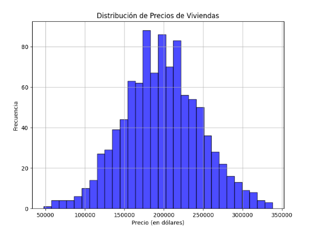

> **Ejemplo**
>
> Si en un conjunto de datos sobre precios de viviendas, la mayoría de los precios están agrupados entre 100.000 y 300.000, pero hay algunas casas con precios de hasta 2.000.000, un histograma mostraría una cola larga hacia la derecha, lo que indica una distribución **sesgada hacia la derecha**.

#### **Boxplots (diagramas de caja)**

Los boxplots son útiles para visualizar la distribución de una variable junto con su dispersión y posibles **valores atípicos**. Un boxplot muestra la mediana, el rango intercuartílico (IQR), y los límites para detectar *outliers*. Este tipo de gráfico es especialmente útil cuando se desea comparar varias distribuciones a la vez o detectar diferencias significativas en la dispersión entre grupos.

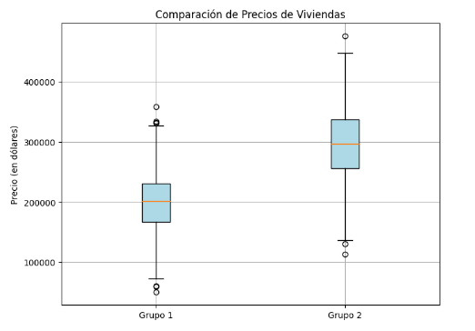

> **Ejemplo**
>
> En la gráfica anterior pueden observarse dos grupos de valores diferenciados. El **Grupo 1**tiene un precio de vivienda promedio de alrededor de $200.000$, con una dispersión de aproximadamente $50.000$. Su caja mostraría una mediana cercana a este valor, con algunos valores atípicos si hubiera casas significativamente más caras o baratas en el grupo. En el **Grupo 2** los precios son más altos en general, con un promedio de alrededor de $300.000$ y una mayor dispersión, con una desviación estándar de $60.000$. La caja del segundo grupo sería más alta que la del primer grupo, mostrando que los precios están concentrados en un rango mayor. También es posible que haya más valores atípicos debido a la mayor variabilidad.

#### **Gráficos de densidad**

Son una versión suavizada de los histogramas y se utilizan para estimar la **función de densidad de probabilidad** de una variable. Los gráficos de densidad permiten identificar picos en la distribución y dan una visión continua de cómo están distribuidos los valores. Son especialmente útiles para detectar si la variable tiene una distribución unimodal (un solo pico) o multimodal (varios picos).

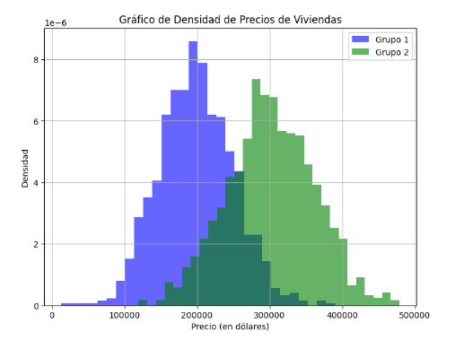

> **Ejemplo**
>
> En el caso del gráfico anterior se distinguen dos grupos de valores:
>
> - **Grupo 1** tendría una curva con un pico alrededor de $200.000$, lo que indica que la mayoría de los valores de precios están concentrados en ese rango.
> - **Grupo 2**, con precios más altos, tendría su pico alrededor de $300.000$. La mayor dispersión de los datos en este grupo provocaría que su curva sea más baja y más ancha, indicando mayor variabilidad en los precios.
>
> Ambas curvas mostrarían cómo están distribuidos los precios de las viviendas en ambos grupos, permitiendo visualizar de manera clara si los valores tienden a concentrarse en torno a ciertos puntos y cómo se dispersan a lo largo de la distribución.

### Identificación de asimetrías, curtosis y valores atípicos

Además de la visualización, es importante cuantificar ciertos aspectos de la distribución como la **asimetría** (*skewness*) y la **curtosis**, ya que estas propiedades nos dan más información sobre la forma de la distribución.

#### **Asimetría (*skewness*)**

La asimetría mide la simetría de la distribución. Una distribución es simétrica si los valores están igualmente distribuidos a ambos lados de la media. Si la cola de la distribución es más larga hacia la derecha, se dice que la variable está **sesgada hacia la derecha** (asimetría positiva). Si la cola es más larga hacia la izquierda, está **sesgada hacia la izquierda** (asimetría negativa).


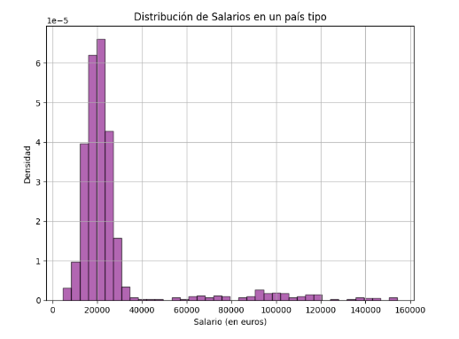

> **Ejemplo**
>
> Si analizamos la distribución de salarios en un país, es común encontrar asimetría positiva, ya que hay relativamente pocas personas con ingresos extremadamente altos en comparación con la mayoría de la población. El gráfico anterior mostraría lo siguiente:
>
> - **La mayoría de los salarios** estarían concentrados en la parte baja de la escala (alrededor de 20.000 a 30.000 euros), que es típico de una distribución salarial en muchos países.
> - **Un pequeño número de salarios** más altos crearían una **cola larga hacia la derecha**, representando a las personas con salarios significativamente superiores (ej. salarios ejecutivos o profesionales altamente especializados, alrededor de 100.000 euros o más).

#### **Curtosis**

La curtosis mide la "agudeza" o "achatamiento" de la distribución. Una distribución con **alta curtosis** tiene picos más pronunciados y colas más largas, lo que indica la presencia de muchos valores extremos. Una **curtosis baja** indica que los datos están más dispersos y tienen menos valores atípicos.

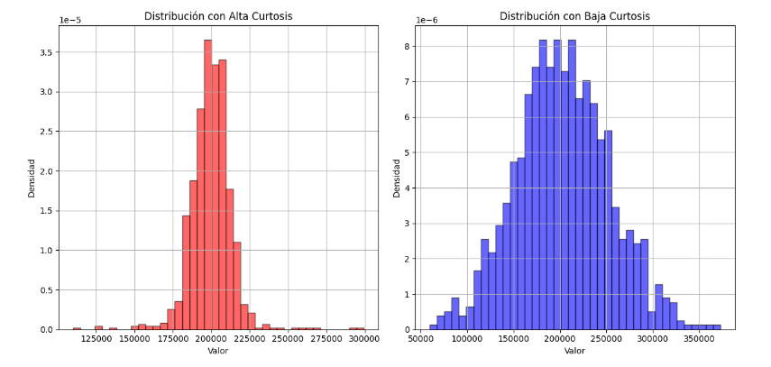

> **Ejemplo**
>
> Si se analizan las calificaciones de estudiantes en un examen y se observa una alta curtosis, significa que muchas calificaciones se concentran cerca de la media, pero también hay algunos estudiantes con calificaciones extremadamente altas o bajas.

### **Valores atípicos (outliers)**

Los **valores atípicos** son puntos de datos que se desvían significativamente del resto de los valores. Estos valores pueden afectar negativamente el rendimiento de los modelos supervisados, ya que pueden distorsionar la media y aumentar la varianza. Los valores atípicos pueden detectarse fácilmente a través de boxplots o usando métodos estadísticos como el rango intercuartílico (IQR).

> **Ejemplo**
>
> En un conjunto de datos sobre precios de viviendas, un valor de 10.000.000 para una casa podría considerarse un valor atípico si la mayoría de los precios oscilan entre 100.000 y 500.000.

## Comparación entre distribuciones de variables independientes y la variable objetivo

Un aspecto fundamental del análisis exploratorio es comparar cómo se distribuyen las **variables independientes** (features) en relación con la **variable objetivo**. Esta comparación es esencial para entender las posibles correlaciones y el comportamiento predictivo de las características. 

En un problema de **regresión**, por ejemplo, es útil visualizar cómo varían las características independientes en relación con la variable objetivo (por ejemplo, mediante gráficos de dispersión o regresiones lineales). Esto puede ayudar a identificar si existe una relación lineal, no lineal o si no hay correlación significativa entre las variables.

> **Ejemplo**: Si en un conjunto de datos se está tratando de predecir el precio de una vivienda basado en el tamaño de la misma, un gráfico de dispersión puede revelar una correlación positiva entre el tamaño y el precio, indicando que a mayor tamaño, mayor es el precio de la vivienda.

En problemas de **clasificación**, es común comparar las distribuciones de las características independientes en cada clase de la variable objetivo. Este análisis puede ayudar a determinar si las clases están bien separadas o si existe solapamiento, lo que podría dificultar la clasificación.

> **Ejemplo**: En un problema de clasificación binaria donde se intenta predecir si un correo es "spam" o "no spam", un gráfico de densidad para una característica como la longitud del mensaje podría mostrar que los correos más largos tienden a ser clasificados como no spam, mientras que los más cortos tienden a ser spam.

### Distribución de clases en problemas de clasificación: balanceo de clases

En problemas de clasificación, es común encontrarse con conjuntos de datos **desbalanceados**, donde una clase es mucho más prevalente que la otra. El **balanceo de clases** es una tarea crítica, ya que los modelos supervisados tienden a inclinarse hacia la clase mayoritaria si no se abordan adecuadamente los desequilibrios en las distribuciones.

El análisis de la **distribución de clases** debe realizarse para determinar si es necesario aplicar técnicas como el **sobremuestreo** de la clase minoritaria o el **submuestreo** de la clase mayoritaria. Estas técnicas ayudan a equilibrar las proporciones y mejorar el rendimiento del modelo en la predicción de ambas clases.

> **Ejemplo**: En un conjunto de datos sobre detección de fraudes financieros, solo el 2 % de las transacciones son fraudulentas, mientras que el 98 % son legítimas. Sin un balance adecuado de clases, el modelo puede predecir que todas las transacciones son legítimas, logrando una precisión alta pero con un pobre rendimiento en la identificación de fraudes.

## Identificación de relaciones entre variables

En el análisis exploratorio de datos, la identificación de relaciones entre variables es necesaria para comprender cómo interactúan y se influyen mutuamente. Este análisis permite detectar dependencias, correlaciones o patrones que podrían mejorar la capacidad predictiva de los modelos supervisados. A continuación, se abordan varias técnicas para explorar las relaciones entre variables numéricas y categóricas.

### Matrices de correlación para datos numéricos

La **correlación** es una medida estadística que indica el grado en que dos variables numéricas están relacionadas. La **matriz de correlación** es una herramienta que permite observar las relaciones entre varias variables numéricas a la vez. Los coeficientes de correlación varían entre -1 y 1:
- Un valor de **1** indica una correlación perfecta y positiva.
- Un valor de **-1** indica una correlación perfecta pero negativa.
- Un valor cercano a **0** sugiere que no existe una correlación significativa entre las variables.

La fórmula del coeficiente de correlación de Pearson para dos variables \(X\) y \(Y\) es:

$$
r_{XY} = \frac{\sum (X_i - \overline{X})(Y_i - \overline{Y})}{\sqrt{\sum (X_i - \overline{X})^2 \sum (Y_i - \overline{Y})^2}}
$$

> **Ejemplo**: Supongamos que tienes un conjunto de datos sobre propiedades inmobiliarias, donde las variables incluyen el precio, el tamaño de la vivienda y el número de habitaciones. Una matriz de correlación mostraría cómo estas variables están relacionadas entre sí. Por ejemplo, podrías observar una fuerte correlación positiva entre el tamaño de la vivienda y el precio, pero una correlación más débil entre el número de habitaciones y el precio.

Para visualizar una **matriz de correlación**, se puede usar un gráfico de calor (**heatmap**), donde los colores representan la magnitud de las correlaciones. Por ejemplo:

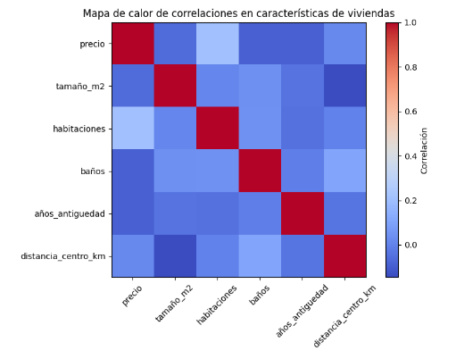

### Gráficos de dispersión y análisis bivariado

Los **gráficos de dispersión** son una herramienta simple pero poderosa para visualizar la relación entre dos variables numéricas. Cada punto en el gráfico representa una observación y las posiciones de los puntos a lo largo de los ejes reflejan los valores de las dos variables. Los gráficos de dispersión son útiles para identificar **relaciones lineales**, **no lineales**, o incluso **valores atípicos** que pueden influir en los modelos.

> **Ejemplo**: En el caso de un conjunto de datos sobre precios de viviendas, un gráfico de dispersión entre el **precio de una casa** (eje x) y **renta media de la zona** (eje y) podría revelar una relación positiva, indicando que a mayor renta media en el barrio, mayor es el precio de la vivienda.

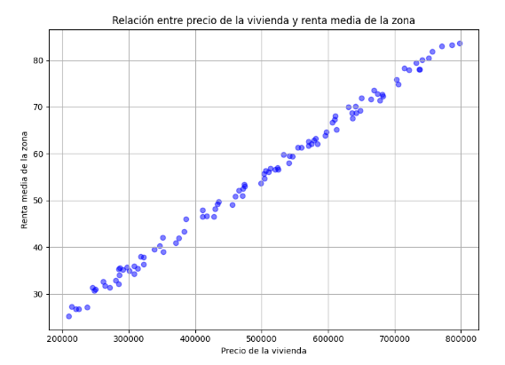

### Uso de gráficos de pares (pairplots) para análisis multivariante

Los **gráficos de pares** (pairplots) son una herramienta útil para visualizar las relaciones entre múltiples variables numéricas en un solo gráfico. Este tipo de gráfico muestra una serie de gráficos de dispersión para cada par de variables en el conjunto de datos, lo que facilita la identificación de patrones y relaciones complejas.

Además, los pairplots pueden incluir distribuciones univariadas (en la diagonal) y están coloreados según categorías, lo que ayuda a identificar cómo las características se agrupan o se relacionan con una variable categórica.

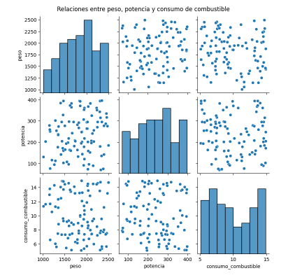

> **Ejemplo**
>
> En un conjunto de datos sobre automóviles, un pairplot podría mostrar cómo el **peso**, la **potencia** y el **consumo de combustible** se relacionan entre sí, revelando tendencias como que los automóviles más pesados tienden a consumir más combustible.

### Relación entre variables categóricas y la variable objetivo

Cuando se trabaja con **variables categóricas**, es importante analizar cómo se relacionan con la variable objetivo, especialmente en problemas de clasificación. Las **tablas de contingencia** y los **gráficos de barras** son herramientas efectivas para explorar estas relaciones.

**Tablas de contingencia**

Son tablas que muestran la frecuencia con la que ocurren las combinaciones de categorías de dos variables categóricas. Esto permite identificar relaciones entre variables categóricas y la variable objetivo, ayudando a determinar si ciertas categorías están más asociadas con un resultado particular.

> **Ejemplo**
>
> La siguiente tabla corresponde a una **tabla de contingencia** que muestra la proporción de personas en cada categoría de estado laboral que han o no han solicitado un préstamo. Por ejemplo, el 100% de los asalariados en este conjunto de datos ha solicitado un préstamo, mientras que el 67% de los autónomos no lo ha solicitado.
>
> | Estado laboral | No ha solicitado préstamo | Ha solicitado préstamo |
> | -------------- | ------------------------- | ---------------------- |
> | Asalariado     | 0.00                      | 1.00                   |
> | Autónomo       | 0.67                      | 0.33                   |
> | Desempleado    | 1.00                      | 0.00                   |

**Gráficos de barras**: Visualizan la frecuencia o proporción de las diferentes categorías de una variable, permitiendo comparar su impacto en la variable objetivo.

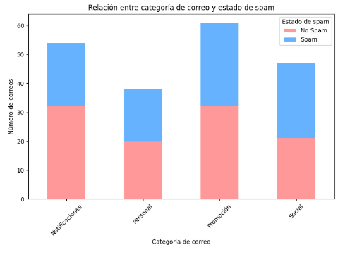

> **Ejemplo**: El gráfico de arriba  corresponde a una **tabla de contingencia** que muestra la relación entre la **categoría de correo** y el **estado de spam**. El gráfico de barras apiladas indica cómo cada tipo de correo (como "Promoción", "Social", etc.) se distribuye entre correos clasificados como "Spam" o "No Spam". Este tipo de visualización es útil para observar si ciertos tipos de correos electrónicos están más asociados con ser clasificados como spam.

## Detección de anomalías y valores atípicos

En cualquier conjunto de datos, es común encontrar observaciones que se desvían significativamente del resto. Estas observaciones, conocidas como **valores atípicos** o **outliers**, pueden distorsionar el análisis estadístico y afectar el rendimiento de los modelos supervisados. Por ello, es fundamental detectarlos y tomar decisiones informadas sobre cómo tratarlos. Los valores atípicos pueden tener diversas causas, como errores de medición, errores de registro o la presencia de una subpoblación distinta en los datos.

### Tipos de valores atípicos: univariados vs. multivariados

Existen dos categorías principales de valores atípicos, según el tipo de análisis: **univariados** y **multivariados**.

Los **valores atípicos univariados** se detectan al analizar una única variable. Por ejemplo, si estamos analizando los precios de viviendas y encontramos que la mayoría de las casas tienen un precio entre 100.000 y 300.000 euros, pero una casa tiene un precio de 2.000.000 de euros, este sería un valor atípico univariado, ya que se desvía considerablemente de los demás.

Los **valores atípicos multivariados** se detectan al analizar múltiples variables simultáneamente. Es posible que un valor no sea atípico cuando se observa una sola variable, pero puede ser atípico cuando se consideran varias variables conjuntamente. Por ejemplo, un automóvil con un precio moderado pero una eficiencia de combustible extremadamente alta podría no parecer inusual al observar cada característica por separado, pero al analizarlas juntas, la combinación puede ser atípica.

### Métodos de detección

La detección de valores atípicos puede realizarse utilizando diversas técnicas estadísticas y algorítmicas. Entre las más comunes están las que se enumeran a continuación:

#### **Z-score (Puntuación Z)**

El Z-score mide cuántas desviaciones estándar se encuentra un valor respecto a la media. Si un valor tiene un Z-score superior a 3 o inferior a -3, generalmente se considera un outlier en distribuciones normales. La fórmula para calcular el Z-score es:

$$
Z = \frac{X - \mu}{\sigma}
$$

Donde:
  - $X$ es el valor observado,
  - $\mu$ es la media de los valores,
  - $\sigma$ es la desviación estándar.

Valores muy alejados de 0 en la escala de Z indican posibles valores atípicos.

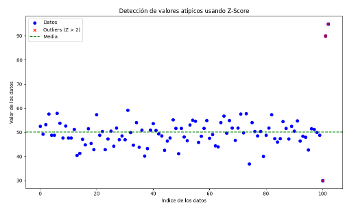

#### **Rango intercuartílico (IQR)**

El IQR es una técnica robusta que se basa en los **cuartiles** de una distribución. El IQR mide la dispersión de los datos entre el primer cuartil ($Q_1$) y el tercer cuartil ($Q_3$), eliminando el 25% superior e inferior de los datos. Los valores atípicos se detectan si caen fuera del rango definido por $Q_1 - 1.5 \times IQR$ o $Q_3 + 1.5 \times IQR$. Esta técnica es menos sensible a los valores extremos que el Z-score.

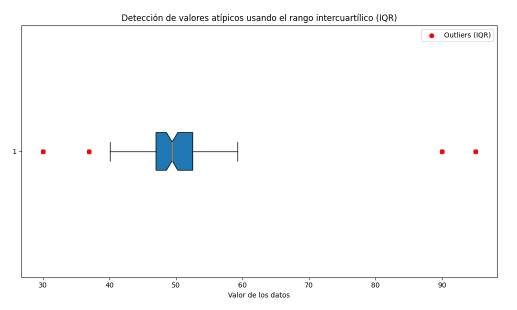

#### **Técnicas robustas**

Además de los métodos estadísticos tradicionales, existen técnicas más avanzadas, como el **Isolation Forest** o el **DBSCAN** (Density-Based Spatial Clustering of Applications with Noise). Estos métodos pueden identificar valores atípicos multivariados y detectar anomalías en conjuntos de datos de alta dimensionalidad sin hacer suposiciones sobre la distribución de los datos.

### Tratamiento de valores atípicos

Una vez identificados los valores atípicos, se debe decidir cómo tratarlos. Existen varias estrategias, y la elección depende del contexto del problema y del impacto que los outliers puedan tener en el análisis o el modelo. Esta tarea es propia de la fase de preprocesamiento, aunque las decisiones sobre qué hacer se pueden tomar en la fase de EDA. Lo más común es optar por alguna de las siguientes alternativas

1. **Eliminación de valores atípicos**: En algunos casos, puede ser adecuado eliminar los outliers, especialmente si se sospecha que son errores de registro o medición. Sin embargo, eliminar valores sin una justificación clara puede llevar a la pérdida de información valiosa, por lo que esta estrategia debe usarse con precaución. 

2. **Transformación de valores atípicos**: En lugar de eliminar los valores atípicos, se pueden aplicar transformaciones matemáticas para reducir su impacto. Entre las transformaciones más comunes están:
   - **Transformación logarítmica**: Reduce la magnitud de los valores atípicos y acerca la distribución a una normalidad.
   - **Transformación mediante *Winsorización***: Consiste en reemplazar los valores atípicos por valores dentro del rango normal de la distribución.
   - **Escalado o normalización**: Puede reducir el efecto de los valores extremos al normalizar todas las variables en un rango determinado (por ejemplo, entre 0 y 1).

3. **Imputación**: En algunos casos, los valores atípicos pueden ser imputados, es decir, reemplazados por valores calculados en función del resto de los datos. Sin embargo, esta estrategia es menos común y generalmente se reserva para casos donde se sospecha que los outliers son fruto de errores.

### Impacto de los valores atípicos en modelos supervisados

Los **valores atípicos** pueden tener un impacto significativo en los modelos de aprendizaje supervisado, dependiendo de la naturaleza del modelo y la cantidad de outliers presentes en los datos.

En **modelos lineales** como la regresión lineal, los valores atípicos pueden influir desproporcionadamente en los coeficientes del modelo, lo que puede llevar a predicciones incorrectas. Esto ocurre porque los modelos lineales ajustan los parámetros minimizando el error cuadrático, lo que amplifica el impacto de los valores extremos.

En **modelos basados en distancia**, como K-Nearest Neighbors (KNN), los valores atípicos pueden distorsionar la relación entre los puntos de datos, afectando la capacidad del modelo para clasificar correctamente o realizar predicciones precisas.

En **algoritmos basados en árboles**, como los árboles de decisión o los bosques aleatorios, el impacto de los valores atípicos suele ser menor, ya que estos modelos son robustos a valores extremos. No obstante, en grandes cantidades, los outliers pueden reducir la capacidad de generalización del modelo.

> [!TIP]
>
> En general, los valores atípicos deben tratarse con cuidado, ya que su impacto varía según el algoritmo utilizado y la naturaleza del conjunto de datos. Una correcta identificación y tratamiento de estos valores es esencial para garantizar la robustez y la precisión de los modelos supervisados.

## Análisis de la multicolinealidad

La **multicolinealidad** es un fenómeno estadístico que tiene lugar cuando dos o más variables independientes en un modelo están altamente correlacionadas entre sí. En otras palabras, la multicolinealidad surge cuando existe una **fuerte relación lineal entre las variables predictoras**, lo que genera problemas en los modelos supervisados, especialmente en aquellos basados en **regresión lineal**. La presencia de multicolinealidad puede distorsionar las estimaciones de los coeficientes del modelo, afectando la interpretación y reduciendo la precisión de las predicciones.

### Definición de multicolinealidad y su efecto en modelos supervisados

Cuando varias características de un modelo están altamente correlacionadas, se produce **redundancia de información**. Como resultado, el modelo tiene dificultades para identificar qué variable es realmente responsable de explicar la variabilidad en la variable objetivo. Este problema afecta principalmente a los modelos que dependen de las relaciones lineales, como la **regresión lineal** o modelos similares.

Los efectos más comunes de la multicolinealidad son:

- **Coeficientes inestables**: Los coeficientes estimados en un modelo con multicolinealidad pueden cambiar drásticamente en respuesta a pequeños cambios en los datos, lo que indica que el modelo no está capturando de manera fiable las relaciones subyacentes.
  
- **Pérdida de interpretabilidad**: Con la presencia de multicolinealidad, es difícil interpretar los coeficientes individuales, ya que un cambio en una variable puede estar relacionado con otro cambio en otra variable. Por lo tanto, la magnitud y el signo de los coeficientes pueden no ser representativos de la verdadera relación entre la variable independiente y la variable objetivo.

- **Aumento de la varianza de los coeficientes**: Los coeficientes de las variables correlacionadas suelen tener grandes errores estándar, lo que implica menor precisión y confianza en las estimaciones del modelo.

### Detectar multicolinealidad: VIF (Variance Inflation Factor) y matrices de correlación

Existen varios métodos para detectar la multicolinealidad en un conjunto de datos. Dos de los más utilizados son la **matriz de correlación** y el **Variance Inflation Factor (VIF)**.

En el caso de las **matrices de correlación**, si observamos dichas matrices en las variables independientes, se puede detectar la presencia de relaciones lineales fuertes. Correlaciones cercanas a 1 o -1 entre dos o más variables indican multicolinealidad. Aunque esto es útil para identificar correlaciones binarias, la matriz de correlación no siempre captura relaciones más complejas entre múltiples variables.

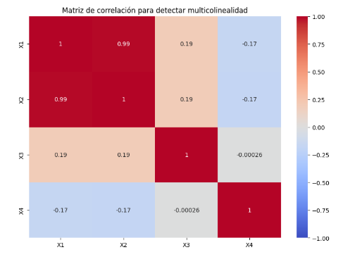

> **Ejemplo**
>
> En la figura anterior se puede observar una matriz de correlación representada mediante un *heatmap*. En este ejemplo, puedes observar un caso de multicolinealidad entre las variables independientes, particularmente entre `X1` y `X2`, que muestran una correlación cercana a 1 (alta colinealidad). Este fenómeno de multicolinealidad puede afectar negativamente el rendimiento de los modelos de regresión lineal, ya que dificulta la interpretación de los coeficientes de las variables correlacionadas. Las otras variables (`X3` y `X4`) no presentan correlaciones fuertes con `X1` ni con `X2`, lo cual indica una menor colinealidad con estas. 

Por otra parte, el ***Variance Inflation Factor* (VIF)** es una medida cuantitativa que indica cuánto se ha incrementado la varianza de los coeficientes de una variable debido a la correlación con otras variables del modelo. Un VIF alto indica que una variable está altamente correlacionada con otras variables. La fórmula del VIF para una variable $X_j$ es:

$$
VIF(X_j) = \frac{1}{1 - R_j^2}
$$

Donde $R_j^2$ es el coeficiente de determinación obtenido al ajustar un modelo de regresión con $X_j$ como variable dependiente y las demás variables independientes como predictoras.

En general:
- Un **VIF mayor a 5** indica una posible multicolinealidad moderada.
- Un **VIF mayor a 10** sugiere una multicolinealidad severa, lo que requiere acción para mitigar su efecto.

### Técnicas para tratar la multicolinealidad

Existen diversas técnicas para reducir o eliminar los efectos de la multicolinealidad, dependiendo del contexto y de las variables involucradas. Algunas de las más comunes son:

#### **Eliminación de características**

Una de las soluciones más sencillas es eliminar una o más de las variables correlacionadas. Si dos variables están altamente correlacionadas, es posible que una de ellas no aporte información adicional significativa al modelo. Por ejemplo, si dos variables tienen una correlación muy alta, una opción es eliminar la variable que tiene menor relevancia para la predicción.

#### **Regularización (Lasso, Ridge)**

Los algoritmos de regularización, como **Ridge** y **Lasso**, son herramientas poderosas para combatir la multicolinealidad. Estos métodos añaden una penalización a la magnitud de los coeficientes durante el ajuste del modelo, lo que permite que el modelo sea más robusto frente a correlaciones entre las variables. Concretamente:

- **Ridge** (o regularización L2) penaliza los coeficientes grandes sin eliminarlos por completo, lo que reduce su impacto en la predicción.
  
- **Lasso** (o regularización L1) no solo penaliza los coeficientes grandes, sino que también tiende a eliminar algunos coeficientes, reduciendo el número de variables activas en el modelo.


El uso de **regularización** es particularmente útil en modelos de regresión con muchas características correlacionadas, ya que ayuda a controlar el sobreajuste y mejora la estabilidad de los coeficientes.

> [!tip]
>
> En resumen, la **multicolinealidad** puede ser un problema serio en modelos supervisados que dependen de la relación lineal entre las variables. Detectar y tratar la multicolinealidad de manera efectiva es esencial para garantizar que el modelo no solo sea más interpretable, sino también más preciso y robusto frente a cambios en los datos.

## Análisis de la relación entre la variable objetivo y las variables independientes

El análisis de la relación entre las **variables independientes** y la **variable objetivo** es clave para mejorar la capacidad predictiva de los modelos supervisados. Este análisis se realiza de manera distinta según se trate de problemas de **regresión** o **clasificación**. Identificar si las relaciones son lineales o no, y realizar transformaciones adecuadas cuando sea necesario, puede aumentar significativamente la precisión y eficiencia del modelo.

### Análisis en problemas de regresión

En los problemas de regresión, donde el objetivo es predecir un valor continuo, es importante analizar la relación entre las variables numéricas y la variable objetivo. El **análisis de correlación lineal** es el primer paso para evaluar si las variables independientes tienen una relación fuerte y directa con la variable objetivo. El coeficiente de correlación de Pearson es una medida comúnmente utilizada para cuantificar esta relación. Su valor oscila entre $-1$ y $1$, donde valores cercanos a $1$ indican una correlación lineal positiva, y valores cercanos a $-1$ indican una correlación negativa.

> **Ejemplo:** supongamos que estamos analizando el precio de las viviendas y encontramos una fuerte correlación entre el tamaño de la casa y el precio. Esto indicaría que a medida que el tamaño de la casa aumenta, el precio también tiende a subir de manera proporcional.

Sin embargo, no todas las relaciones son lineales. Es fundamental identificar aquellas relaciones que no pueden ser explicadas con una línea recta. Para estos casos, es común aplicar **transformaciones**. La **transformación logarítmica**, por ejemplo, se utiliza cuando los datos presentan una relación exponencial. Al aplicar el logaritmo a una variable, podemos transformar una curva en una línea recta, lo que facilita el modelado. Del mismo modo, las **transformaciones polinómicas** permiten modelar relaciones complejas agregando términos cuadráticos o cúbicos a las variables.

También existe la opción de realizar la **discretización** de variables continuas, dividiendo sus valores en intervalos. Esta técnica es útil cuando la relación entre la variable continua y la variable objetivo no puede ser capturada fácilmente por un modelo lineal o no lineal. Un ejemplo sería transformar la variable "edad" en rangos de edad como 20-30, 30-40, etc.

### Análisis en problemas de clasificación

En los problemas de clasificación, el objetivo es predecir una categoría o clase a partir de las variables independientes. Un análisis clave en este caso es la **separabilidad entre clases**, es decir, la capacidad de las variables para diferenciar claramente las observaciones en sus respectivas clases. Si las clases son separables, los modelos de clasificación tendrán un rendimiento superior. Si las clases están solapadas o mezcladas, es probable que el modelo tenga dificultades para distinguirlas. 

Un análisis visual inicial puede ayudar a evaluar esta separabilidad. Para las variables numéricas, se pueden utilizar gráficos de dispersión, mientras que las tablas de contingencia son útiles para variables categóricas. Por ejemplo, en un problema de clasificación de correos electrónicos, los correos que contienen ciertas palabras clave pueden ser claramente diferenciables entre "spam" y "no spam".

Cuando trabajamos con datos de alta dimensionalidad, es difícil visualizar directamente la relación entre las variables independientes y la variable objetivo. En estos casos, se utilizan técnicas de **reducción de dimensionalidad** como el **Análisis de Componentes Principales (PCA)** o el **t-SNE (t-distributed Stochastic Neighbor Embedding)**. El **PCA** transforma las variables originales en un conjunto de variables no correlacionadas (componentes principales), permitiendo reducir la dimensionalidad sin perder mucha información. Esto facilita la visualización y el análisis de las relaciones entre las variables en datos complejos. En cuanto al, **t-SNE** es útil para visualizar agrupaciones o separaciones entre clases, ya que conserva las relaciones locales entre las observaciones en un espacio de menor dimensión.

### Transformaciones de variables

Las transformaciones de variables son herramientas esenciales para mejorar la relación entre las variables independientes y la variable objetivo. Cuando se identifica una relación no lineal o no es posible capturar un patrón claro, aplicar una transformación puede mejorar el ajuste del modelo.

La **transformación logarítmica** se utiliza principalmente cuando los datos siguen una tendencia exponencial o cuando se desea reducir el impacto de valores atípicos. Al aplicar el logaritmo a una variable, los valores más altos se "comprimen", lo que permite que los modelos lineales se ajusten mejor. Un ejemplo común es aplicar el logaritmo a los ingresos o precios de viviendas, donde los valores más altos pueden distorsionar las predicciones.

En cuanto a las **transformaciones polinómicas**, estas permiten modelar relaciones no lineales más complejas al agregar términos como $x^2$ o $x^3$ a la variable independiente. Esto es útil cuando la relación entre las variables muestra una curvatura que no puede ser explicada por una regresión lineal simple. 

Finalmente, la **discretización** es útil cuando una variable continua puede ser más informativa si se agrupa en categorías discretas. Un ejemplo típico es convertir la variable "edad" en rangos como 20-30, 30-40, etc. Esto simplifica el análisis y puede mejorar el rendimiento del modelo, especialmente en problemas de clasificación donde las variables discretas suelen ser más interpretables.

## Manejo de valores ausentes

El manejo de **valores ausentes** es fundamental para garantizar la robustez y la precisión de los modelos supervisados. Los valores faltantes pueden influir en los resultados del análisis exploratorio y afectar el rendimiento de los modelos predictivos. En este contexto, se abordarán los métodos más eficaces para tratar los valores ausentes tanto en características numéricas como categóricas.

### Impacto de los datos faltantes en el análisis y el modelado

Los valores ausentes pueden alterar los resultados del análisis estadístico y el entrenamiento de los modelos supervisados. Por ejemplo, en modelos que dependen de estadísticas como la media, la desviación estándar o la correlación, la presencia de valores faltantes puede llevar a estimaciones incorrectas o sesgadas. Muchos algoritmos de machine learning, como la regresión lineal, no permiten trabajar con datos incompletos, por lo que el manejo de los valores ausentes es esencial antes de construir un modelo.

Es fundamental comprender la naturaleza y el patrón de los valores faltantes. Si los datos faltantes están distribuidos aleatoriamente, el impacto podría ser menor, pero si siguen un patrón sistemático, podría haber sesgo en los resultados. En estos casos, es vital aplicar las estrategias de manejo de valores ausentes adecuadas para evitar distorsionar los resultados.

### Métodos de imputación para características numéricas

Para tratar los valores ausentes en variables numéricas, existen diversas estrategias de imputación:

La **imputación por la media** es una técnica simple que consiste en reemplazar los valores ausentes con la media de la variable. Sin embargo, puede reducir la varianza y distorsionar la distribución de los datos. Alternativamente, puede utilizarse la **mediana** cuando la variable tiene una distribución asimétrica.

Para datos categóricos, se utiliza la **imputación por la moda**, reemplazando los valores ausentes con la categoría más frecuente. Esta técnica es adecuada si la variable categórica tiene un claro valor dominante, pero no es apropiada si la moda no representa bien la distribución de la variable.

En casos de series temporales u otras variables ordenadas, la **interpolación** es una opción. Este enfoque estima los valores faltantes basándose en los valores vecinos. Se pueden usar métodos lineales o no lineales, dependiendo de las características de los datos.

### Métodos de imputación para características categóricas

El tratamiento de los valores faltantes en variables categóricas requiere una estrategia específica, ya que estas características no tienen un orden o una continuidad intrínseca. A continuación, se presentan las técnicas más utilizadas para manejar los valores faltantes en características categóricas:

#### Imputación por la moda

La **imputación por la moda** es el método más simple consiste en reemplazar los valores ausentes con la **moda** de la variable, es decir, la categoría más frecuente. Esta técnica es útil cuando la mayoría de los datos pertenecen a una única categoría, y los valores ausentes son pocos en relación con el tamaño del conjunto de datos.

> **Ejemplo:** En un conjunto de datos sobre clientes de un banco, si el 80% de los clientes pertenecen a la categoría "empleado", y una pequeña fracción de los datos de la variable "estado laboral" está ausente, podemos imputar estos valores ausentes con la categoría "empleado".

#### Imputación basada en modelos

La **imputación basada en modelos** puede usarse en situaciones más complejas, donde la imputación por la moda podría no ser adecuada. Un enfoque común es la imputación mediante **K-Nearest Neighbors (KNN)**, donde los valores ausentes se imputan en función de las observaciones más cercanas en el espacio de características. Otra opción es la **regresión logística**, que puede predecir el valor categórico basado en otras variables.

En el caso de KNN, el algoritmo encuentra las observaciones más cercanas a los valores ausentes y utiliza la categoría predominante entre los vecinos para imputar los valores. Este método es particularmente útil cuando existen relaciones claras entre las variables categóricas y otras características del conjunto de datos.

> **Ejemplo:** Supongamos que estamos trabajando con un conjunto de datos que contiene información sobre características de automóviles, y tenemos una columna que representa el tipo de combustible del automóvil, que está parcialmente incompleta.
>
> | Peso (kg) | Potencia (CV) | Tipo de Combustible |
> | --------- | ------------- | ------------------- |
> | 1500      | 100           | Gasolina            |
> | 1400      | 95            | Diesel              |
> | 1600      | 110           | Gasolina            |
> | 1450      | 105           | ? (Faltante)        |
> | 1700      | 120           | Gasolina            |
>
> En este conjunto de datos, la variable "Tipo de Combustible" está ausente para una de las observaciones (la cuarta fila). Vamos a utilizar **K-Nearest Neighbors (KNN)** para imputar este valor basado en las observaciones más cercanas (en términos de las variables numéricas como el peso y la potencia).
>
> Primero hay que **seleccionar las variables numéricas**: En este caso, utilizamos el **peso** y la **potencia** como variables para medir la distancia entre los automóviles. Posteriormente hay que **calcular la distancia**, que es una métrica que permite calcular la cercanía entre los automóviles con valores conocidos y el automóvil con el valor faltante. Para la fila con valores faltantes, calculamos la distancia a cada una de las otras observaciones. 
>
> La distancia euclidiana entre dos puntos $(x_1, y_1)$ y $(x_2, y_2)$ en este caso se calcula como:
>
> $$
> d = \sqrt{(x_1 - x_2)^2 + (y_1 - y_2)^2}
> $$
>
> Donde $x$ representa el peso y $y$ la potencia.
>
> Ahora procedemos a **buscar los vecinos más cercanos**. Seleccionamos los $K$ vecinos más cercanos, donde $K$ es el número de vecinos que decidimos utilizar para la imputación (generalmente, se elige $K = 3$ o $K = 5$).
>
> Supongamos que calculamos las distancias y encontramos que los tres vecinos más cercanos para la fila faltante son:
> - Automóvil 1 (Gasolina)
> - Automóvil 2 (Diesel)
> - Automóvil 3 (Gasolina)
>
> Por últmo quedaría **imputar el valor**, basándonos en los $K$ vecinos más cercanos imputamos la categoría más frecuente entre esos vecinos. En este caso, dos de los tres vecinos más cercanos tienen "Gasolina" como tipo de combustible. Por lo tanto, imputamos el valor faltante como **Gasolina**.
>
> **Resultado después de la imputación:**
>
> | Peso (kg) | Potencia (CV) | Tipo de Combustible     |
> | --------- | ------------- | ----------------------- |
> | 1500      | 100           | Gasolina                |
> | 1400      | 95            | Diesel                  |
> | 1600      | 110           | Gasolina                |
> | 1450      | 105           | **Gasolina (Imputado)** |
> | 1700      | 120           | Gasolina                |
>

En ocasiones se puede optar por la **creación de una nueva categoría para "Desconocido"**: En algunos casos, es recomendable crear una nueva categoría llamada "Desconocido" o "Faltante" para indicar la ausencia de un valor. Esta estrategia es especialmente útil cuando la ausencia de datos en sí misma puede proporcionar información útil para el modelo. Por ejemplo, si estamos analizando el historial de compras de clientes y algunos datos de una característica categórica están ausentes, esto podría indicar que el cliente no realizó ciertas acciones o no pertenece a una categoría particular.

Por último podemos aplicar una **imputación basada en frecuencias condicionales**. Esta técnica, más sofisticada, se basa en utilizar las frecuencias condicionales para imputar los valores ausentes. Esto implica calcular las probabilidades de las categorías en función de otras características presentes en los datos.

> **Ejemplo**
>
> Si se imputa el estado civil de una persona, se puede utilizar la distribución condicional del estado civil según su grupo de edad, lugar de residencia o nivel de ingresos. De este modo, la imputación es más precisa y refleja mejor la realidad del conjunto de datos.

### Visualización de patrones de datos ausentes

Una parte importante del manejo de valores ausentes es identificar si los datos faltantes siguen un patrón específico o están distribuidos aleatoriamente. Para ello, es útil utilizar herramientas de visualización que proporcionen una visión clara de la distribución de los valores ausentes.

Los **gráficos de calor** son una excelente opción para visualizar los patrones de datos faltantes. En estos gráficos, se utiliza un esquema de colores donde cada celda representa un valor en el conjunto de datos, y los valores ausentes se resaltan con un color distintivo. Esto facilita la identificación de qué variables o filas contienen más datos faltantes.

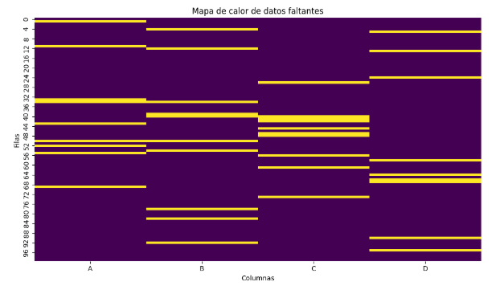

> **Ejemplo**: La figura de arriba representa un gráfico de calor que visualiza los datos faltantes en un conjunto de datos ficticio. Las áreas resaltadas en el gráfico indican la presencia de valores faltantes (NaN), lo que permite identificar rápidamente en qué filas y columnas se encuentran estos valores. Esta técnica es útil para comprender la estructura de los datos faltantes antes de decidir cómo manejarlos. 

Otra técnica útil es el **mapa de valores faltantes**, donde se muestra una matriz de los datos, destacando las observaciones con valores ausentes. Si los valores ausentes se concentran en ciertas partes del conjunto de datos, el mapa lo indicará claramente, lo que ayudará a determinar si los datos faltantes siguen un patrón no aleatorio.

Dentro de la categoría de mapas de valores faltantes podemos optar por gráficos como:

- **Gráfico de barras** para mostrar la cantidad total de valores faltantes por columna.

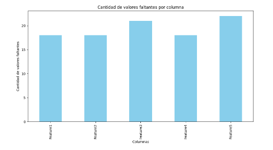

- **Gráfico de matriz** que muestre patrones de valores faltantes, como la correlación de los valores ausentes entre diferentes columnas.

  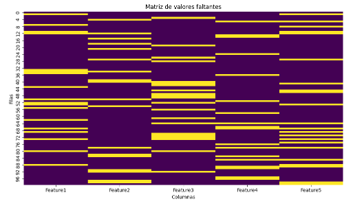

- **Dendrograma de valores faltantes**: Ilustra las relaciones entre las columnas basadas en sus patrones de valores ausentes. Las columnas que están más cerca en el dendrograma tienen patrones similares de datos faltantes.

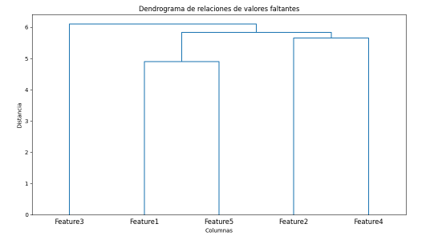

> **Ejemplo**: si se observa que los datos faltantes en una variable categórica están presentes principalmente en un subconjunto de observaciones con características comunes, podría indicar que la ausencia de datos está relacionada con esas características, lo que puede ser relevante para el modelado.

## Exploración de interacciones y efectos conjuntos entre variables

En el análisis exploratorio de datos supervisados, uno de los aspectos más importantes es la exploración de las **interacciones entre variables**. Las relaciones entre características no siempre son independientes, y muchas veces los efectos de una variable en la variable objetivo dependen de otra variable. Estas interacciones pueden ser lineales o no lineales, y su identificación y aprovechamiento son cruciales para mejorar la capacidad predictiva de los modelos.

### Análisis de interacciones entre características: gráficos de interacción

Las interacciones entre características se refieren a cómo el efecto de una variable independiente sobre la variable objetivo cambia en función de otra variable. Estas relaciones pueden ser identificadas visualmente utilizando **gráficos de interacción**. En los gráficos de interacción, se muestran los efectos de dos o más variables independientes simultáneamente sobre la variable objetivo.

> **Ejemplo**: Un caso sencillo de interacción se observa en un problema de predicción de ventas donde se analizan dos características: **precio del producto** y **gasto en publicidad**. Si analizamos estas dos variables por separado, podríamos observar que, en general, un aumento en el gasto en publicidad aumenta las ventas, y un aumento en el precio del producto reduce las ventas. Sin embargo, si ambas características están relacionadas, podría ser que el efecto positivo del gasto en publicidad en las ventas sea más fuerte cuando el precio del producto es bajo, lo que sugiere una **interacción** entre el precio y la publicidad.

Los gráficos de interacción permiten visualizar este tipo de relaciones cruzadas y no lineales entre variables. Estos gráficos muestran cómo la combinación de diferentes valores de las características afecta la variable objetivo, permitiendo identificar relaciones complejas que no se podrían detectar analizando las características de forma individual.


> **Ejemplo**
>
> La figura de arriba corresponde a un gráfico de dispersión que muestra la interacción entre las variables `X1`, `X2` y la variable dependiente `Y`. Los puntos están coloreados según el valor de `X2`, lo que permite visualizar cómo la interacción entre `X1` y `X2` influye en `Y`. Este tipo de gráfico es útil para analizar cómo dos variables independientes influyen conjuntamente en una variable dependiente, lo que es típico en análisis de interacción en modelos de regresión. 

### Identificación de efectos no aditivos

Los **efectos no aditivos** ocurren cuando el efecto combinado de dos o más variables sobre la variable objetivo no puede explicarse simplemente sumando los efectos de cada variable por separado. Este tipo de relaciones es común en modelos complejos, donde las características tienen un impacto conjunto sobre el resultado que no es evidente al analizar cada una de manera aislada.

> **Ejemplo**
>
> Un caso típico de efectos no aditivos puede encontrarse en el campo de la salud, donde el impacto de una determinada dieta y el ejercicio físico sobre la salud puede no ser simplemente la suma de ambos factores. Es posible que una persona que sigue una dieta saludable y realiza ejercicio regularmente experimente una mejora en la salud mayor que la que se observaría sumando los efectos individuales de la dieta y el ejercicio por separado. Esto indica que hay un **efecto conjunto** o sinergia entre ambas variables.

Los efectos no aditivos pueden identificarse mediante técnicas estadísticas avanzadas, como el uso de **modelos de regresión con términos de interacción**, que permiten modelar explícitamente cómo dos variables interactúan y cómo su interacción afecta la variable objetivo.

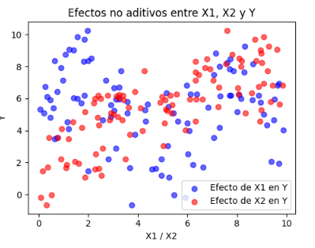

> **Ejemplo**
>
> En la figura de arriba observamos un gráfico que ilustra los **efectos no aditivos** entre las variables `X1`, `X2` y la variable dependiente `Y`. En este caso, `Y` no se determina simplemente como una combinación lineal de `X1` y `X2`, sino que hay una interacción no lineal (a través de funciones como el seno, el logaritmo y la multiplicación de `X1` y `X2`). 
>
> El gráfico de dispersión permite visualizar cómo los valores de `Y` varían de manera compleja según los valores de `X1` y `X2`. Este tipo de comportamiento es típico en situaciones donde los modelos lineales no pueden capturar las relaciones subyacentes, y se requieren modelos más complejos como árboles de decisión o redes neuronales

### Técnicas de interacción cruzada para aumentar la capacidad predictiva

Las **interacciones cruzadas** son técnicas utilizadas para capturar efectos combinados entre variables. Estas interacciones pueden ser modeladas directamente mediante la creación de **nuevas características**, que son productos o combinaciones de las variables originales. Por ejemplo, si en un modelo de predicción de ventas observamos una interacción entre el **precio** y el **gasto en publicidad**, podemos crear una nueva variable que sea el producto del precio y el gasto en publicidad para capturar mejor esta interacción en el modelo.

Las técnicas de interacción cruzada son particularmente útiles cuando se utilizan algoritmos lineales, como la regresión lineal, que no pueden capturar relaciones no lineales o combinaciones entre variables sin la creación explícita de estas interacciones. Al incluir variables de interacción en el modelo, se puede mejorar la capacidad del modelo para capturar relaciones complejas en los datos y, por lo tanto, aumentar su capacidad predictiva.

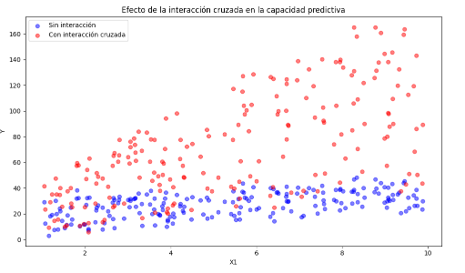

> **Ejemplo**: En la figura de arriba puedes ver un gráfico que ilustra el efecto de la **interacción cruzada** sobre la capacidad predictiva de un modelo. El gráfico compara dos escenarios:
>
> - **Sin interacción cruzada**: Los puntos azules muestran el comportamiento de la variable dependiente `Y` sin incluir el término de interacción entre `X1` y `X2`.
> - **Con interacción cruzada**: Los puntos rojos muestran el comportamiento de `Y` cuando se incluye un término de interacción entre `X1` y `X2`.
>
> Como puedes observar, el término de interacción entre `X1` y `X2` modifica la relación entre las variables, permitiendo capturar una relación más compleja. Esto aumenta la capacidad predictiva del modelo cuando los efectos entre las variables no son simplemente aditivos.

Además de crear nuevas características a partir de las interacciones entre las variables, los modelos más avanzados, como los **árboles de decisión**, las **redes neuronales** o los **modelos de ensamblaje** (como los **Random Forests** o **Gradient Boosting**), son capaces de capturar estas interacciones de forma más automática, sin necesidad de crear manualmente términos de interacción cruzada. Estos modelos detectan automáticamente las combinaciones de características que tienen el mayor impacto sobre la variable objetivo y las modelan de manera adecuada.

Un enfoque muy utilizado para captar estas interacciones en modelos no lineales es el uso de **polinomios cruzados** o el uso de algoritmos como **Kernel SVM**, que pueden manejar relaciones complejas y no lineales entre las características.

> [!tip]
>
> El análisis sobre la exploración de interacciones y efectos conjuntos entre variables destaca la importancia de comprender cómo las variables se combinan para afectar la variable objetivo. El uso de gráficos de interacción, la identificación de efectos no aditivos, y la creación de características basadas en interacciones cruzadas son herramientas clave para mejorar la capacidad predictiva de los modelos supervisados.

## Automatización del análisis exploratorio

A lo largo de este capítulo hemos comprobado que el **análisis exploratorio de datos (EDA)** es una parte fundamental del ciclo de vida de los modelos supervisados, ya que permite obtener una visión general de las características de los datos antes de aplicar cualquier modelo. Sin embargo, realizar el EDA manualmente puede ser tedioso y consumir mucho tiempo, especialmente cuando se trabaja con grandes conjuntos de datos o en proyectos donde se necesitan análisis repetidos. Para abordar este desafío, han surgido diversas **herramientas de automatización**, que facilitan la generación rápida de informes detallados sobre las características de los datos.

### Herramientas de automatización para el análisis exploratorio de datos

Entre las herramientas más populares para la **automatización del EDA** se encuentran **Pandas Profiling** y **Sweetviz**, que permiten generar informes exhaustivos sobre los datos con solo unas pocas líneas de código. Estas herramientas son capaces de resumir estadísticas importantes, visualizar distribuciones de variables, identificar valores atípicos y detectar valores faltantes de manera automática.

#### **Pandas Profiling**

Esta herramienta genera un informe detallado y visual sobre un conjunto de datos. Proporciona resúmenes de las variables numéricas y categóricas, incluyendo medidas de tendencia central (media, mediana), dispersión (desviación estándar, rango), valores atípicos, correlaciones, y alertas sobre problemas potenciales en los datos (como valores faltantes o distribuciones sesgadas). *Pandas Profiling* es especialmente útil para tener una visión rápida y completa de los datos sin necesidad de escribir múltiples scripts de análisis manual.

Con **Pandas Profiling**, un informe de análisis exploratorio puede generarse con una sola línea de código:

```python
import pandas_profiling
report = df.profile_report()
report.to_file("EDA_report.html")
```

#### **Sweetviz**

Al igual que *Pandas Profiling*, **Sweetviz** es otra herramienta de automatización que genera informes visuales completos de un conjunto de datos. Una de las características diferenciadoras de *Sweetviz* es su capacidad para comparar dos conjuntos de datos (por ejemplo, un conjunto de entrenamiento y uno de prueba), lo que es útil para detectar discrepancias en las distribuciones de los datos. También genera visualizaciones interactivas que ayudan a entender mejor las relaciones entre variables.

Un ejemplo sencillo de uso de Sweetviz sería:

```python
import sweetviz
report = sweetviz.analyze(df)
report.show_html("Sweetviz_report.html")
```

Ambas herramientas generan informes detallados en formato HTML que pueden explorarse de manera interactiva, lo que las convierte en opciones ideales para un análisis inicial de los datos.

### Ventajas y limitaciones de hacer EDA automatizado

El **EDA automatizado** presenta varias **ventajas** importantes, pero también tiene **limitaciones** que deben ser consideradas.

Entre las **ventajas** podemos enumerar la rapidez, la eficiencia, las posibilidades de estandarización o la facilidad de uso. En efecto, las herramientas automatizadas permiten obtener un análisis detallado de grandes conjuntos de datos en cuestión de segundos o minutos, lo que ahorra tiempo y esfuerzo. Esto es especialmente útil cuando se trabaja con plazos ajustados o cuando se necesitan múltiples análisis en diferentes etapas del proyecto. También es cierto que se consigue una mayor estandarización ya que al usar herramientas automatizadas, se garantiza que el análisis exploratorio siga un enfoque sistemático y coherente. Esto reduce el riesgo de pasar por alto aspectos importantes de los datos, como la presencia de valores atípicos o correlaciones significativas entre variables. Por último, es indudable que estas herramientas son fáciles de implementar, incluso para personas con conocimientos limitados de programación. Proporcionan informes completos con pocas líneas de código, lo que simplifica el análisis preliminar de los datos.

Sin embargo las herramientas de automatización también tienen sus **limitaciones**. En primer lugar los análisis que se realizan pueden ser en ocasiones algo superficiales, ya que aunque los análisis sean detallados, los resúmenes generados no están contextualizados para el problema en cuestión. Puede ocurrir que las herramientas no detecten patrones específicos que podrían ser relevantes para el objetivo del proyecto. En segundo lugar, en ocasiones se observa cierta falta de personalización. Las herramientas de EDA automatizado ofrecen informes predefinidos, pero pueden no ajustarse perfectamente a las necesidades de un análisis específico. Personalizar el análisis puede requerir más esfuerzo que realizar un EDA manual en algunos casos. Por último, pueden detectarse problemas a la hora de interpretar los resultados. Aunque las herramientas proporcionan gráficos y resúmenes, interpretar correctamente los resultados sigue siendo responsabilidad del analista. Las herramientas automatizadas no ofrecen explicaciones detalladas sobre los patrones detectados ni sugieren posibles soluciones.

En resumen, el **EDA automatizado** es una herramienta valiosa para obtener una vista preliminar de los datos y detectar problemas evidentes, pero **no debe sustituir completamente el análisis manual y más detallado cuando es necesario**.

### Uso de pipelines de EDA como parte del flujo de trabajo en machine learning

Incorporar **pipelines de EDA** en el flujo de trabajo de **machine learning** permite automatizar no solo el análisis inicial de los datos, sino también su preparación para el modelado. Un **pipeline de EDA** es un conjunto de etapas que incluyen la carga, el preprocesamiento, el análisis exploratorio y la limpieza de los datos. Esto asegura que los mismos pasos se apliquen de manera consistente y repetida, lo que es esencial en proyectos a gran escala o cuando se ejecutan experimentos múltiples.

Algunas herramientas como **scikit-learn** permiten integrar tareas de preprocesamiento (por ejemplo, imputación de valores faltantes, escalado de variables y selección de características) en un pipeline que se ejecuta de manera secuencial antes de ajustar el modelo. De este modo, el análisis exploratorio y la preparación de los datos forman parte de un proceso automatizado que puede reutilizarse en diferentes iteraciones del modelo.

Por ejemplo, un pipeline básico podría incluir los siguientes pasos:
1. Imputación de valores faltantes.
2. Escalado de variables.
3. Generación de informes automáticos de EDA con Pandas Profiling o Sweetviz.
4. Aplicación del modelo de machine learning.

Esto se puede implementar con herramientas como **scikit-learn** usando la clase `Pipeline`:

```python
from sklearn.pipeline import Pipeline
from sklearn.preprocessing import StandardScaler
from sklearn.impute import SimpleImputer
from sklearn.linear_model import LinearRegression

pipeline = Pipeline([
    ('imputer', SimpleImputer(strategy='mean')),
    ('scaler', StandardScaler()),
    ('model', LinearRegression())
])

pipeline.fit(X_train, y_train)
```

Integrar el EDA en el flujo de trabajo automatizado garantiza que los datos se traten de manera adecuada en cada paso del proceso, desde el análisis inicial hasta el modelado, lo que permite una mayor consistencia y reproducibilidad.

## Consideraciones finales: Análisis exploratorio de datos para el modelado

Ha quedado claro que el **análisis exploratorio de datos** juega un papel fundamental en la fase previa de preprocesamiento y preparación para el modelado en proyectos de aprendizaje supervisado. El EDA no solo proporciona una visión inicial de las características y patrones presentes en los datos, sino que también **influye directamente en las decisiones que se toman durante el proceso de modelado**. A través de este análisis, es posible identificar los problemas y oportunidades que deben abordarse antes de aplicar cualquier algoritmo, lo que incrementa la precisión y eficacia de los modelos resultantes.

### Cómo usar el EDA para tomar decisiones informadas en la selección de algoritmos

Uno de los resultados más importantes del EDA es la capacidad de **tomar decisiones informadas** sobre qué algoritmos son más adecuados para el problema en cuestión. El tipo de datos, las relaciones entre las variables y la presencia de valores atípicos o faltantes influyen en la selección de los modelos a utilizar.

Por ejemplo, si durante el EDA se detecta que las relaciones entre las variables y la variable objetivo son principalmente lineales, los **modelos lineales** como la regresión lineal o la regresión logística serán opciones naturales para empezar. Sin embargo, si se identifican relaciones no lineales, el uso de algoritmos como los **árboles de decisión** o las **redes neuronales** puede ser más adecuado.

Además, el análisis de las distribuciones de las variables puede sugerir si es necesario usar algoritmos que sean robustos a los valores atípicos. Los modelos como los **árboles de decisión** o los **Random Forests** suelen ser más tolerantes a los valores extremos, mientras que los modelos lineales pueden verse fuertemente afectados por ellos. De este modo, el EDA permite **adaptar la selección del modelo** al tipo de datos con el que se está trabajando.

### Determinación de la necesidad de transformaciones adicionales

El EDA también proporciona una guía clara sobre la necesidad de aplicar **transformaciones adicionales** a las variables antes del modelado. Si el análisis muestra que las variables independientes tienen distribuciones muy asimétricas o contienen valores extremos, puede ser necesario aplicar transformaciones como el **logaritmo** o la **raíz cuadrada** para normalizar las distribuciones.

Otro aspecto importante es la identificación de relaciones no lineales. En este caso, las transformaciones polinómicas o la creación de variables de interacción pueden mejorar la capacidad del modelo para capturar estas relaciones. El EDA ayuda a determinar qué transformaciones son necesarias para asegurar que las variables se ajusten a las suposiciones del algoritmo seleccionado.

Por ejemplo, si durante el EDA se observa que la variable objetivo tiene una distribución exponencial, la **transformación logarítmica** puede mejorar la capacidad del modelo para predecir correctamente. De manera similar, si el EDA revela que ciertas características están muy correlacionadas entre sí, puede ser necesario aplicar técnicas como la **reducción de dimensionalidad** o eliminar características redundantes para mejorar la eficiencia del modelo.

### Impacto del EDA en el preprocesamiento y la ingeniería de características

El EDA tiene un impacto directo en el **preprocesamiento de los datos** y en la **ingeniería de características**, ya que revela qué características necesitan tratamiento especial antes del modelado. Una de las primeras tareas de preprocesamiento es la **imputación de valores faltantes**, que se define durante el EDA al identificar qué características tienen datos incompletos. Dependiendo del patrón de valores ausentes detectado, se pueden aplicar diferentes técnicas de imputación, como la imputación por la media, la moda o mediante modelos más avanzados como KNN.

El EDA también guía la **selección de características** y la creación de **nuevas variables**. En muchos casos, se puede observar que ciertas variables no tienen una correlación significativa con la variable objetivo y, por lo tanto, pueden ser eliminadas para evitar sobreajuste o reducir la complejidad del modelo. De manera inversa, el EDA puede sugerir la creación de nuevas características basadas en interacciones entre las variables existentes, mejorando la capacidad predictiva del modelo. 

Por ejemplo, si se detecta durante el análisis que dos variables independientes tienen una interacción no lineal, la creación de una nueva variable que capture esa interacción puede mejorar el rendimiento del modelo. El EDA también puede revelar la necesidad de escalar variables o aplicar técnicas de normalización para asegurar que los algoritmos basados en distancia, como el KNN o las máquinas de soporte vectorial, funcionen de manera eficiente.

### Integración del EDA en el flujo completo del aprendizaje supervisado

El EDA no es un proceso independiente ni aislado del flujo de trabajo del **aprendizaje supervisado**. Más bien, debe integrarse de manera natural en todas las etapas del proceso, desde la **selección de características** hasta el **ajuste del modelo** y la **evaluación del rendimiento**.

La integración del EDA en el flujo de trabajo puede lograrse mediante el uso de **pipelines** que automatizan las tareas de preprocesamiento y análisis. Al automatizar estos pasos, se garantiza que el análisis exploratorio se aplique de manera consistente en cada iteración del ciclo de modelado. Además, este enfoque permite que el análisis inicial de los datos evolucione a medida que se descubren nuevos patrones durante el ajuste del modelo.

El EDA también desempeña un papel crítico en la **validación del modelo**, ya que ayuda a identificar posibles problemas en los datos que podrían afectar la generalización del modelo a nuevos conjuntos de datos. Al incluir el análisis exploratorio como una etapa constante a lo largo del proceso de modelado, se puede ajustar y mejorar continuamente tanto el preprocesamiento como el propio modelo, garantizando que el enfoque sea robusto y eficaz.

