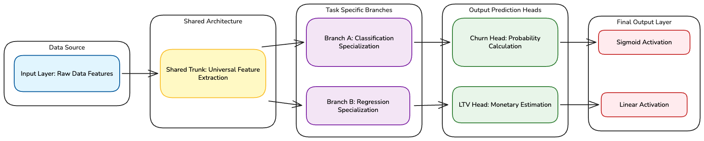
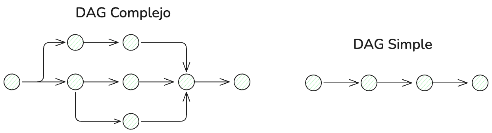

# Apéndice: Enfoques de desarrollo con TensorFlow en Deep Learning

En un proyecto profesional de IA, ***TensorFlow*** no es solo una biblioteca de funciones; es un motor de ejecución distribuida y optimización matemática. Mientras que ***Keras*** actúa como la interfaz de usuario para el desarrollador (proporcionando simplicidad y velocidad), TensorFlow es el encargado de gestionar los recursos de hardware, la memoria y el flujo de los datos. Comprender este ecosistema es vital para pasar de "ajustar modelos" a "diseñar sistemas de IA robustos".

## Conceptos fundamentales del motor TensorFlow

Para entender cómo funciona cualquier ejemplo de los que hemos visto en clase debemos diseccionar los tres pilares que TensorFlow gestiona a bajo nivel:

### El Tensor: La unidad mínima de información

Un ***Tensor*** es una estructura de datos multidimensional (una generalización de lo que entendemos por **vectores** o **matrices**). En TensorFlow, los datos no son simples listas de Python; son objetos con un tipo de dato (`dtype`) y una forma (`shape`) definida que residen en la memoria de la GPU o CPU.

- **Escalar (Rango 0)**: Un solo número.
- **Vector (Rango 1)**: Una lista de características (ej: datos de un solo cliente).
- **Matriz (Rango 2)**: Una tabla de datos (ej: el lote o **batch** de entrenamiento).
- **Tensor (Rango 3)**: Un cubo de datos o una colección de matrices. El ejemplo más común es una imagen en color, donde las dimensiones representan (altura, anchura, canales de color RGB), o un lote de series temporales (muestras, pasos de tiempo, características).

### El Grafo Computacional: El mapa de ejecución

TensorFlow no ejecuta operaciones de forma aislada. Cuando definimos un modelo, estamos construyendo un **Grafo Acíclico Dirigido (DAG)**. Los nodos son operaciones matemáticas (multiplicaciones, sumas, activaciones) y las aristas son los tensores que fluyen entre ellas.

Este mapa permite a TensorFlow optimizar qué operaciones pueden ejecutarse en paralelo y cómo calcular las derivadas necesarias para el aprendizaje (backpropagation) de forma automática. Por ejemplo, en un típico caso de estudio podríamos tener algo así:



### La abstracción de Keras: Simplificando el motor

Keras abstrae la complejidad de TensorFlow en tareas que, de otro modo, requerirían cientos de líneas de código y una gestión manual del estado del hardware. La diferencia radica en quién asume la responsabilidad de la lógica de bajo nivel:

- **Inicialización de pesos**: En TensorFlow Core, el desarrollador debe definir manualmente la distribución estadística (media y varianza) de los pesos iniciales para evitar que los gradientes exploten. Keras automatiza esto usando esquemas inteligentes asegurando que la red sea capaz de empezar a aprender desde la primera época.
- **Gestión del bucle de entrenamiento (El método .fit)**: Sin Keras, el entrenamiento requeriría escribir un bucle manual (`for epoch in range...`), gestionar la fragmentación de datos (**batching**), abrir un contexto de `tf.GradientTape` para registrar las operaciones, calcular las derivadas parciales y llamar explitamente al optimizador para actualizar cada peso. Keras encapsula todo este proceso en una sola línea de código.
- **Gestión de estados y variables**: En una red con miles de parámetros, rastrear qué pesos corresponden a qué capa y cuáles deben ser "entrenables" es complejo. Keras gestiona automáticamente el registro de las variables `tf.Variable` y su persistencia, permitiendo que el desarrollador piense en "Capas" y no en "Matrices de memoria".
- **Inferencia de formas (Shape Inference)**: Keras deduce automáticamente el tamaño de las capas intermedias basándose solo en la entrada. En TensorFlow Core, cada operación matricial debe ser calculada manualmente por el programador ($A times B$ requiere que las columnas de $A$ igualen las filas de $B$); Keras realiza esta contabilidad matemática por nosotros.

## De datos raw a tensores: El flujo de ingesta y preprocesamiento

Ningún modelo de deep learning puede "leer" un archivo CSV directamente. Existe un proceso de transformación y **preprocesamiento** crítico:

1. **Estado Raw**: Datos en disco (CSV, SQL,...).
2. **Estructura de Datos y Preprocesamiento**: Carga en memoria y limpieza. **Aquí es donde transformamos la realidad en números comparables** (escalado, codificación de categorías, imputación de nulos).
3. **Conversión a Tensor**: TensorFlow transforma los datos limpios en tensores de punto flotante (`tf.float32`).
4. **Flujo por el Grafo**: Los tensores entran en la `input_shape` y se transforman matemáticamente.

### Ejemplo típico de implementación del flujo con preprocesamiento

A continuación podemos ver un ejemplo típico de como abordar la ingesta de los datos del modelo

```python
import pandas as pd
import numpy as np
import tensorflow as tf


# 1. ESTADO RAW: Definimos la ruta local del archivo
path_local # "data/dataset.csv"

# 2. ESTRUCTURA DE DATOS Y PREPROCESAMIENTO:
# Leemos los datos y aplicamos transformaciones necesarias para el Grafo
df # pd.read_csv(path_local)

# Ejemplo de preprocesamiento: Escalado de características
# Es vital que todas las variables tengan un rango similar (ej: 0 a 1)

from sklearn.preprocessing import StandardScaler

scaler # StandardScaler()
features_raw # df[['v1', 'v2']].values
features_scaled # scaler.fit_transform(features_raw) # Datos normalizados

# 3. CONVERSIÓN A TENSOR: Cruce de la frontera hacia el motor de TensorFlow
# El dato ya preprocesado se convierte en un tensor listo para la GPU

```Python
tensor_x # tf.convert_to_tensor(features_scaled, dtype#tf.float32)

print(f"Tipo de objeto: {type(tensor_x)}")
print(f"Forma del Tensor (Shape): {tensor_x.shape}")

```


### Gestión de datasets pesados: El pipeline de `tf.data`

Cuando el volumen de datos es masivo (Big Data), cargarlo todo en un `DataFrame` de Pandas saturará la memoria RAM. En estos casos, TensorFlow proporciona la API *`tf.data`*, que permite crear una tubería (**pipeline**) de datos que lee del disco solo lo que necesita en cada momento.

Este enfoque permite que la CPU prepare el siguiente lote de datos mientras la GPU está procesando el actual, maximizando el rendimiento del hardware.

```python
# Definimos el Pipeline de TensorFlow para datasets pesados

# 1. Creamos el objeto Dataset (puede leer directamente de archivos o arrays)
dataset # tf.data.Dataset.from_tensor_slices((features_scaled, labels))

# 2. Mezclamos los datos (Shuffle)
dataset # dataset.shuffle(buffer_size#1024)

# 3. Dividimos en lotes (Batch)
dataset # dataset.batch(32)

# 4. Prefetch: La CPU prepara el siguiente lote mientras la GPU entrena
# AUTOTUNE permite que TF decida cuántos lotes pre-cargar según el hardware
dataset # dataset.prefetch(buffer_size#tf.data.AUTOTUNE)

# Ahora el modelo puede consumir este objeto directamente
```

## Arquitectura de redes. La elección del set de herramientas adecuadas dentro TensorFlow

Imagina que te adentras en el mundo del Deep Learning no como un programador, sino como un arquitecto que debe dar forma al flujo de la información. Al principio, tus necesidades serán sencillas, pero a medida que tus problemas se vuelven más humanos y complejos, las herramientas que utilizas deben evolucionar contigo. En el ecosistema de **TensorFlow y Keras**, este crecimiento se refleja en tres formas de entender la construcción de modelos.

### La Elegancia de la Línea Recta: Sequential

Todo comienza con la sencillez. Cuando te enfrentas a problemas donde el conocimiento fluye en un solo sentido, como una serie de decisiones encadenadas una tras otra, la API **Sequential** es tu mejor aliada. Es como una línea de montaje perfecta: los datos entran por un extremo, se transforman en cada etapa y salen por el otro convertidos en una predicción. Es aquí donde nacen los **Perceptrones Multicapa (MLP)** más directos, esos que nos ayudan a clasificar si un cliente se quedará con nosotros o si un número escrito a mano es un cinco o un tres. Incluso las **Redes Neuronales Convolucionales (CNN)** más clásicas, aquellas que aprenden a ver bordes y texturas de forma jerárquica, o las **Redes Recurrentes (RNN)** básicas que leen secuencias de texto, encuentran en esta estructura lineal su hogar ideal.

### El salto a la *Red de Caminos*: API Funcional

Sin embargo, el mundo real rara vez se mueve en línea recta. Pronto descubrirás que para resolver problemas de alta ingeniería, necesitas que tu arquitectura se asemeje más a un mapa de carreteras con puentes, desvíos y rotondas. Aquí es donde entra la **API Funcional**, permitiéndote diseñar modelos que ya no son solo una lista, sino un grafo complejo.

Es la herramienta que necesitas cuando tu modelo debe "mirar" varias cosas a la vez (entradas múltiples) o cuando una sola comprensión de los datos debe servir para tomar varias decisiones distintas (salidas múltiples). Es el lenguaje que hablan las arquitecturas modernas como **ResNet**, donde permitimos que la información "salte" capas para no perderse en la profundidad, o los **Autoencoders**, donde diseñamos un embudo que comprime la realidad para luego intentar reconstruirla. En este nivel, dejas de apilar ladrillos para empezar a conectar estaciones de procesamiento, lo que te otorga un control total sobre cómo se bifurca y se fusiona el conocimiento.

### La Libertad del Creador: Model Subclassing

Finalmente, llegamos a la frontera de la investigación y la innovación. Hay momentos en los que ni siquiera un grafo es suficiente, porque necesitas que tu modelo tenga "voluntad" propia; que sea capaz de ejecutar lógica de Python pura, como condicionales o bucles, mientras los datos lo atraviesan. Al usar **Model Subclassing**, ya no estás limitado por las reglas de Keras; ahora eres tú quien define el comportamiento íntimo de la red.

Este es el territorio de los **Autoencoders Variacionales (VAE)**, donde el azar juega un papel fundamental al muestrear un espacio latente o de las **Redes GAN (Generativas Antagónicas)**. En una GAN, no tienes un modelo, sino un duelo entre un falsificador (Generador) y un detective (Discriminador). Entrenar algo así requiere bajar al núcleo de TensorFlow y usar herramientas como `tf.GradientTape` para orquestar manualmente una competición donde ambos modelos aprenden el uno del otro. Es el nivel de control absoluto, donde la IA deja de ser una configuración para convertirse en un programa dinámico.

### Cómo elegir un enfoque para cada problema

Para saber qué camino tomar, solo hay que observar la naturaleza del desafío:

Si la red es una progresión natural de capas donde cada una alimenta a la siguiente, se puede optar por la sencillez del modelo **Sequential**. Es la opción más productiva para la mayoría de los *MLP, CNN y RNN* tradicionales.

Si la arquitectura requiere que la información se divida en ramas, que existan conexiones que saltan niveles o si se está construyendo un sistema de **Autoencoders** con partes que se quiere reutilizar por separado, la **API Funcional** puede ser la solucion. Es el equilibrio perfecto entre potencia visual y flexibilidad técnica.

Si se está diseñando una arquitectura radicalmente nueva, si es necesario que la red se comporte de forma distinta durante el entrenamiento y la inferencia mediante lógica personalizada, o si se abordan modelos generativos como **VAEs o GANs** que requieren una gestión manual de los gradientes, el **Model Subclassing** es la mejor solución.

> **Es importante tener en cuenta siempre esta máxima del diseño**: Lo esencial no es usar la herramienta más compleja, sino utilizar la más sencilla que resuelve el problema con total eficiencia. Hay que empezar siempre por lo simple y dejar que la complejidad del modelo sea la que pida, paso a paso, avanzar hacia el siguiente nivel.

# Arquitectura secuencial. Uso en redes MLP

## Protocolos de Preprocesamiento: La Base de la Arquitectura Computacional

En el desarrollo de modelos de aprendizaje profundo, especialmente bajo la API **Sequential**, la integridad del sistema depende críticamente de la calidad del flujo de entrada. Antes de proceder al diseño de las capas, se debe establecer un **Pipeline de Datos** robusto que garantice una transición eficiente entre la información en estado bruto y los tensores procesables por TensorFlow.

Un diseño deficiente en esta etapa no solo compromete la precisión del modelo, sino que puede inducir inestabilidades numéricas durante el entrenamiento que resulten en la degradación del aprendizaje.

### Gestión de la ingesta y escalabilidad

El proceso de ingesta representa el primer contacto del sistema con los activos de información, ya residan en archivos planos (CSV), bases de datos relacionales o repositorios de objetos multimedia. El desafío técnico principal radica en la escalabilidad: en entornos de producción, la carga total de datos en la memoria RAM suele ser inviable.

Por ello, se implementan técnicas de **Streaming**, donde el pipeline lee y suministra datos de forma fraccionada. Este enfoque asegura que el sistema sea capaz de procesar volúmenes masivos de información sin agotar los recursos de hardware, manteniendo una latencia de carga constante durante todo el ciclo de vida del entrenamiento.

### Segmentación del dataset: La primera barrera contra el "Data Leakage" y la garantía de generalización del modelo

Antes de aplicar cualquier transformación o cálculo estadístico, es imperativo realizar una segmentación rigurosa de los datos. El fenómeno conocido como **Data Leakage** (fuga de datos) ocurre cuando la información de los conjuntos de evaluación se utiliza inadvertidamente para configurar el preprocesamiento, invalidando así la fiabilidad de las métricas de rendimiento.

Para garantizar la generalización del modelo, la división debe ser el paso inmediatamente posterior a la ingesta:

1. **Entrenamiento**: Datos destinados exclusivamente al ajuste de los pesos sinápticos y al cálculo de los parámetros de preprocesamiento (medias, varianzas, modas).
2. **Validación**: Subconjunto utilizado para la monitorización del rendimiento y el ajuste de hiperparámetros. Debe ser tratado como datos externos durante el cálculo de transformaciones.
3. **Test (Prueba)**: Un registro reservado que actúa como "examen final". Su aislamiento debe ser absoluto hasta la fase de evaluación estanca.

### Depuración y transformación vectorial controlada

Una vez segmentada la información, los protocolos de transformación deben aplicarse bajo una jerarquía estricta: los parámetros de limpieza se derivan únicamente del conjunto de entrenamiento y se aplican posteriormente a los demás bloques.

- **Imputación de Valores**: Las estrategias para resolver la ausencia de registros (como el uso de la media o la mediana) deben calcularse exclusivamente sobre el conjunto de entrenamiento para evitar que tendencias del futuro o del test contaminen el aprendizaje.
- **Codificación de Categorías**: Conversión de variables cualitativas a representaciones numéricas inteligibles. Es fundamental que el vocabulario de categorías se extraiga del conjunto de entrenamiento; las categorías nuevas detectadas en validación o test deben gestionarse como "desconocidas" para simular un entorno de producción real.
- **Filtrado Estructural**: Eliminación de datos anómalos fundamentada en criterios definidos sobre la distribución de entrenamiento.

### Estabilización numérica y escalado sin contaminación

La disparidad en las magnitudes de las variables de entrada es una de las causas principales de fallo en la convergencia del gradiente. Sin embargo, el proceso de **Normalización** o **Estandarización** es el punto más vulnerable al **data leakage**.

Para evitar este riesgo, se debe seguir un protocolo de escalado riguroso:

- Se calculan los parámetros de escalado (máximos, mínimos o desviaciones típicas) **únicamente** con los datos de entrenamiento.
- Dichos parámetros se aplican de forma idéntica y estática a los conjuntos de validación y test. Esto garantiza que todas las dimensiones tengan una escala comparable sin que el modelo haya "visto" indirectamente los rangos de valores del conjunto de evaluación final.

### Optimización del flujo de ingesta con `tf.data`

Una vez que los datos han sido transformados y segmentados de forma adecuada, el desafío final es asegurar que lleguen al motor de entrenamiento con la mayor eficiencia posible. La API `tf.data` actúa como el director de orquesta de este flujo, implementando estrategias que minimizan los tiempos muertos del hardware y optimizan la convergencia matemática. Existen tres técnicas asociadas a este enfoque que es necesario concocer:

- **Shuffle (Aleatorización estratégica)**: La reordenación estocástica de los registros en cada época es una medida de seguridad contra el aprendizaje de secuencias irrelevantes. Si la informacion en el dataset se presenta en un orden fijo (por ejemplo, todos los clientes con baja primero), el modelo podría ajustar sus pesos para reconocer esa secuencia específica en lugar de los patrones subyacentes. Un `buffer_size` adecuado garantiza que el mezclado sea lo suficientemente profundo como para representar la varianza real del dataset, permitiendo que cada lote (**batch**) sea una muestra representativa y diversa de la realidad.
- **Batching (Separación en lotes y estabilidad numérica)**: La agrupación de datos en bloques no es solo una cuestión de velocidad, sino de estabilidad matemática. El entrenamiento mediante lotes (*Mini-batch Gradient Descent*) suaviza las fluctuaciones del gradiente que ocurrirían si procesáramos un solo ejemplo a la vez. Al consolidar datos en bloques (habitualmente potencias de 2 como 32, 64 o 128), maximizamos el aprovechamiento de la memoria VRAM de la GPU, permitiendo que las operaciones matriciales se realicen en paralelo y logrando un equilibrio óptimo entre la precisión del gradiente y la eficiencia computacional.
- **Prefetch (Precarga y paralelismo asíncrono)**: En un sistema sin optimizar, la GPU permanece inactiva mientras la CPU carga y preprocesa el siguiente lote de datos (un fenómeno conocido como "starving"). La técnica de `Prefetching` resuelve este cuello de botella al permitir que la CPU trabaje en el lote de la época *n+1** de forma asíncrona mientras la GPU todavía está procesando la época **n*. Utilizando `tf.data.AUTOTUNE`, TensorFlow ajusta dinámicamente este "colchón" de datos según los recursos disponibles del sistema, garantizando que el hardware de entrenamiento nunca se detenga a esperar información.

## Diseño técnico de la red: El flujo lógico del proyecto

A continuación, se irá detallando la implementación en forma de bloques para conocer dónde actúa el núcleo de TensorFlow.

### Importación y Contexto del Motor

Este primer bloque es el "check-in" de hardware. Por defecto, TensorFlow intenta reservar toda la memoria de la tarjeta de video (VRAM) nada más arrancar para evitar la fragmentación. Sin embargo, al activar `set_memory_growth`, le indicamos que solo reserve una pequeña parte inicial y vaya pidiendo más a la GPU según la demanda del entrenamiento. Esto es vital para que los procesos de carga de datos (CPU) y procesamiento (GPU) no colapsen por falta de recursos compartidos.

```python
import tensorflow as tf
from tensorflow.keras import layers, models

# Verificación y configuración del motor: ¿Estamos usando GPU?
gpus # tf.config.list_physical_devices('GPU')
if gpus:
    print(f"GPU detectada: {gpus}")
    # Configuración de 'Memory Growth' para evitar bloqueos en pipelines pesados
    for gpu in gpus:
        tf.config.experimental.set_memory_growth(gpu, True)
else:
    print("No se ha detectado GPU. El motor usará la CPU.")
```

### Diseño de la arquitectura (Definición del Grafo)

El objetivo principal de esta fase es **establecer la topología de la red** y crear el "molde" matemático que procesará los tensores. Tendremos en cuenta tres fases principales: La definicion del pipeline de entrada, el diseño de capas y la compilacion del modelo.

#### Definición del Contrato de Entrada (Input Pipeline)

En lugar de usar valores estáticos, la red debe "interrogar" al tensor preprocesado para definir su entrada. Si usamos algo del estilo `tensor_x.shape[1]` (para arrays) o `dataset.element_spec` (para pipelines), garantizamos que el grafo sea indiferente a cambios en el número de variables.

#### Criterios de Diseño (Capas y Neuronas):

- **Profundidad (Capas)**:En el caso de redes densas secuenciales una capa oculta suele bastar para patrones simples. Dos o tres capas permiten aprender jerarquías de rasgos.
- **Ancho (Neuronas)**: Se recomienda una estructura **piramidal invertida o decreciente**. La primera capa suele tener un número de neuronas cercano o superior al de las variables de entrada.
- **Potencias de 2**: El uso de $32, 64, 128...$ neuronas optimiza el aprovechamiento de los registros en la memoria de la GPU.

```python
from tensorflow.keras import layers, models

# Vínculo dinámico: input_dim se obtiene del tensor ya preprocesado (ej: 15 variables)

input_dim # tensor_x.shape[1] 

model # models.Sequential([
    # Capa de entrada: Punto de anclaje para los tensores que vienen del preprocesamiento
    
    layers.Input(shape#(input_dim,)),
    
    layers.Dense(64, activation#'relu'), 
    layers.Dense(32, activation#'relu'),                    
    
    # Capa de salida: Nodo final que emite la probabilidad (Binary Classification)
    layers.Dense(1, activation#'sigmoid')                   
])
```

#### Compilación (Configuración de la Optimización)

Desde la perspectiva de TensorFlow, la **compilación** es el puente donde la estructura estática del grafo se une a la dinámica de la optimización.

Los elementos mínimos obligatorios a definir en esta fase son:

- **Optimizador**: El algoritmo que actualiza los pesos basándose en el error (ej: 'adam').
- **Función de pérdida (Loss)**: El criterio matemático que define el "éxito" o "error" del modelo.
- **Las métricas**: Para poder evaluar posteriormente el módelo.

| **Parámetro** | **Opción Común**        | *Objetivo Técnico / Uso*                                   |
| ------------- | ----------------------- | ------------------------------------------------------------ |
| **Optimizer** | `'adam'`                | Estándar habitual. Ajusta la tasa de aprendizaje automáticamente. |
| **Loss**      | `'binary_crossentropy'` | Obligatoria para salida Sigmoide (Clasificación binaria 0/1). |
| **Metrics**   | `['accuracy']`          | Seguimiento visual de aciertos globales.                     |

```python
model.compile(
    optimizer#'adam',           
    loss#'binary_crossentropy',  
    metrics#['accuracy']
)
```

## Fase de Entrenamiento: Aprendizaje y Validación Interna

Durante el entrenamiento, el motor utiliza los datos para ajustar pesos, pero también necesita un subconjunto de "validación" para monitorizar si está aprendiendo correctamente o si está cayendo en sobreajuste (**overfitting**).

### Escenario A: Datasets en RAM (NumPy / Arrays)

Cuando los datos caben en memoria, TensorFlow puede gestionar la partición de forma automática mediante el parámetro `validation_split`. El motor separa un porcentaje de los datos (normalmente el 20%) antes de empezar a entrenar y los usa para validar al final de cada época.

```python
# Entrenamiento con validación automática (solo para arrays en RAM)
history # model.fit(
    X_train, y_train, 
    epochs#20, 
    batch_size#32, 
    validation_split#0.2 # Crea el conjunto de validación automáticamente
)
```

### Escenario B: Pipeline de Datos (`tf.data` / Big Data)

En Big Data, el motor recibe un flujo constante (**streaming**). No puede retroceder para separar una parte del dataset. Por lo tanto, el parámetro `validation_split` **no es válido**. Debemos haber segmentado el pipeline manualmente antes de llamar a `.fit()`.

```python
# Entrenamiento con Pipeline (requiere pasar el dataset de validación explícitamente)
history # model.fit(
    train_dataset, 
    epochs#20, 
    validation_data#val_dataset # Pipeline de validación segmentado previamente
)
```

## Fase de Post-entrenamiento: Diagnóstico y Evaluación

Una vez que el modelo ha terminado de entrenarse, puede pasarse a la fase de diagnóstico y a la prueba final.

### Diagnóstico con el objeto History

El objeto `history` es el registro histórico del aprendizaje. Contiene un diccionario con la evolución de la pérdida (**loss**) y las métricas en cada época. Es habitual visualizar la progresion y los resultados del entrenamiento mediante gráficas

```python
import matplotlib.pyplot as plt

# Visualización de la convergencia

plt.figure(figsize#(10, 5))
plt.plot(history.history['loss'], label#'Pérdida Entrenamiento')
plt.plot(history.history['val_loss'], label#'Pérdida Validación')
plt.title('Diagnóstico del Aprendizaje (Loss)')
plt.legend()
plt.show()
```

### Evaluación Final y Testeo

Esta fase es crítica: se realiza con el conjunto de **Test**, el cual es totalmente estanco y ha sido separado del entrenamiento del modelo. Son datos que no han participado en el ajuste de pesos ni en la monitorización de épocas.

#### ¿Cómo segmentar en Pipelines de Big Data?

Usamos los métodos `.take()` (para coger una porción) y `.skip()` (para saltar esa porción y coger el resto).

```python
# Segmentación manual de un Pipeline para asegurar la estanqueidad
test_dataset # dataset.take(100)           # 10% para el examen final (Test)
temp_dataset # dataset.skip(100)

# --- EVALUACIÓN FINAL ---
# Solo se ejecuta una vez al final del proyecto sobre el dataset de test
test_loss, test_acc # model.evaluate(test_dataset)
print(f"Precisión en datos jamás vistos: {test_acc}")
```

### Inferencia y Persistencia

Si los resultados son satisfactorios, el modelo se "congela" y se guarda para producción.

```python
# 1. Guardar el modelo completo (Arquitectura + Pesos + Optimizador)
model.save('modelo_produccion.keras')

# 2. Carga e Inferencia sobre un nuevo cliente
new_model # tf.keras.models.load_model('modelo_produccion.keras')

# 3. Devuelve la predicción de un nuevo tensor de entrada
prediccion # new_model.predict(nuevo_cliente_tensor) 
```

## ¿Qué no puede abstraer Keras? Limitaciones

Aunque Keras es la interfaz estándar por su alta productividad, existen "zonas grises" en la investigación y la industria donde la abstracción se queda corta. Bajar al núcleo de TensorFlow (Core) permite un **control quirúrgico** sobre el flujo matemático y la gestión de recursos. Se pueden citar los siguientes escenarios

- **Arquitecturas no lineales y dinámicas**: Mientras que Keras destaca en redes secuenciales, ciertos modelos requieren estructuras que cambian durante la ejecución (como los **Dynamic Computational Graphs**). Definir la lógica mediante operaciones de bajo nivel de TF permite crear redes cuya estructura dependa de condiciones lógicas en tiempo real sobre los datos de entrada.
- *Entrenamiento personalizado con `tf.GradientTape`*: Es el ingrediente secreto para modelos avanzados como las Redes Generativas Antagónicas (GANs). En lugar de usar el bucle `.fit()`, abrimos una "cinta de grabación" que registra cada operación. Esto permite aplicar gradientes solo a ciertas partes de la red, usar múltiples optimizadores simultáneamente o modificar pesos basándose en reglas externas al modelo.
- **Operaciones de bajo nivel y Álgebra Lineal**: Si necesitas implementar una función de pérdida que no existe (ej. basada en geometría diferencial) o capas que realicen descomposiciones de matrices complejas, debes usar los módulos `tf.linalg` o `tf.math`. En este nivel, Keras actúa simplemente como un contenedor para tus operaciones personalizadas de bajo nivel.
- **Gestión granular del Hardware**: Al trabajar con el núcleo, el desarrollador puede decidir manualmente en qué dispositivo (CPU vs múltiples GPUs) se ubica cada tensor específico, optimizando el ancho de banda de la memoria en sistemas de computación de alto rendimiento.

# API Funcional: Caso de Uso Multi-Tarea

Mientras que un modelo basado en la API `Sequential` nos obliga a seguir una ruta lineal de principio a fin, la **API Funcional** de Keras nos otorga la libertad de diseñar arquitecturas que se comportan como *grafos acíclicos dirigidos (DAG)* que van más alla de una serie de nodos en linea recta conectados entre sí. En este paradigma, las capas dejan de ser simples peldaños en una estructura rígida para convertirse en funciones matemáticas explícitas que el desarrollador invoca y conecta a su voluntad. Esto permite gestionar flujos de datos complejos, ramificaciones y uniones que imitan mejor la interconexión de variables en problemas del mundo real.



Para ilustrar este potencial, vamos a desarrollar un sistema de *Aprendizaje Multi-Tarea (Multi-task Learning)*. El objetivo es diseñar una única red neuronal que, tras procesar la información de un cliente a través de un tronco común de capas (donde se extraen las características generales), sea capaz de ramificarse en dos "cabezas" especializadas para resolver simultáneamente dos desafíos críticos de negocio:

1. **Clasificación Binaria (Retención de Clientes)**: Determinar la probabilidad de que el cliente se dé de baja (**Churn**). Aquí, el modelo emite un valor entre 0 y 1 mediante una salida con activación **Sigmoide**.
2. **Regresión (Previsión de Ingresos)**: Estimar el valor económico total que el cliente aportará a la empresa a lo largo de su relación (**Customer Lifetime Value** o LTV). En este caso, el modelo utiliza una salida **Lineal** para predecir un valor monetario continuo sin límites predefinidos.

Este enfoque no solo optimiza el uso del hardware al evitar entrenar dos modelos por separado, sino que introduce una ventaja técnica llamada "regularización por tarea compartida": la red aprende patrones más robustos al ser forzada a entender qué hace a un cliente propenso a irse y, al mismo tiempo, qué define su valor económico.

## Ingesta y Preprocesamiento con Pipelines (`tf.data`)

Como ya se ha mencionado, en entornos de Big Data, no debe cargarse el dataset completo en memoria. El motor de TensorFlow debe "leer en streaming". Además, al tener múltiples objetivos (Churn y LTV), el preprocesamiento debe entregar los datos en un formato específico que el grafo pueda entender.

### ¿Sklearn o Keras? El dilema del escalado. Division del dataset de entrada

Realizar el escalado con `sklearn.preprocessing` es sencillo para prototipos, pero nos obliga a guardar y cargar un archivo extra (`scaler.pkl`) en producción. Si por cualquier razón se olvida aplicar el escalado antes de la inferencia, el modelo fallará silenciosamente.

La alternativa profesional es usar **Keras Preprocessing Layers**. Con ello se integra el escalado como la primera capa del modelo y se consigue que éste se vuelve **autónomo**: Es el propio modelo el que recibe datos crudos y se encarga de escalarlos.

Pero incluso si usamos Keras para escalar, la división debe ser previa para evitar fugas de información (**Data Leakage**).

```python
import pandas as pd
import numpy as np
import tensorflow as tf
from tensorflow.keras import layers
from sklearn.model_selection import train_test_split

# 1. División inicial (Sklearn sigue siendo lo más sencillo para el split)
df # pd.read_csv("data/clientes_completo.csv")
train_df, test_df # train_test_split(df, test_size#0.1, random_state#42)

# 2. Definición de la capa de Normalización de Keras
# Esta capa sustituye al StandardScaler de Sklearn
normalizer # layers.Normalization(axis#-1)

# "Adaptamos" la capa solo a los datos de entrenamiento
# Esto es el equivalente al .fit() de Sklearn
train_features # train_df[['edad', 'consumo', 'antiguedad', 'reclamaciones']].values
normalizer.adapt(train_features)

# A partir de aquí, el modelo tendrá esta capa integrada
```

En una segunda fase y teniendo  en cuenta un entorno  Big Data, hay que separar los datos de validación de los de entrenamiento usando métodos nativos de `tf.data`. Podríamos tener un código parecido a éste:

```python
def crear_pipeline(features, labels_dict, batch_size#32, is_training#True):
    dataset # tf.data.Dataset.from_tensor_slices((features, labels_dict))
    if is_training:
        dataset # dataset.shuffle(buffer_size#len(features))
    dataset # dataset.batch(batch_size).prefetch(tf.data.AUTOTUNE)
    return dataset

# Preparación de etiquetas

y_train_dict # {"salida_churn": train_df['churn'].values, "salida_ltv": train_df['ltv'].values}
y_test_dict # {"salida_churn": test_df['churn'].values, "salida_ltv": test_df['ltv'].values}

# Pipelines finales

total_train_ds # crear_pipeline(train_features, y_train_dict)
val_size # int(0.2 * len(train_features) // 32)
val_dataset # total_train_ds.take(val_size)
train_dataset # total_train_ds.skip(val_size)

test_dataset # crear_pipeline(test_df[['edad', 'consumo', 'antiguedad', 'reclamaciones']].values, y_test_dict, is_training#False)
```

## El diseño de la arquitectura

En la API Funcional, el diseño de la red se aborda desde una perspectiva puramente arquitectónica, en la que el desarrollador actúa como un ingeniero que idea un plano para el flujo de información. A diferencia de las estructuras lineales, se construye **una red que permite la bifurcación y especialización de los datos**. Al integrar la normalización directamente tras la capa de entrada, la arquitectura con una bifurcación en "Y" se vuelve significativamente más robusta y fiable ante el ruido de los datos crudos.

Este diseño asegura que la señal de entrada esté escalada antes de dividirse, lo que protege al "tronco compartido" de la inestabilidad numérica. Al centralizar la comprensión del cliente en una base común y luego delegar la resolución de problemas específicos a ramas independientes, garantizamos que el modelo aprenda rasgos universales de comportamiento que benefician a ambas predicciones simultáneamente, optimizando así la convergencia del gradiente en todo el grafo.

Veámoslo en el siguiente esquema:


En la API Funcional, definimos primero los "tensores de entrada" y luego los hacemos fluir a través de las capas. Como puede observarse, se crea un **tronco común** que extrae características generales y luego *ramas específicas* para cada tarea.

### Paso 1: Definición de la Entrada y Tronco Común

En la API Funcional, el primer paso fundamental es la creación de un objeto `Input`. Este no es una capa de computación **per se**, sino un **tensor simbólico** que define el contrato de entrada: le indica a TensorFlow exactamente cuántas dimensiones y qué tipo de datos debe esperar. Al asignarle un nombre (`name#'entrada_cliente'`), facilitamos el seguimiento del grafo en herramientas como TensorBoard.

Inmediatamente después de la entrada, inyectamos la capa de **Escalado**. Al hacerlo, estamos garantizando que el preprocesamiento sea parte integral del grafo matemático. A su vez, esto significa que los pesos de las capas posteriores siempre recibirán datos con media cero y varianza unitaria (en el caso de la estandarizacion), o en un intervalo acotado (en el caso de la normalizacion), lo que acelera drásticamente la convergencia del optimizador y evita que variables con rangos numéricos elevados eclipsen a variables con rangos pequeños (como el consumo anual haría con el número de reclamaciones en este caso de uso).

El **Tronco Común (Backbone)** que sigue actúa como un "filtro de inteligencia" general. La primera capa densa proyecta las variables de entrada a un espacio de mayor dimensionalidad (64 neuronas) para capturar interacciones no lineales entre ellas. La segunda capa (32 neuronas) comienza a destilar esa información en representaciones latentes más abstractas. Este conocimiento compartido es vital: la red está aprendiendo qué comportamientos del cliente son relevantes tanto para predecir el abandono como para estimar su valor económico, permitiendo que una tarea "ayude" a la otra mediante la transferencia de rasgos comunes.

Veámoslo todo en la siguiente pieza de código:

```python
from tensorflow.keras import layers, models, Input

# Definición del contrato de entrada

# El shape indica el número de características (features) por cada muestra
input_dim # train_features.shape[1] 
inputs # Input(shape#(input_dim,), name#'entrada_cliente')

# Normalización integrada
# Inyectamos el tensor de entrada en la capa de normalización adaptada previamente
x # normalizer(inputs)

# Tronco compartido (Backbone)
# Estas capas aprenden representaciones que sirven para ambas predicciones finales

# Capa de expansión: Captura correlaciones cruzadas complejas entre variables
shared_1 # layers.Dense(64, activation#'relu')(x)

# Capa de compresión/abstracción: Sintetiza los rasgos más significativos
shared_2 # layers.Dense(32, activation#'relu')(shared_1)

```

### Paso 2: Creación de las Ramas (Heads)

En esta etapa, el grafo se bifurca para dar lugar a las ramas *"expertas" en cada tarea*. Cada rama recibe la representación abstracta del cliente generada por el tronco común y la procesa de manera independiente para extraer conclusiones especializadas. 

Es fundamental notar que en este caso concreto se incluye una capa densa intermedia en cada rama antes de llegar a la predicción final. Estas capas actúan como "traductores de dominio" que filtran y reinterpretan la información general del **backbone** hacia el formato específico requerido por cada salida.

Mientras que la rama de **Churn** utiliza sus 16 neuronas intermedias para buscar combinaciones de rasgos que indiquen riesgo de insatisfacción o patrones de desconexión, la rama de **LTV** busca simultáneamente señales de potencial económico, frecuencia de consumo y fidelidad a largo plazo. Esta especialización individual garantiza que las particularidades de la regresión no "contaminen" el aprendizaje de la clasificación y viceversa, permitiendo que cada cabeza sea un experto en su campo respetando la base de conocimiento común.

Veamos todo esto en este código:

```python
# Rama de Clasificación (Churn)
# Esta sub-red se especializa exclusivamente en detectar señales de abandono

churn_branch # layers.Dense(16, activation#'relu', name#'especializacion_churn')(shared_2)

# La activación sigmoide comprime el resultado en una probabilidad de 0 a 1
churn_output # layers.Dense(1, activation#'sigmoid', name#'salida_churn')(churn_branch)

# Rama de Regresión (Lifetime Value - LTV)
# Esta sub-red traduce los rasgos abstractos en magnitudes monetarias

ltv_branch # layers.Dense(16, activation#'relu', name#'especializacion_ltv')(shared_2)

# La activación lineal permite que el valor predicho sea cualquier número real positivo
ltv_output # layers.Dense(1, activation#'linear', name#'salida_ltv')(ltv_branch)

```

### Paso 3: Unión en el Modelo

El objeto `Model` de Keras es la pieza fundamental que actúa como el orquestador final del sistema. Su función primordial es cerrar formalmente el grafo acíclico dirigido, consolidando todas las capas y transformaciones previas bajo una única entidad de gestión centralizada. Al instanciar esta clase, TensorFlow realiza un recorrido exhaustivo hacia atrás desde los tensores de salida hasta los de entrada para validar que la conectividad sea perfecta, asegurando que cada nodo esté correctamente vinculado y que el flujo de gradientes sea viable durante el entrenamiento.

En este paso crítico, definimos el "contrato final" de nuestra red neuronal. Al pasar una lista al argumento `outputs`, le estamos indicando al motor de ejecución que cada vez que inyectemos un lote de datos por la entrada, esperamos recibir una tupla de resultados perfectamente sincronizados: una probabilidad de fuga y una estimación de valor. 

Esta capacidad de encapsulación es la que nos permite tratar a una arquitectura compleja con múltiples ramas como un objeto sencillo que podemos entrenar, evaluar y desplegar en producción como una sola pieza atómica de software.

```python
# Unificamos el grafo: el modelo sabe qué entra y qué debe devolver exactamente
model # models.Model(inputs#inputs, outputs#[churn_output, ltv_output])

```

### Patrones Avanzados en la API Funcional: Optimización y Flujo de Señal

Para abordar con éxito casos de uso reales de alta complejidad, donde las relaciones entre variables son sutiles y los conjuntos de datos masivos, es imperativo trascender el uso de ramas simples y estructuras lineales. En este nivel de ingeniería se pueden implementar patrones arquitectónicos avanzados diseñados específicamente para optimizar el flujo de gradientes y prevenir la degradación de la señal a medida que la red gana profundidad. Estos patrones actúan como "atajos inteligentes" y mecanismos de reutilización de conocimiento que aseguran que el aprendizaje sea coherente en grafos altamente ramificados, permitiendo que la información relevante de la entrada persista y se transforme eficientemente hasta alcanzar las capas de salida.

Vamos a ver a modo de ejemplo algunas arquitecturas que usan patrones avanzados de la API Funcional

#### Conexiones Residuales (Skip Connections)

Este mecanismo constituye el motor de las redes profundas (ResNet). Permiten que la información "salte" capas mediante atajos de identidad, lo cual evita que el gradiente se desvanezca o pierda fuerza en arquitecturas de gran profundidad. De este modo, ayudan a que el modelo preserve la esencia de la información original de la entrada mientras se dedica a aprender, de forma mucho más estable, los ajustes residuales y refinamientos de las transformaciones complejas en lugar de verse forzado a reconstruir la señal desde cero.

```python
xpython # layers.Dense(64, activation#'relu')(inputs)

# Bloque residual
residual # x 
x # layers.Dense(64, activation#'relu')(x)
x # layers.Dense(64, activation#'relu')(x)

# Sumamos la entrada original al resultado (deben tener el mismo shape)
x # layers.Add()([x, residual]) 
x # layers.Activation('relu')(x)

```

#### Capas Compartidas (Weight Sharing)

Este patrón permite procesar múltiples flujos de entrada utilizando la **misma instancia de capa**, lo que garantiza que la lógica de transformación y, lo más importante, los **pesos aprendidos** sean idénticos para cada rama. En términos matemáticos, estamos aplicando la misma función $f(x)$ a diferentes vectores de entrada.

El uso de capas compartidas tiene implicaciones profundas en el aprendizaje:

1. **Coherencia en el espacio latente**: Al usar los mismos pesos, nos aseguramos de que entradas distintas sean proyectadas en un espacio de características comparable. Por ejemplo, en una **Red Siamesa** diseñada para comparar si dos clientes son similares, necesitamos que el "codificador" de rasgos sea el mismo para ambos; de lo contrario, estaríamos comparando "peras con manzanas".
2. **Reducción de parámetros**: Al reutilizar la misma instancia, el modelo tiene menos pesos que optimizar, lo que acelera el entrenamiento y reduce drásticamente el riesgo de **overfitting** (sobreajuste), forzando a la red a aprender rasgos universales en lugar de memorizar detalles específicos de una sola rama.

```python
# 1. Definimos una única instancia de la capa (el 'molde' compartido)
shared_processor # layers.Dense(32, activation#'tanh', name#'procesador_universal')

# 2. Definimos dos entradas independientes (ej: Cliente A y Cliente B)
input_a # Input(shape#(10,), name#'cliente_a')
input_b # Input(shape#(10,), name#'cliente_b')

# 3. Hacemos pasar ambas entradas por la MISMA instancia
# Los gradientes de ambos flujos se sumarán para actualizar estos mismos pesos
processed_a # shared_processor(input_a)
processed_b # shared_processor(input_b)

# 4. Operación de comparación final (ej: similitud por coseno)
distance # layers.Dot(axes#1, normalize#True, name#'medida_similitud')([processed_a, processed_b])

```

#### Modelos como Capas

En la API Funcional, un modelo entero se puede tratar como si fuera una sola capa. Esto es extremadamente útil para la **modularidad**, ya que permite encapsular lógicas complejas en bloques lógicos reutilizables y jerárquicos. Al invocar un objeto `Model` sobre un tensor, estamos inyectando toda su arquitectura interna y sus pesos entrenables en un nuevo contexto mayor. Esto no solo fomenta la **reutilización de código**, sino que permite construir sistemas robustos donde cada sub-módulo tiene una responsabilidad clara, facilitando la depuración y el mantenimiento de sistemas complejos a gran escala.

En la práctica industrial, este patrón es la base de técnicas como el **Transfer Learning**, donde cargamos modelos pre-entrenados de última generación y los anidamos dentro de nuestro propio flujo como extractores de rasgos fijos o ajustables. También es un componente esencial en arquitecturas de **Autoencoders**, donde el 'Encoder' y el 'Decoder' se definen a menudo como modelos independientes para ser validados por separado, pero se anidan finalmente en un modelo maestro para el entrenamiento extremo a extremo. Esta granularidad permite, por ejemplo, que diferentes equipos de ingenieros trabajen en módulos aislados que luego se integran perfectamente sin conflictos de conectividad en el grafo principal.

```python
# Definimos un sub-modelo de extracción de características

encoder_input # Input(shape#(input_dim,))
z # layers.Dense(32, activation#'relu')(encoder_input)
encoder_model # models.Model(encoder_input, z, name#"encoder")

# Usamos el modelo dentro de otro flujo

main_input # Input(shape#(input_dim,))
features # encoder_model(main_input) # Tratamos al modelo como una capa
final_output # layers.Dense(1, activation#'sigmoid')(features)
```


### Documentación y Visualización del Grafo

Dado que la API Funcional no es lineal, el método `model.summary()` a veces puede ser difícil de leer. La mejor práctica es generar una imagen del grafo para documentar visualmente cómo fluyen los tensores por las ramas.

En este código de ejemplo se puede ver cómo hacerlo:

```python
from tensorflow.keras.utils import plot_model

# Generamos un esquema detallado con las dimensiones de cada tensor
plot_model(
    model, 
    show_shapes#True, 
    show_layer_names#True, 
    to_file#'arquitectura_funcional_completa.png'
) 
```

## Compilación: Múltiples Funciones de Pérdida y el Equilibrio de Gradientes

Uno de los puntos más potentes de TensorFlow es que permite asignar una función de pérdida diferente a cada salida. Durante el entrenamiento, el optimizador no ve dos problemas separados, sino un único objetivo matemático: la **Pérdida Total ($"Loss"_{"total"}$)**, que se define como la suma ponderada de las pérdidas individuales de cada rama.

Este proceso es crítico porque las tareas pueden tener naturalezas matemáticas muy distintas. Por ejemplo, en nuestro caso de uso, el error de clasificación (**Binary Crossentropy**) suele ser un valor pequeño (entre 0 y 1), mientras que el error de regresión (**Mean Squared Error**) puede alcanzar valores de miles o millones si los ingresos del cliente son altos. Sin un ajuste correcto, el optimizador "olvidaría" la clasificación para centrarse únicamente en reducir el gran error de la regresión.

### Losses: Mapeo de objetivos

Para que el motor sepa qué etiqueta comparar con qué salida, utilizamos un diccionario. Las claves de este diccionario deben coincidir exactamente con los nombres (`name`) que definimos en las capas de salida del grafo. Esto permite una flexibilidad total:

- **En la rama de Churn**: Aplicamos una pérdida logarítmica (`binary_crossentropy`), ideal para castigar severamente las predicciones que están muy seguras de la clase incorrecta.
- **En la rama de LTV**: Aplicamos una pérdida cuadrática (`mse`), que penaliza de forma proporcional la distancia entre el valor monetario real y el predicho.

### Loss Weights: El equilibrio de poder

Este es el concepto más importante para que el modelo aprenda correctamente. Imagina que en la regresión el error es de 500 (dólares de diferencia), mientras que en la clasificación el error es de 0.4. Si los sumamos sin más, el optimizador ignorará por completo el Churn para centrarse en bajar esos 500 puntos de la regresión. 

En este caso los pesos de cada una de las funciones de pérdida actúan como **normalizadores de gradiente**:

- **Equilibrio de escalas**: Al asignar un peso minúsculo (ej. `0.001`) a la regresión, estamos reduciendo su error a una escala comparable con el de la clasificación (ej. $500 \times 0.001 = 0.5$). Ahora el optimizador puede prestar atención a ambos.
- **Prioridad estratégica**: Si para el negocio es vital detectar el Churn pero el valor LTV es solo "informativo", podemos subir el peso del Churn. Esto fuerza al modelo a sacrificar precisión en la regresión si con ello mejora el acierto en la clasificación. Es la forma técnica de decirle a la IA qué tarea es más importante.

Por lo demás, sigue siendo válido lo comentado en la seccion anterior sobre los elementos a tener en cuenta en la compilacion. Además de los pesos relativos de cada función de pérdida es necesario definir el optimizador, las propias funciones de pérdida y las métricas.

Veámoslo en el siguiente código:

```python
model.compile(
    optimizer#'adam',
    loss#{
        'salida_churn': 'binary_crossentropy',
        'salida_ltv': 'mse'
    },
    loss_weights#{
        'salida_churn': 1.0, 
        'salida_ltv': 0.5   # Le damos la mitad de importancia a la regresión
    },
    metrics#{
        'salida_churn': 'accuracy',
        'salida_ltv': 'mae'
    }
)
```

## Fase de Entrenamiento: Orquestación del Aprendizaje Multi-Tarea

El proceso de entrenamiento en un modelo funcional multi-salida requiere una coordinación precisa entre el flujo de datos y el motor de optimización. A diferencia de un modelo de una sola tarea, aquí el método `.fit()` está supervisando múltiples frentes simultáneamente.

### Estructura de las Etiquetas en el Pipeline

Como hemos visto en la sección de preprocesamiento, para que el modelo aprenda a resolver ambas tareas, debemos entregarle las etiquetas en un formato que el grafo pueda "desempaquetar". La forma más eficiente y escalable para Big Data es utilizar un pipeline de `tf.data.Dataset` donde cada lote (**batch**) sea una tupla: `(características, diccionario_de_etiquetas)`.

Este diccionario es el mapa que guía al optimizador. TensorFlow busca las claves (`'salida_churn'`, `'salida_ltv'`) y las empareja automáticamente con los nombres de las capas finales que definimos en la arquitectura.

```python
# Entrenamiento unificado: el motor ajusta todos los pesos del grafo (Backbone + Heads)
# Monitorizamos la pérdida total y las pérdidas individuales por rama en cada época
history # model.fit(
    train_dataset,
    validation_data#val_dataset,
    epochs#20,
    verbose#1
)
```

Durante cada época, se podra ver en la consola no solo la pérdida global (`loss`), sino también el desglose: `salida_churn_loss` y `salida_ltv_loss`. Esto es vital para diagnosticar si una rama está aprendiendo mientras la otra se estanca.

## Evaluación y Diagnóstico de la Convergencia

Una vez concluido el entrenamiento, no podemos saltar directamente a la inferencia. Debemos realizar una evaluación estanca en el **dataset de test** para verificar que el modelo no ha memorizado los datos (overfitting) en ninguna de sus dos ramas. Al ejecutar `.evaluate()`, el modelo nos devuelve una lista con todos los resultados finales.

```python
# Evaluación final sobre datos jamás vistos por el modelo (Test Dataset)
results # model.evaluate(test_dataset)

# Los resultados siguen el orden: [Loss Total, Loss Churn, Loss LTV, Acc Churn, MAE LTV]
print(f"Pérdida Total en Test: {results[0]:.4f}")
print(f"Precisión Final (Churn): {results[3]:.2%}")
print(f"Error Medio (LTV): ${results[4]:.2f}")
```

## Inferencia en Producción: Resultados Combinados

La fase de inferencia es el momento en que el modelo se pone a trabajar con datos reales. Gracias a la **capa de normalización integrada**, este proceso es extremadamente limpio y reduce drásticamente las posibilidades de error en el despliegue.

### Inferencia sobre Datos Crudos

Ya no es necesario que el desarrollador de software que consume el modelo sepa cómo escalar los datos manualmente. El modelo recibe el tensor de características tal cual vienen de la base de datos (edad, consumo, etc.) y él mismo aplica la transformación aprendida durante el entrenamiento.

```python
# La inferencia devuelve una lista con las predicciones de cada rama
# El orden coincide exactamente con la lista 'outputs' definida en el constructor Model
predicciones # model.predict(test_dataset)

# Extraemos y procesamos los resultados para negocio
prob_fuga # predicciones[0]     # Resultados de la rama Sigmoide
valor_estimado # predicciones[1] # Resultados de la rama Lineal

# Ejemplo de interpretación para un cliente concreto
print(f"Probabilidad de fuga: {prob_fuga[0][0]:.2%}")
print(f"Valor estimado del cliente: ${valor_estimado[0][0]:.2f}")
```

## Ventajas Estratégicas de la API Funcional

La adopción de este enfoque multi-tarea trasciende la mera estética técnica para convertirse en una ventaja estratégica fundamental en términos de rendimiento y estabilidad del sistema. 

Desde una perspectiva de eficiencia computacional, este diseño **optimiza el uso de la unidad de procesamiento gráfico (GPU)** al consolidar operaciones que, de otro modo, serían redundantes. Al procesar diversas tareas bajo un mismo tronco común o **Backbone**, el modelo evita el gasto innecesario de recursos que supondría ejecutar múltiples redes independientes para analizar el mismo flujo de entrada. En consecuencia, se logra realizar una única inferencia para obtener múltiples resultados, lo que reduce drásticamente la latencia en tiempo de ejecución y minimiza el consumo de memoria VRAM, factores críticos cuando el sistema debe escalar para atender a miles de usuarios simultáneamente.

Más allá del hardware, este enfoque *aporta una robustez matemática superior mediante el fenómeno de la regularización por co-aprendizaje*. Al obligar a las capas compartidas a extraer rasgos que sean útiles para objetivos dispares —como estimar el valor económico del cliente y, al mismo tiempo, predecir su riesgo de abandono—, la red se ve forzada a desarrollar una comprensión mucho más profunda y generalizable de la información. Los patrones aprendidos para una tarea actúan como un mecanismo de control para la otra; por ejemplo, las señales detectadas para entender la fidelidad económica a menudo contienen pistas sutiles que mejoran la detección de la fuga. Este aprendizaje cruzado evita que el modelo se enfoque en ruidos específicos de una sola etiqueta, resultando en un extractor de rasgos mucho más inteligente y menos propenso al sobreajuste.

Finalmente, el impacto en el ciclo de vida de mantenimiento y despliegue (MLOps) es notable al **simplificar la infraestructura necesaria para la puesta en producción**. Al consolidar toda la lógica en un único archivo, se elimina la fragmentación típica de los sistemas que dependen de múltiples modelos y escaladores externos. Este enfoque garantiza que la arquitectura de red y el preprocesamiento de datos viajen siempre de manera atómica y sincronizada, actuando como una "fuente única de verdad". De este modo, se facilita enormemente el control de versiones y se reducen los errores críticos de integración, asegurando que el modelo se comporte en el servidor de producción exactamente igual a como lo hizo durante su validación en el entorno de desarrollo.

# Model Subclassing: Programación imperativa y modelos dinámicos

En nuestro recorrido por el ecosistema de **TensorFlow y Keras**, hemos pasado de la estructura lineal de `Sequential` a la flexibilidad de grafos de la **API Funcional**. Sin embargo, existe una frontera donde el diseño deja de ser una configuración de "piezas conectadas" para convertirse en un ejercicio de **programación orientada a objetos**. En el enfoque de **Model Subclassing** se entra en un nivel avanzado donde el desarrollador hereda la clase base `tf.keras.Model` para definir comportamientos dinámicos, funciones de pérdida exóticas o bucles de entrenamiento muy personalizados.

## Fundamentos del Subclassing: Estructura, Comportamiento y Control

Se detallan a continuacion los pilares generales que rigen el diseño bajo este paradigma. Comprender estos elementos es vital para dominar cualquier arquitectura avanzada, ya que definen cómo el modelo almacena su estado, cómo procesa la lógica y cómo evoluciona a través de la optimización.

### La Filosofía del Objeto `Model`

En este paradigma, el modelo trasciende la noción de ser un simple grafo estático para convertirse en una entidad programable. El desarrollador deja de configurar una estructura externa y pasa a definir el comportamiento intrínseco del modelo mediante la programación de carácter imperativo. 

La metodología se articula fundamentalmente sobre dos pilares estructurales:

En primer lugar la definición de un *constructor (`__init__`). Este elemento* representa la fase de definición de recursos y estado. En este método, instanciamos de forma explícita todas las capas, sub-modelos y variables que compondrán la arquitectura. Es el inventario de componentes donde se "compran" los materiales; al definirlos aquí, TensorFlow puede rastrear automáticamente sus pesos y parámetros entrenables. Esta separación permite una modularidad extrema, permitiendo anidar arquitecturas complejas como bloques independientes dentro de un sistema mayor que pueden ser reutilizados o entrenados por separado.

En segundo lugar un *método `call.`* Actúa como el motor lógico y cerebro operativo del modelo. Es el espacio donde se describe el flujo del **forward pass** o paso hacia adelante de los tensores. Lo que dota de una potencia superior a este método es su capacidad para integrar lógica de Python estándar sin restricciones. Podemos emplear estructuras de control como sentencias `if/else` para crear rutas condicionales, bucles `for` para arquitecturas recurrentes personalizadas, o realizar operaciones matemáticas directas sobre los tensores en tiempo real. Además, el acceso al argumento `training` permite que el modelo modifique su comportamiento interno dependiendo de si se encuentra en fase de aprendizaje o de inferencia, garantizando un control estrecho sobre transformaciones sensibles como el dropout o la normalización por lotes.

### El Comportamiento Dinámico: Más allá de los Grafos Estáticos

Mientras que en los enfoques secuenciales o funcionales el camino de los datos está preestablecido —similar a una vía de tren donde la ruta es fija e inalterable—, en el **Model Subclassing** el modelo adquiere la capacidad de "decidir" su ruta de procesamiento en tiempo real.

Esta distinción es fundamental desde un punto de vista didáctico: pasamos de una **IA de configuración** a una **IA de comportamiento**. Imagina una red neuronal que debe actuar de forma distinta dependiendo de las propiedades estadísticas de la entrada; por ejemplo, una arquitectura que solo active ciertas capas de procesamiento profundo si detecta que la imagen de entrada es especialmente compleja o ruidosa.

En este nivel de abstracción, las operaciones que antes eran implícitas se vuelven naturales y explícitas. El modelo deja de comportarse como una "caja negra" de conexiones rígidas para transformarse en un **script inteligente**. Esto no solo permite implementar procesos estocásticos (como la inyección de ruido para simulaciones naturales o técnicas de regularización avanzadas), sino que otorga al ingeniero una transparencia total sobre la lógica interna. Al depurar el modelo, ya no buscamos errores en un grafo estático, sino que podemos seguir el flujo lógico de los tensores como si estuviéramos leyendo un algoritmo tradicional, facilitando la identificación de cuellos de botella o fallos en la representación de los datos.

#### El Corazón del Entrenamiento: Sobrescribiendo `train_step`

Tradicionalmente, el método `.fit()` de Keras actúa como un director de orquesta invisible que gestiona de forma automática el cálculo de errores y la actualización de pesos. Sin embargo, cuando nos situamos en la vanguardia del diseño de arquitecturas, el estándar a menudo se queda corto. Sobrescribir el método `train_step` es, esencialmente, "abrir el capó" del motor de aprendizaje para modificar manualmente la combustión interna de la red sin perder las ventajas estructurales de la biblioteca.

Al invocar este método, nos adentramos en el *Contexto de Gradientes (`tf.GradientTape`)*. Esta herramienta es análoga a una cinta de grabación matemática que registra cada operación realizada durante el paso hacia adelante. Como desarrolladores, asumimos la responsabilidad técnica de ejecutar una receta de cuatro pasos críticos:

- **Predicción (Forward Pass)**: Ejecutamos el modelo para obtener resultados provisionales basándonos en los pesos actuales.
- **Cálculo de Pérdida (Loss Logic)**: Definimos qué constituye el "éxito" o el "error". Aquí podemos ir mucho más allá de una simple métrica; podemos combinar múltiples funciones de pérdida, añadir penalizaciones por complejidad o incluso integrar factores externos que guíen el aprendizaje.
- **Derivación (Backpropagation Manual)**: Es el momento de la verdad matemática. Solicitamos a la "cinta" (`tape`) que calcule los gradientes, es decir, las derivadas parciales de nuestra pérdida con respecto a cada uno de los miles de pesos entrenables del modelo.
- **Actualización (Optimization)**: Finalmente, entregamos estos gradientes al optimizador (como Adam o SGD) para que realice el ajuste fino de los pesos, completando así el ciclo de aprendizaje.

Este nivel de intervención detallada es lo que permite implementar sistemas sofisticados donde el aprendizaje no es lineal. Podemos decidir, por ejemplo, que ciertos pesos solo se actualicen cada diez lotes de datos, o que la pérdida sea un equilibrio delicado entre diferentes fuerzas matemáticas que compiten por optimizar el modelo desde perspectivas opuestas. En definitiva, el `train_step` transforma el entrenamiento de un proceso automatizado a una coreografía matemática diseñada a medida del problema.

## Implementación Detallada: Predictor personalizado

Para llevar la teoría a la práctica se puede analizar el caso de uso de un predictor basado en MLP paso a paso, comenzando desde el suministro de datos hasta la orquestación final.

### Caso de uso: Predictor MLP con Penalización Dinámica

#### Contexto del Problema: Regresión Crítica en Logística

Imagina que trabajas para una empresa de logística que predice el costo de envío de paquetes. En este negocio, un error pequeño de predicción es aceptable, pero un error grande (por ejemplo, subestimar el costo de un envío internacional pesado) puede significar que la empresa pierda dinero en ese contrato.

Queremos diseñar un **predictor basado en una arquitectura MLP** que sea "consciente" de la gravedad de sus errores. Si el modelo comete un error leve, el entrenamiento sigue su curso normal; pero si el error supera un umbral crítico, queremos que el modelo aplique una penalización extra sobre sí mismo, obligando al optimizador a realizar un ajuste de pesos mucho más drástico. Esta lógica de "negocio" es imposible de implementar con las funciones de pérdida estándar de Keras, lo que nos obliga a usar **Model Subclassing**.

#### Fases de Desarrollo del Sistema

Para construir este predictor basado en MLP con una lógica de regresión, seguiremos un flujo de trabajo que va más allá de la simple definición de la red:

Para lograrlo, seguiremos estas fases:

1. **Segmentación y Preprocesamiento**: División estanca del dataset y normalización.
2. **Preparación del Pipeline**: Creación de un flujo de datos eficiente con `tf.data`.
3. **Diseño de la Clase**: Construcción de la arquitectura MLP con lógica de penalización.
4. **Entrenamiento y Evaluación**: Ejecución del bucle y examen final en datos no vistos.
5. **Diagnóstico Visual**: Visualización de la eficacia de la penalización.

Vamos a ir detallando la construccion del código necesario para este modelo:

### A. El Pipeline de Datos (tf.data)

Antes de que el modelo pueda aprender, necesitamos que los datos lleguen de forma eficiente desde su origen. En este caso supondremos que disponemos de un **archivo externo CSV**. 

Como hemos visto ya anteriormente en lugar de intentar volcar archivos masivos directamente en el bucle de entrenamiento (lo cual saturaría la memoria RAM y provocaría cuellos de botella), utilizamos la función `cargar_pipeline_datos` para orquestar la ingesta. Esta función crea un **objeto Dataset**, que podemos imaginar como una cinta transportadora inteligente que conecta el disco duro con la GPU.

En este flujo, TensorFlow toma los datos leídos del CSV y los prepara para ser consumidos fila por fila mediante `from_tensor_slices`. Es vital aplicar `shuffle` inmediatamente; esto mezcla los ejemplos constantemente para asegurar que cada sesión de entrenamiento sea distinta y evitar que el modelo memorice el orden de los registros del archivo, algo que causaría un aprendizaje sesgado.

Posteriormente, usamos `batch` para agrupar los datos en lotes (como paquetes de 32 envíos), lo que hace que el entrenamiento sea mucho más estable y aproveche la potencia de cálculo paralelo de la GPU. El paso final para un rendimiento profesional es `prefetch`. Esta instrucción permite que la CPU trabaje de forma asíncrona: mientras la GPU está ocupada ingestando el lote actual de datos, la CPU ya está leyendo y preparando el siguiente bloque del CSV. Gracias al parámetro `AUTOTUNE`, TensorFlow decide cuántos lotes pre-cargar según la potencia de tu equipo, eliminando esperas innecesarias y acelerando el proceso global.

```python
import tensorflow as tf
from tensorflow.keras import layers, models, metrics
import numpy as np

# 1.1 Configuración de Ingesta Profesional (Streaming desde Disco)
def crear_pipeline_desde_archivo(ruta_csv, label_name, batch_size#32, shuffle#True):
    # make_csv_dataset lee el archivo de forma eficiente y fraccionada
    dataset # tf.data.experimental.make_csv_dataset(
        ruta_csv,
        batch_size#batch_size,
        label_name#label_name, # Indicamos cuál es nuestra columna objetivo
        num_epochs#1,
        shuffle#shuffle,
        header#True
    )
    
    # 1.2 Optimización del flujo asíncrono
    # Prefetch permite que la CPU prepare el siguiente lote mientras la GPU entrena
    dataset # dataset.prefetch(buffer_size#tf.data.AUTOTUNE)
    return dataset

# Ahora cargaríamos cada dataset por separado:
train_ds # crear_pipeline_desde_archivo("data/train.csv", "costes", shuffle#True)
val_ds # crear_pipeline_desde_archivo("data/val.csv", "costes", shuffle#False)
test_ds # crear_pipeline_desde_archivo("data/test.csv", "costes", shuffle#False)

# Nota sobre Preprocesamiento:
# Al leer en streaming, el escalado (normalización) suele integrarse como una capa 
# de Keras (layers.Normalization) dentro del modelo para que sea automática.
```

### B. El Esqueleto de la Clase Maestra

Una vez resuelto el suministro de datos, entramos en la construcción del cerebro del sistema. En el **Model Subclassing**, el modelo no es una lista pasiva de capas, sino un **objeto vivo** con estado y comportamiento propio. Esto permite integrar lógica dinámica, donde la red reacciona y toma decisiones internas durante el flujo de aprendizaje, actuando como una entidad programable y adaptable al contexto de cada lote.

#### Esquema Conceptual

Antes de ver la sintaxis real, observa este esquema que resume las responsabilidades de cada parte:

```python
# DEFINICIÓN DE LA CLASE
class MiModelo(tf.keras.Model):
    
    def __init__(self):
        # 1. EL ALMACÉN: Aquí definimos las capas y las guardamos
        ...
        
    def metrics(self):
        # 2. EL MONITOR: Aquí decimos qué métricas vigilar
        ...
        
    def call(self, entradas):
        # 3. EL MAPA: Aquí conectamos las capas para predecir
        # ENTRADA -> Capa1 -> Capa2 -> PREDICCIÓN
        ...
        
    def train_step(self, lote_datos):
        # 4. EL APRENDIZAJE: Cómo corregimos los errores
        # Grabar Operaciones -> Calcular Error -> Aplicar 'Multas' -> Actualizar Pesos
        ...
```

Ahora vamos con cada parte

#### El Constructor (`__init__`): Definición del Estado

El constructor es el cimiento del modelo. Aquí es donde definimos qué capas y objetos de estado usaremos. Es vital entender que en este método **no estamos conectando las capas**, solo estamos declarando que existen y asignándolas a la instancia del modelo.

```python
class RegresorMLPPersonalizado(models.Model):
    def __init__(self, unidades#32, *kwargs):
        # La llamada obligatoria al padre
        super(RegresorMLPPersonalizado, self).__init__(*kwargs)
        
        # Capa de Normalización (se adaptaría a los datos de entrenamiento)
        self.normalizador # layers.Normalization() 
        
        # Definición de las Capas (Atributos de estado)
        self.capa_oculta # layers.Dense(unidades, activation#'relu')
        self.capa_salida # layers.Dense(1)
        
        # Definición de Rastreadores (Trackers)
        self.loss_tracker # metrics.Mean(name#"pérdida_total")
```

*Disección técnica del constructor:*

- *`super().__init__(*kwargs)`*: Esta línea es fundamental. Al heredar de `tf.keras.Model`, nuestra clase necesita ejecutar el código interno de Keras que habilita la gestión de pesos, el guardado en disco y la compatibilidad con el motor de entrenamiento.
- *Asignación a `self`*: Cuando definimos `self.capa_oculta`, TensorFlow registra automáticamente todos los pesos de esa capa. A partir de este momento, el modelo "sabe" que esos parámetros le pertenecen.
- *`self.loss_tracker`*: Es una "calculadora acumulativa". Como el entrenamiento ocurre por lotes, necesitamos este rastreador para que vaya sumando la pérdida de cada lote y nos devuelva el promedio real al final de la época.

#### La Propiedad `metrics`: Gestión del Estado de los Rastreadores

Una de las dudas más frecuentes es: "¿Por qué necesitamos declarar las métricas aquí si ya las definimos en el constructor?". La respuesta reside en el ciclo de vida del entrenamiento.

```python
    @property
    def metrics(self):
        # Exponemos los trackers para que Keras los gestione automáticamente
        return [self.loss_tracker]
```

*Funcionamiento de `@property metrics`:*

- **El Contrato de Limpieza**: Durante el entrenamiento, el `loss_tracker` acumula valores lote tras lote. Si no le indicamos a Keras que este objeto es una métrica oficial, el contador no se detendría nunca. Al incluirlo en esta propiedad, Keras llamará automáticamente al método `.reset_states()` de nuestro tracker al inicio de cada época. Sin esto, la pérdida que verías en la Época 10 sería el promedio de toda la historia del entrenamiento, no el rendimiento específico de esa época.
- **Visibilidad en el Progreso**: Esta propiedad es la que permite que `model.fit()` sepa qué valores debe imprimir en la barra de progreso. Todo lo que devuelvas en esta lista será rastreado y mostrado automáticamente en la consola.
- **Tratamiento Automático**: Gracias a este decorador, el desarrollador se desentiende de la lógica de "limpieza" de memoria y acumuladores, permitiendo que el foco se mantenga exclusivamente en la lógica del aprendizaje manual.

#### El Método `call`: El flujo del Dato

Este método define el **Forward Pass**. Es el mapa que indica cómo una entrada se transforma en una predicción. Al delegar la estructura a este método, permitimos que el modelo actúe como una entidad programable y adaptable.

```python
def call(self, inputs):
    # Definimos el flujo hacia adelante
    x # self.capa_oculta(inputs)
    return self.capa_salida(x)
```

#### El Método `train_step`: El Mecanismo de Aprendizaje

El método `train_step` es la pieza central donde el enfoque de **subclassing** brilla por su capacidad de control. Mientras que en un modelo estándar el aprendizaje es una "caja negra", aquí definimos un flujo de trabajo manual que nos permite integrar reglas de negocio directamente en el cálculo del gradiente. En nuestro caso, implementamos una **penalización asimétrica** para proteger el margen de beneficio de la empresa de logística.

```python
def train_step(self, data):
    # Desempaquetamos el lote proveniente del pipeline (x: entrada, y: realidad)
    x, y # data 

    # Contexto de Gradientes: TensorFlow empieza a 'grabar' las operaciones
    with tf.GradientTape() as tape:
        # 1. Forward Pass: Calculamos la predicción invocando al método call
        y_pred # self(x, training#True)

        # 2. Cálculo de la función de coste base (Error Cuadrático Medio)
        loss # tf.reduce_mean(tf.square(y - y_pred))

        # 3. LÓGICA DE NEGOCIO: Penalización Dinámica
        # Si el error supera 10.0 (umbral crítico), multiplicamos la pérdida por 1.5.
        loss # tf.cond(loss > 10.0, lambda: loss * 1.5, lambda: loss)

    # 4. Cálculo de Gradientes (Backpropagation Quirúrgico)
    # Obtenemos las derivadas de nuestra 'loss' final respecto a los pesos entrenables
    gradientes # tape.gradient(loss, self.trainable_variables)

    # 5. Aplicación de cambios (Optimización)
    self.optimizer.apply_gradients(zip(gradientes, self.trainable_variables))

    # 6. Actualización del estado del monitor visual
    self.loss_tracker.update_state(loss)
    return {"pérdida_total": self.loss_tracker.result()}
```

**Comprensión Teórica de la Penalización de Gradientes**

Para entender por qué multiplicamos la pérdida por un factor (como $1.5$) cuando se supera un umbral crítico, debemos entender cómo funciona la matemática de la optimización. Desde un punto de vista formal, la derivada de una función multiplicada por una constante $C$ es igual a esa misma constante multiplicada por la derivada original:

$$
\frac{d}{dx}[C \cdot f(x)] = C \cdot f'(x)
$$

Esta regla, en apariencia sencilla, tiene implicaciones profundas en el comportamiento del modelo.

Cuando nuestro MLP comete un error grave, la "señal de corrección" (el gradiente) que enviamos a través de la red no es la estándar, sino un $50\%$ más intensa. Esto se traduce en un **escalado del ajuste**: obligamos al modelo a realizar actualizaciones de pesos mucho más agresivas de lo normal. Es, en un sentido figurado, como si el modelo recibiera un "tirón de orejas" matemático cada vez que comete un fallo costoso, forzándolo a abandonar esas zonas de alto error con una velocidad que la pérdida estándar nunca permitiría.

Este proceso redefine visualmente lo que conocemos como el **paisaje de pérdida** (*loss landscape*). Al aplicar la penalización, estamos deformando intencionadamente este terreno, convirtiendo las regiones de error crítico en pendientes extremadamente pronunciadas, casi paredes verticales. El optimizador (como por ejemplo Adam), que siempre busca el camino de menor resistencia hacia el valle del error mínimo, percibirá estas zonas como lugares peligrosos de los que debe alejarse inmediatamente.

En términos de estrategia de negocio, esta técnica nos permite **priorizar los casos críticos**. Un modelo estándar podría conformarse con un error promedio bajo aunque este incluya algunos fallos catastróficos. Sin embargo, nuestra lógica de penalización asegura que el MLP preste una atención desproporcionada a esos fallos graves, garantizando que la precisión del sistema sea máxima precisamente allí donde el impacto económico es mayor para la empresa de logística.

### C. Orquestación y Entrenamiento

Esta es la etapa final, donde todas las piezas que hemos diseñado de forma aislada se encuentran para empezar a trabajar. La orquestación consiste en instanciar nuestra clase maestra y conectarla al flujo de datos. Lo más fascinante de esta fase es comprobar cómo, a pesar de haber programado una lógica interna tan compleja, la interfaz de cara al usuario sigue siendo extremadamente sencilla y elegante gracias a Keras.

```python
# Instanciación: Creamos el cerebro del sistema
model # RegresorMLPPersonalizado()

# Compilación: Definimos solo el optimizador
# Al haber definido la función de pérdida dentro de train_step, 
# ya no es necesario (ni recomendable) pasar el argumento 'loss' aquí.
model.compile(optimizer#'adam')

# Entrenamiento: Conectamos el pipeline de datos
# Keras detectará automáticamente que el modelo tiene un train_step propio
# y usará nuestra lógica de penalización en lugar de la estándar.

history # model.fit(
    train_ds, 
    validation_data#val_ds, 
    epochs#20
)
```

#### Entendiendo la Orquestación Final

El objetivo de esta fase es poner en marcha la maquinaria. Al ejecutar `model # RegresorMLPPersonalizado()`, estamos reservando el espacio en la memoria de la GPU para nuestros pesos. Es en este momento cuando el "inventario" que hicimos en el constructor se hace realidad.

Un punto que suele generar dudas es el método `model.compile`. Tradicionalmente, aquí le indicamos al modelo qué función de pérdida usar (como 'mse' o 'mae'). Sin embargo, como nosotros hemos decidido tomar el control total y escribir nuestra propia pérdida con penalización dinámica dentro de la clase, en la compilación **solo necesitamos proporcionar el optimizador**. El optimizador (en este caso 'adam') es el encargado de leer los gradientes que nosotros calculamos manualmente y decidir cómo mover los pesos. Es una separación de poderes perfecta: nosotros calculamos el error y el optimizador ejecuta la actualización.

Finalmente, al llamar a `model.fit`, el círculo se cierra. Se usan los pipelines de entrenamiento y validación separados en disco. Keras es lo suficientemente inteligente como para reconocer que estos objetos no son una simple lista de números, sino una *tubería de datos (`tf.data.Dataset`)*. El modelo empezará a "succionar" lotes de datos del pipeline, los pasará por la lógica de clase y nos informará de la pérdida a través de los trackers que se configuraron. Lo importante es ver que, aunque hayamos "bajado al núcleo" para programar el aprendizaje, seguimos disfrutando de la comodidad de Keras para gestionar las épocas y el progreso del entrenamiento.

### D. Evaluación y Predicciones Finales

El conjunto de **Test** es el garante último de la honestidad del modelo. A diferencia del entrenamiento o la validación, estos datos representan el "mundo real" que el modelo nunca ha explorado. Al ejecutar `model.evaluate()`, el motor de Keras realiza un paso por todo el pipeline de test sin activar la grabación de gradientes; es una auditoría de rendimiento pura.

Sin embargo, para entender cómo se comporta el modelo en casos concretos, necesitamos realizar predicciones individuales. Aquí nos encontramos con un reto técnico: un `tf.data.Dataset` no es una lista o un array al que podamos acceder por índice (como `X[0]`), sino que es un flujo continuo o tubería. Para "pescar" un fragmento de datos, debemos interactuar con el iterador del pipeline.

Primero, usamos `take(1)` para aislar el primer elemento que sale de la tubería, que en nuestro caso es un lote completo de 32 ejemplos. Como este objeto sigue siendo una estructura de datos de TensorFlow, necesitamos convertirlo en un **iterador de Python** mediante `iter()` y luego solicitarle el contenido efectivo con `next()`. Esta secuencia nos permite extraer y desempaquetar el lote en dos variables: `muestra_x` (las características que el modelo evaluará) y `muestra_y` (los costos reales que figuran en el CSV original). Una vez que tenemos estos datos "en mano", podemos llamar a `model.predict()` para observar cómo se traducen las capas que hemos programado en una respuesta numérica real.

Sin embargo, en un entorno de **producción**, es probable que no recibas un pipeline de archivos, sino un solo dato (un JSON de una API o una fila de una base de datos). Es crucial entender que, aunque solo estemos prediciendo para un individuo, los modelos de Deep Learning siempre esperan una entrada con **dimensión de lote**. Si intentas pasar una muestra con forma `(10,)` (10 características), el modelo fallará porque espera `(None, 10)`, donde `None` es el tamaño del lote. Por tanto, ante una muestra individual, debemos "fingir" un lote de tamaño 1 usando técnicas como `np.expand_dims(dato, axis#0)` o simplemente envolviendo el dato en un nuevo eje. Esto garantiza que el grafo matemático pueda procesar la muestra individual respetando la jerarquía tensorial de la arquitectura.

Por último señalar que en esta fase puede ser interesante introducir la métrica de **Coeficiente de Determinación (*$R^2$*)**. Mientras que el **MSE** (Error Cuadrático Medio) es la métrica que el modelo optimiza matemáticamente (porque es derivable y "suave"), el $R^2$ es la métrica de interpretación humana. El MSE nos da un error en "unidades al cuadrado" (difícil de visualizar), pero el $R^2$ nos dice qué porcentaje de la variabilidad de los datos ha sido capturado por el modelo. Un $R^2 = 0.85$ significa que nuestro MLP explica el $85\%$ del comportamiento del costo de envío, algo mucho más útil para un informe de negocio.

```python
# Evaluación con datos nuevos: El examen final
test_results # model.evaluate(test_ds, verbose#0)
print(f"Error Final en Test (Pérdida): {test_results:.4f}")

# Cálculo del R2 para evaluar la bondad de ajuste
# Comparamos las predicciones con los valores reales del lote de test
r2 # r2_score(muestra_y.numpy(), predicciones)
print(f"Coeficiente de Determinación R2 en lote de Test: {r2:.4f}")

# Caso de inferencia individual por lotes: Extracción manual de la tubería
muestra_x, muestra_y # next(iter(test_ds.take(1)))

# El método predict genera un flujo de inferencia optimizado sobre el lote extraído
predicciones # model.predict(muestra_x, verbose#0)

# Caso de predicción de una muestra única
# Supongamos que recibimos un solo vector de características de 10 elementos
individual_raw # np.random.rand(10).astype("float32") 
# Añadimos la dimensión de lote necesaria para el modelo: (10,) -> (1, 10)
individual_batch # tf.expand_dims(individual_raw, axis#0)
resultado_unico # model.predict(individual_batch, verbose#0)

print(f"Predicción para un solo cliente en producción: {resultado_unico[0][0]:.2f}")
```

### E. Diagnóstico Visual del Modelo

La visualización es la herramienta de diagnóstico que nos permite verificar si nuestra arquitectura está aprendiendo patrones útiles o si simplemente está memorizando ruido.

En la curva de aprendizaje, buscamos la convergencia: la pérdida de entrenamiento y la de validación deben descender de forma armónica. Si vemos que la curva de validación comienza a subir mientras la de entrenamiento baja, estamos ante un caso de sobreajuste (**overfitting**). Por su parte, el gráfico de dispersión "Real vs Predicho" es donde validamos nuestra **lógica de negocio**. Si la penalización dinámica ha funcionado, deberíamos ver que los puntos se agrupan estrechamente alrededor de la diagonal roja, especialmente en los valores altos donde el error es más costoso.

```python
import matplotlib.pyplot as plt

# 5.1 Evolución de la Pérdida (Curva de Aprendizaje)

plt.figure(figsize#(14, 6))
plt.subplot(1, 2, 1)
plt.plot(history.history['pérdida_total'], label#'Pérdida Entrenamiento', color#'blue', linewidth#2)
plt.plot(history.history['val_pérdida_total'], label#'Pérdida Validación', color#'orange', linestyle#'--')
plt.title('Diagnóstico del Aprendizaje: Evolución de Loss')
plt.xlabel('Época')
plt.ylabel('Costo (Loss)')
plt.grid(alpha#0.3)
plt.legend()

# 5.2 Análisis de Fidelidad (Gráfico de Dispersión)

plt.subplot(1, 2, 2)
# Los puntos deben seguir la diagonal de identidad (x#y)
plt.scatter(muestra_y.numpy(), predicciones, alpha#0.6, color#'teal', edgecolors#'white')
# Dibujamos la línea de perfección (Predicción # Realidad)
lims # [np.min(muestra_y), np.max(muestra_y)]
plt.plot(lims, lims, color#'red', linestyle#'--', label#'Predicción Perfecta', zorder#5)
plt.title('Fidelidad de Predicción: Realidad vs. Modelo')
plt.xlabel('Costo Real (CSV)')
plt.ylabel('Costo Predicho (MLP)')
plt.legend()
plt.tight_layout()
plt.show()
```

## Conclusión: ¿Cuándo saltar al Subclassing?

El dominio del **Model Subclassing** marca el punto de inflexión donde dejas de ser un mero usuario de herramientas prefabricadas para convertirte en un verdadero **arquitecto de Inteligencia Artificial**. Ser un arquitecto implica que ya no te limitas a seleccionar un modelo de una librería y "esperar a ver qué pasa"; ahora posees el conocimiento para diseñar cómo el modelo percibe la información, cómo procesa las excepciones y, lo más importante, bajo qué reglas éticas o de negocio debe aprender de sus errores.

Al integrar una estructura de clase robusta con un pipeline de datos profesional (`tf.data`) basado en **streaming**, puedes contruir un sistema que no solo es potente en teoría, sino que está listo para el mundo real. Esta infraestructura es capaz de procesar volúmenes masivos de datos que desbordarían cualquier ordenador convencional, aplicando una lógica de aprendizaje "inteligente" que reacciona dinámicamente a la gravedad de los fallos. En el entorno de producción actual, la escalabilidad y la eficiencia no son opcionales, y este enfoque garantiza ambas.

Este flujo de trabajo completo —que abarca desde la ingesta cruda en disco, pasando por la manipulación quirúrgica de gradientes, hasta el diagnóstico visual de la bondad de ajuste mediante $R^2$— representa el **estándar de oro** en la ingeniería de aprendizaje profundo moderno. Has transformado una serie de scripts aislados en una solución de software cohesiva, mantenible y profesional. 

Este es solo el primer paso: con estas bases, estaríamos en disposicion de explorar desde modelos generativos y aprendizaje por refuerzo hasta las arquitecturas de Transformers que están definiendo el futuro de esta tecnología.