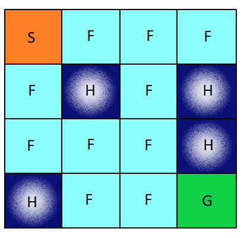
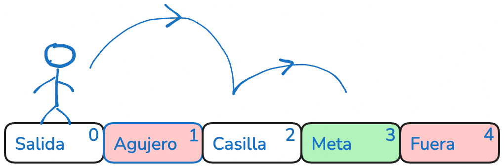
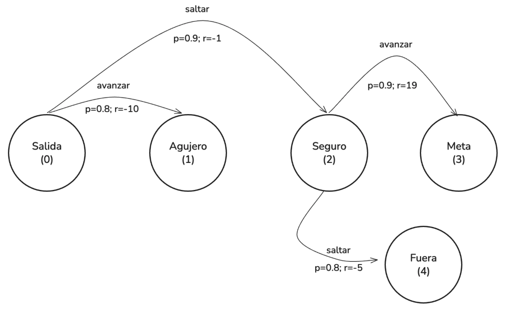

# Tema 4. Sistemas de aprendizaje automático por refuerzo

## Algoritmos de Aprendizaje por Refuerzo: Programación dinámica

### Introducción

En los capítulos anteriores hemos establecido las bases formales del aprendizaje por refuerzo. Hemos definido el problema como un proceso de decisión de Markov (MDP), identificado sus componentes esenciales —estados, acciones, recompensas, transiciones y factor de descuento— y presentado las funciones de valor como herramienta fundamental para cuantificar el rendimiento esperado de un agente. También hemos introducido las ecuaciones de Bellman, que relacionan el valor de un estado o acción con el de sus sucesores, y hemos discutido la distinción entre predicción (evaluar una política dada) y control (encontrar una política óptima).

Sin embargo, hasta ahora hemos trabajado principalmente a nivel conceptual. Llega el momento de responder a una pregunta práctica: dado un MDP completamente especificado —es decir, conociendo la función de transición $p(s' \mid s, a)$ y la función de recompensa $R(s, a, s')$—, ¿cómo podemos calcular de manera efectiva la política óptima? La respuesta a esta pregunta nos introduce en el primer gran bloque algorítmico del aprendizaje por refuerzo: **la programación dinámica**.

La programación dinámica (DP) no es, en rigor, un método de *aprendizaje* en el sentido de adquirir conocimiento a partir de la experiencia. Más bien, es un enfoque de *planificación* que explota el modelo del entorno para resolver las ecuaciones de Bellman de forma iterativa. Aunque esta dependencia del modelo limita su aplicabilidad directa en entornos reales —donde rara vez disponemos de una descripción probabilística completa—, su estudio es indispensable por tres razones fundamentales.

En primer lugar, la programación dinámica constituye el **fundamento teórico** sobre el que se construyen todos los métodos modernos de aprendizaje por refuerzo sin modelo. Algoritmos como Q-learning o SARSA pueden entenderse como aproximaciones muestrales de los procedimientos iterativos que ahora estudiaremos. Comprender DP es, por tanto, comprender el "por qué" y el "para qué" de las actualizaciones que realizan los agentes de RL.

En segundo lugar, la DP ofrece **garantías de convergencia** y un marco de análisis riguroso. Aprenderemos que la iteración de políticas y la iteración de valores convergen siempre a la solución óptima en un número finito de pasos (para espacios de estados finitos), y que este proceso puede interpretarse como una aplicación sistemática del principio de mejora de políticas que ya esbozamos en el capítulo anterior.

En tercer lugar, y quizás lo más importante para el desarrollo de la intuición, la programación dinámica nos muestra cómo **el valor se propaga a través del espacio de estados**. Veremos cómo, partiendo de estimaciones iniciales arbitrarias, los algoritmos de DP van "inyectando" información desde los estados terminales —que tienen valor conocido— hacia atrás, iluminando progresivamente el valor de todos los estados. Esta imagen de propagación hacia atrás es la misma que subyace en los métodos de diferencia temporal, y constituye una de las ideas más potentes y elegantes de todo el aprendizaje por refuerzo.

> **Ejemplo**: Imaginemos un pequeño robot que debe navegar por una cuadrícula de 4×4 casillas. La casilla de salida es la esquina superior izquierda, y la meta es la esquina inferior derecha, que otorga una recompensa de +1. El resto de transiciones tienen recompensa 0. El robot puede moverse arriba, abajo, izquierda o derecha, pero el movimiento es estocástico: solo se ejecuta correctamente el 33% de las veces; el resto de la probabilidad se reparte entre las direcciones ortogonales. Conociendo estas reglas (el modelo), la programación dinámica nos permitirá calcular, paso a paso, el valor esperado de cada casilla bajo la política que siempre intenta moverse hacia la derecha y hacia abajo, y luego mejorarla iterativamente hasta encontrar la estrategia óptima. Este ejemplo, que desarrollaremos en detalle a lo largo del capítulo, ilustra cómo la DP transforma un problema global de optimización en una secuencia de actualizaciones locales manejables.

En las siguientes secciones abordaremos primero la **evaluación de políticas**: el cálculo de $v_\pi(s)$ para una política fija utilizando el modelo del entorno. A continuación, presentaremos el **algoritmo de mejora de políticas**, que nos permitirá construir una política mejor a partir de la función de valor de la actual. Combinando ambos pasos obtendremos la **iteración de políticas**, un procedimiento que garantiza la convergencia a la política óptima. Finalmente, estudiaremos la **iteración de valores**, una variante más compacta que fusiona evaluación y mejora en una sola regla de actualización, y que resulta especialmente eficiente en la práctica.

Al concluir este capítulo, se dispondrá de una visión completa de cómo resolver MDPs cuando el modelo es conocido, y estaremos preparados para entender por qué los métodos sin modelo (Monte Carlo y TD) adoptan las formas que estudiaremos en capítulos posteriores.

> **¿Por qué es útil estudiar programación dinámica si en la mayoría de problemas reales no conocemos el modelo del entorno?** 
>
> **Clave**: La programación dinámica no es solo un método aplicable, sino un **andamiaje conceptual**. Sin ella, algoritmos como Q-learning o SARSA serían difíciles de justificar y de entender. Además, existen entornos —como ciertos juegos de mesa, problemas de control con dinámica conocida o simulaciones— donde el modelo sí está disponible y la DP puede aplicarse directamente.

### Condiciones de aplicabilidad

Así pues, la programación dinámica (DP) proporciona un conjunto de algoritmos clásicos que permiten **resolver problemas de decisión secuencial** cuando se dispone de una descripción completa del entorno. Su aplicación en el aprendizaje por refuerzo se basa en la formalización previa del entorno como un **Proceso de Decisión de Markov (MDP)**.

Sin embargo, no en todos los casos es posible aplicar directamente estos algoritmos. Existen **condiciones necesarias** que deben cumplirse para que la programación dinámica sea una opción viable.

Para aplicar programación dinámica, el agente debe tener acceso completo al modelo del entorno, lo que significa disponer explícitamente de:

- La **función de transición** $p(s' \mid s, a)$, que proporciona la **probabilidad de transición** al estado $s'$ al ejecutar la acción $a$ en el estado $s$.
- La **función de recompensa** $R(s, a, s')$, que determina el valor esperado de la **recompensa inmediata** tras la transición de $s$ a $s'$ al ejecutar la acción $a$.

Este conocimiento permite al agente **simular internamente** los efectos de sus decisiones, sin necesidad de interactuar físicamente con el entorno. En otras palabras, el agente puede planificar su comportamiento mediante **razonamiento sobre el modelo**, en lugar de aprender a partir de la experiencia directa.

#### Aplicabilidad: entornos donde el modelo es accesible

Este marco de suposiciones —es decir, conocer por adelantado las reglas de transición del entorno y su función de recompensa— restringe el uso de la programación dinámica a una clase de problemas muy específicos. No obstante, existen varios contextos relevantes en los que este conocimiento sí está disponible, lo que permite aplicar estos algoritmos de forma efectiva y precisa.

Uno de los escenarios más comunes es el de las **simulaciones artificiales**, especialmente en entornos de tipo lúdico o computacional con espacios de estados reducidos. Por ejemplo, el **tres en raya** (tic-tac-toe) presenta una dinámica completamente definida y determinista: el estado actual del tablero, las acciones legales y el resultado de cada movimiento pueden modelarse sin ambigüedad. Tras aplicar simetrías, su espacio de estados se reduce a unas pocas miles de configuraciones, lo que permite aplicar programación dinámica para calcular el valor exacto de cada posición y derivar una política óptima sin necesidad de ejecutar partidas completas. Otros ejemplos clásicos en la literatura docente incluyen entornos como **FrozenLake** (un tablero de 4×4 o 8×8 con casillas heladas y agujeros), **Gridworld** (laberintos de dimensiones modestas) o juegos de dados como el **Juego de la Oca**, donde el número de casillas es finito y las reglas de transición son completamente conocidas. En todos estos casos, el reducido tamaño del espacio de estados —del orden de decenas a unos pocos miles— hace que la programación dinámica tabular sea una herramienta práctica y didácticamente relevante.

También se encuentran aplicaciones en **modelos físicos** cuya dinámica está bien caracterizada mediante ecuaciones matemáticas. Por ejemplo, en el caso de un **robot móvil que se desplaza sobre un plano sin obstáculos**, el movimiento puede describirse mediante funciones deterministas basadas en la cinemática del sistema. Si se conocen las restricciones físicas, el espacio de estados es discreto y acotado, y las recompensas están definidas (por ejemplo, alcanzar un objetivo o evitar zonas de penalización), entonces se puede resolver el problema de navegación utilizando programación dinámica.

Otra clase de entornos donde esta aproximación resulta útil es la de los **problemas de planificación**, ya sean de naturaleza determinista o estocástica, siempre que se disponga de un **modelo explícito** construido a partir de datos históricos o de especificaciones formales. Por ejemplo, en un sistema de **planificación logística en una red de almacenes y rutas**, es posible modelar la probabilidad de éxito de las entregas, los costes asociados y la evolución del inventario. Si este modelo es suficientemente preciso, entonces la programación dinámica puede emplearse para encontrar políticas de reaprovisionamiento o rutas de transporte que minimicen costes o maximicen eficiencia.

En resumen, los algoritmos de programación dinámica son aplicables en contextos donde el entorno es **completamente especificable** y **computacionalmente tratable**, ya sea por construcción manual del modelo o porque puede derivarse de simulaciones controladas. En estos casos, la planificación basada en el modelo permite resolver las ecuaciones de Bellman con precisión y obtener decisiones óptimas sin necesidad de exploración directa.

Sin embargo, en muchos entornos reales —como la interacción con usuarios, la robótica en entornos no estructurados o el control de procesos inciertos— el modelo del entorno **no está disponible** o **no puede construirse de forma fiable**. Esto limita la aplicabilidad directa de los métodos de programación dinámica y motiva la necesidad de enfoques alternativos basados en aprendizaje a partir de la experiencia, como los algoritmos **model-free**.

Además, incluso cuando el modelo es conocido, la programación dinámica puede resultar computacionalmente ineficiente en espacios de estado y acción muy grandes, lo que justifica el uso posterior de aproximaciones funcionales y técnicas de RL profundo.

> **Ejemplo**: Consideremos el juego del tres en raya. El espacio de estados es finito (unas 5478 posiciones distintas tras aplicar simetrías) y las reglas de transición son deterministas: si un jugador coloca una ficha en una casilla vacía, el nuevo tablero está completamente determinado. Conociendo estas reglas, podemos aplicar programación dinámica para calcular el valor de cada estado (probabilidad de ganar jugando de forma óptima) sin necesidad de jugar ni una sola partida real. Esta es la esencia de la planificación basada en modelo.

**Para reflexionar…**

> **¿Qué ventajas e inconvenientes tiene el uso de programación dinámica frente a métodos que aprenden exclusivamente de la experiencia?**
>
> **Clave**: La planificación permite explorar mentalmente trayectorias completas sin coste ni riesgo, pero requiere un modelo exacto. El aprendizaje por experiencia no necesita modelo, pero puede ser más lento y costoso.

### Evaluación de políticas

Una vez que el entorno se ha modelado como un proceso de decisión de Markov y se dispone de una política concreta —es decir, de una regla que especifica qué acción tomar en cada estado—, el siguiente paso natural consiste en cuantificar su rendimiento. Esta tarea, conocida como **evaluación de políticas**, permite responder a una pregunta fundamental: _¿cuánto valor puede esperar obtener un agente si actúa conforme a dicha política desde un estado determinado?_

La noción clave aquí es la de **función de valor**, que mide el retorno esperado bajo una política fija. Al evaluar una política no se busca modificarla ni mejorarla, sino **entender su comportamiento medio a largo plazo**. Esta información es valiosa porque proporciona una base cuantitativa sobre la cual construir mejoras posteriores, y también porque permite comparar diferentes políticas entre sí de forma objetiva.

Formalmente, se desea calcular la función $v_\pi(s)$, que representa el valor esperado del retorno cuando el agente comienza en el estado $s$ y sigue la política $\pi$:

$$
v_{\pi}(s) = \mathbb{E} \left[ G_t \mid s_t = s \right] = \mathbb{E} \left[ \sum_{k=0}^\infty \gamma^k r_{t+k+1} \mid s_t = s \right]
$$

Donde hemos tenifdo en cuenta la expresion del retorno:

$$
G_t = r_{t+1} + \gamma r_{t+2} + \gamma^2 r_{t+3} + \dots = \sum_{k=0}^{\infty} \gamma^k r_{t+k+1}
$$

Esta expectativa se toma sobre **todas las posibles trayectorias generadas por la política $\pi$, incluyendo la estocasticidad del entorno y de la propia política si no es determinista**. Para calcular esta función de valor, no es necesario simular episodios ni observar interacciones: basta con **resolver el sistema de ecuaciones que se deriva de la ecuación de Bellman para $v_\pi$**, aprovechando que se dispone del modelo completo del entorno.

Recordemos que la **ecuación de Bellman para una política fija** describe el valor de un estado en función de las decisiones dictadas por la política y de las transiciones del entorno. Se expresa como:

$$
v_\pi(s) = \sum_{a \in \mathcal{A}} \pi(a \mid s) \sum_{s' \in \mathcal{S}} p(s' \mid s, a) \left[ R(s, a, s') + \gamma v_\pi(s') \right]
$$

Esta igualdad establece una relación de dependencia entre el valor del estado actual y el de sus sucesores, ponderados por la política y las probabilidades de transición. Cada término del sumatorio representa una posible evolución del sistema al tomar la acción $a$ en el estado $s$, transitar al estado $s'$, recibir una recompensa y continuar desde allí. El valor de un estado, por tanto, se define de manera **recursiva**: depende del valor de otros estados, lo que motiva el uso de métodos iterativos para su resolución.

En la práctica, para calcular esta función de valor se parte de una estimación inicial arbitraria de $v_\pi(s)$ (por ejemplo, asignando cero a todos los estados no terminales) y se aplica la ecuación anterior de forma repetida hasta que los valores convergen. Este procedimiento se conoce como **evaluación iterativa** de la política. En cada iteración se actualiza el valor de cada estado usando los valores actuales de sus sucesores, lo que produce una mejora progresiva de la aproximación.

La convergencia está garantizada bajo ciertas condiciones —por ejemplo, si el número de estados es finito y el factor de descuento $\gamma < 1$—, y el proceso puede detenerse cuando las variaciones entre iteraciones sean inferiores a una tolerancia prefijada. El resultado final es una función $v_\pi(s)$ que representa, con precisión arbitraria, la expectativa de retorno bajo la política considerada.

Una cuestión importante a tener en cuenta tiene que ver con el enfoque usado a la hora de realizar la evaluación de la política. En efecto, cuando aplicamos el método iterativo de evaluación de políticas, el objetivo es aproximar la función de valor $v_\pi(s)$ asociada a una política fija $\pi$, actualizando progresivamente su estimación en todos los estados del entorno.

##### Ejemplo: Tablero bidimensional y evaluación de políticas

Recordemos el problema del tablero bidimensional 4x4 que ya tratamos como ejemplo en capítulos anteriores. El espacio de estados se representaba del siguiente modo:

Donde:

- `S = 0` (estado de inicio)
- `G = 15` (estado final)
- Agujeros en 5, 7, 11 y 12 (estados absorbentes)
- Solo el estado 15 da recompensa 1, el resto 0
- Las transiciones son **estocásticas**, de modo que $p(s' \mid s, a) = 0.33$ para el destino deseado (si es válido) y 0.33 para cada dirección ortogonal

Supongamos una política **determinista** que elige moverse **siempre a la derecha**.

Para evaluar el valor de los estados usaremos la ecuación de Bellman:

$$
v_\pi(s) = \sum_{s'} p(s' \mid s, \pi(s)) \left[ R(s, \pi(s), s') + \gamma \cdot v_\pi(s') \right]
$$

Podemos trabajar con $\gamma = 1$ para simplificar algo más. También supondremos que **los valores iniciales de cada estado son cero**.

La ecuación de Bellman así planteada nos permite usar un método iterativo para calcular los valores de los estados. Empezaremos con todos los valores a cero e iremos iterando para todo el tablero hasta los valores converjan en relación a un parámetro $\theta$ previamente definido. En este caso, por ejemplo, vamos a suponer que $\theta=10^{-4}$  

Ahora vamos a calcular el valor de la ecuación para el estado 14. Para ello tendremos en cuenta que desde ese estado puede se puede transicionar al estado 15, al 9 o quedarse en el mismo estado 14. El sumatorio anterior tendrá tres sumandos y quedará como sigue:

$$
v_\pi(14) = \sum_{a' \in \{\text{right, up, down}\}} p(s' \mid 14, a') \left[ R(14, a', s') + \gamma \cdot v_\pi(s') \right]
$$

Desglosando cada término:

- $0{,}33 \cdot (1 + v_\pi(15))$  
- $0{,}33 \cdot (0 + v_\pi(10))$  
- $0{,}33 \cdot (0 + v_\pi(14))$

Sustituyendo:

$$
v^{(1)}(14) = 0{,}33 \cdot (1 + v_\pi(15)) + 0{,}33 \cdot v_\pi(10) + 0{,}33 \cdot v^{(0)}_\pi(14)
$$

En la primera configuración de estados todos los valores están a cero, así que:

$$
v^{(0)}(10) = v^{(0)}(14) = v^{(0)}(15) = 0
$$

Por tanto:

$$
v^{(1)}(14) = 0{,}33 + 0 + 0 = 0,33
$$

En esta iteración ($k=1$), podemos intentar el calculo para otros estados, aunque debido a los valores nulos el resultado será cero.

Vamos a hora con la siguiente iteración ($k=2$). Volvemos a hacer el cálculo para $s_{14}$ y $s_{10}$. Si planteamos la ecuación de Bellman para $s_{14}$ y sustituimos valores nos quedaría que:

$$
v^{(2)}(14) = 0{,}33 \cdot (1 + 0) + 0{,}33 \cdot 0 + 0{,}33 \cdot 0,33 = 0,42
$$

Y para $s_{10}$ tendremos que:

$$
v^{(1)}(10) = 0{,}33 \cdot 0 + 0{,}33 \cdot 0 + 0{,}33 \cdot 0,33 = 0,1089
$$

Del mismo modo podríamos seguir calculando valores e iterando.

Una cuestión importante es cuándo parar de iterar. Para ello tendremos que calcular tras cada iteración, para cada estado la cantidad

$$
|v^{(k+1)}(s) - v^{(k)}(s)|
$$

Calcularemos el máximo de esa diferencia en todo el espacio de estados. Si ese valor es menor que la tolerancia elegida al principio del algoritmo ($\theta$) ya habremos llegado al final del algorimo y la política $v_\pi$ estará evaluada.

> [!important]
>
> Este proceso constituye el núcleo de la evaluación de políticas. Sin él, no sería posible determinar si una política es buena o no, ni habría forma de mejorarla de manera informada. De hecho, todos los algoritmos de programación dinámica se apoyan sobre esta fase de evaluación como paso esencial, ya sea ejecutado de forma explícita o implícita.

#### Exploración y explotación: un dilema central en el aprendizaje por refuerzo

Uno de los desafíos más importantes a los que se enfrenta un agente en aprendizaje por refuerzo es decidir en cada momento si debe explotar el conocimiento que ya posee sobre el entorno o si, por el contrario, debe explorar nuevas acciones que podrían conducir a soluciones mejores a largo plazo. Esta tensión se conoce como el dilema de exploración y explotación.

**Explotar** significa utilizar la información aprendida hasta el momento para seleccionar la acción que se estima más valiosa. Es decir, el agente toma decisiones basadas en sus estimaciones actuales de las funciones de valor, eligiendo sistemáticamente la mejor opción disponible. Esta actitud es eficiente cuando el conocimiento adquirido es suficientemente fiable, ya que permite maximizar el rendimiento inmediato.

**Explorar**, en cambio, implica tomar acciones que no necesariamente parecen las mejores en el presente, con el objetivo de adquirir información adicional sobre el entorno. Gracias a la exploración, el agente puede descubrir transiciones desconocidas, recompensas inesperadas o caminos más eficientes hacia su objetivo. Aunque explorar puede resultar costoso en el corto plazo, es esencial para mejorar la política y alcanzar un comportamiento verdaderamente óptimo.

El equilibrio entre ambas estrategias es especialmente delicado durante la fase de aprendizaje. Si el agente explota demasiado pronto, puede converger a una política subóptima basada en información incompleta. Si explora en exceso, puede dilatar innecesariamente el proceso de aprendizaje, desperdiciando episodios sin consolidar decisiones útiles. Por esto es por lo que el diseño de mecanismos que regulen este compromiso resulta fundamental en el desarrollo de algoritmos de refuerzo efectivos.

En este contexto pueden diferenciarse distintos tipos de políticas en RL. La primera de ellas, y de las más intuitivas, es la que se denomina una ***política greedy.*** decimos que una política es **greedy** cuando, en cada estado $s$, selecciona la acción $a$ que maximiza el valor estimado:

$$
\pi(s) = \arg\max_a q(s, a)
$$

Es decir, **la política greedy elige siempre la mejor acción conocida**, sin considerar la posibilidad de explorar alternativas. Desde el punto de vista del agente, adoptar una política greedy significa que, en todo momento, **explotará al máximo el conocimiento actual que posee** sobre el entorno para obtener la mayor recompensa posible. Este enfoque resulta adecuado cuando se dispone de una **estimación precisa** de los valores de acción, es decir, cuando $q(s,a)$ refleja con fidelidad la dinámica real del entorno. Esta estrategia puede ser adecuada **al final del entrenamiento**, cuando el agente ha adquirido una representación precisa del entorno. Sin embargo, si se aplica desde el principio o en fases intermedias, limita drásticamente la posibilidad de mejora. No se experimentan nuevas acciones, no se descubren recompensas ocultas, y no se corrigen errores de valoración.

Por este motivo, en la mayoría de los algoritmos prácticos se utilizan políticas que combinan una componente greedy **con un mecanismo de exploración controlada**. La **política $\epsilon$-greedy** es el ejemplo más sencillo: selecciona la acción greedy con alta probabilidad (por ejemplo, $1 - \epsilon$), pero con una pequeña probabilidad $\epsilon$ elige una acción aleatoria. Esta pequeña perturbación permite al agente mantener la posibilidad de explorar, incluso cuando ha comenzado a explotar. A lo largo del tiempo, $\epsilon$ puede reducirse gradualmente, permitiendo una transición progresiva hacia una política completamente determinista.

Este equilibrio dinámico entre exploración y explotación no solo mejora la eficiencia del aprendizaje, sino que también refleja una estrategia adaptativa inteligente. En fases iniciales, donde todo es incierto, es preferible explorar ampliamente. A medida que se acumula experiencia, es razonable explotar cada vez más el conocimiento adquirido. Comprender y gestionar este equilibrio es esencial para diseñar agentes de aprendizaje por refuerzo que sean eficaces y robustos.

Vamos ahora a ver como podemos mejorar una política que se ha evaluado previamente.

### Algoritmo de mejora de la política

Una vez que el agente ha aprendido a evaluar una política, el siguiente paso natural consiste en utilizar esta información para **mejorar dicha política**. El objetivo es aprovechar las estimaciones de valor obtenidas durante la evaluación para modificar el comportamiento del agente en cada estado y así aumentar su rendimiento esperado.

La idea que subyace a este procedimiento es conceptualmente sencilla: si el agente conoce los valores $q_\pi(s, a)$ que reflejan el retorno esperado de cada acción en un estado dado bajo la política actual $\pi$, entonces puede comparar todas las acciones posibles en cada estado y seleccionar aquella que proporcione el mayor valor. De este modo, se obtiene una **nueva política** que es **greedy respecto a la función de valor actual**.

Este procedimiento se denomina **mejora de la política**, y puede formalizarse de la siguiente forma. Dada una política $\pi$ y su correspondiente función acción-valor $q_\pi(s, a)$, se define una nueva política $\pi'$ como:

$$
\pi'(s) = \arg\max_a q_\pi(s, a)
$$

Esta nueva política selecciona, en cada estado, la acción que maximiza el valor estimado. Si $\pi' = \pi$, es decir, si la política actual ya es greedy con respecto a sus propios valores, entonces $\pi$ es **óptima localmente**. En caso contrario, $\pi'$ representa una política **estrictamente mejor o igual** que la anterior.

Desde el punto de vista algorítmico, la mejora de la política se basa en un paso de actualización que puede expresarse así: en cada estado $s$, se recorren todas las acciones disponibles y se selecciona aquella que maximiza la expresión:

$$
\sum_{s'} p(s' \mid s, a) \left[ R(s, a, s') + \gamma v_\pi(s') \right]
$$

Esto equivale a evaluar el impacto esperado de ejecutar la acción $a$ desde $s$, teniendo en cuenta tanto la recompensa inmediata como el valor de los estados futuros a los que puede llevar. La política se modifica para elegir, en cada estado, la acción con mayor expectativa de retorno.

En la práctica, este proceso puede aplicarse tras una fase de evaluación de política. Se obtiene $v_\pi$ o $q_\pi$ y se construye una política mejorada $\pi'$. Posteriormente, esta nueva política puede evaluarse de nuevo, y el ciclo puede repetirse. Esta idea es la base de los algoritmos de iteración de la política que se estudiarán más adelante.

La mejora de política puede visualizarse como un mecanismo de ajuste progresivo. A partir de una política inicial arbitraria, se producen pequeñas modificaciones locales que aumentan el retorno esperado en cada estado. Repetido suficientes veces, este procedimiento puede conducir a políticas óptimas, siempre que se mantenga un equilibrio adecuado entre evaluación y mejora.

Este proceso también refleja el principio de explotación mencionado anteriormente. Al mejorar la política, el agente incrementa su preferencia por acciones que han demostrado un valor alto, y reduce la frecuencia de acciones menos prometedoras. Por esto es por lo que la mejora de política se convierte en un mecanismo natural de optimización dentro del ciclo de aprendizaje por refuerzo.

> [!note]
>
> **¿Es necesario conocer la función acción-valor para mejorar la política?**
>
> Una duda habitual al estudiar el algoritmo de mejora de la política es si es imprescindible disponer de la función acción-valor $q_\pi(s, a)$ para llevar a cabo el proceso de mejora. La respuesta es que **no es necesario conocer ni almacenar explícitamente esta función**, siempre que se disponga de dos elementos fundamentales: la función de valor de estados $v_\pi(s)$ y el modelo del entorno, es decir, las funciones de transición y de recompensa.
>
> En efecto, para mejorar una política en un estado dado, lo único que se necesita es poder comparar las distintas acciones disponibles en ese estado. Esta comparación se realiza evaluando el retorno esperado de cada acción, lo cual puede calcularse directamente mediante la siguiente expresión:
>
> $$
> q_\pi(s, a) = \sum_{s'} p(s' \mid s, a) \left[ R(s, a, s') + \gamma v_\pi(s') \right]
> $$
>
> Esta fórmula no requiere que $q_\pi(s, a)$ se conozca previamente, ya que puede evaluarse **de forma puntual** cada vez que se desea mejorar la política. De este modo, para cada estado $s$, se calcula el valor esperado de todas las acciones posibles $a \in \mathcal{A}(s)$ aplicando esta expresión. A continuación, se selecciona aquella acción que maximiza el resultado obtenido, generando así una nueva política mejorada:
>
> $$
> \pi'(s) = \arg\max_a \sum_{s'} p(s' \mid s, a) \left[ R(s, a, s') + \gamma v_\pi(s') \right]
> $$
>
> Por esto es por lo que se afirma que **la mejora de política puede realizarse directamente a partir de la función de valor** sin necesidad de disponer de la función acción-valor como objeto intermedio. El modelo del entorno proporciona toda la información necesaria para estimar el valor de las acciones en términos de los estados sucesores y sus respectivos valores. Esta capacidad de mejora basada únicamente en $v_\pi$ es una de las razones por las que la programación dinámica es computacionalmente eficiente cuando se dispone del modelo completo del problema.

#### Ejemplo de mejora de la política en un tablero unidimensional

Consideramos un entorno muy simple con tres estados dispuestos en línea: $s_0$, $s_1$ y $s_2$.

- $s_0$ representa un hueco. 
- $s_1$ es el estado inicial. 
- $s_2$ es la meta. 

Las acciones disponibles en todos los estados son:

- $a_0$: moverse a la izquierda. 
- $a_1$: moverse a la derecha.

La dinámica del entorno es determinista. Las transiciones posibles son:

- Desde $s_1$, la acción $a_0$ lleva a $s_0$ (sin recompensa). 
- Desde $s_1$, la acción $a_1$ lleva a $s_2$ (con recompensa $1$). 
- Desde $s_0$ o $s_2$, cualquier acción deja al agente en el mismo estado, sin recompensa. 
- Consideramos $\gamma = 1$.

Supongamos que el agente parte de una **política inicial** $\pi$ que no alcanza la meta:

- $\pi(s_0) = a_0$  
- $\pi(s_1) = a_0$  
- $\pi(s_2) = a_1$  

Tras aplicar el algoritmo de evaluación de política, obtenemos:

- $v_\pi(s_0) = 0$  
- $v_\pi(s_1) = 0$  
- $v_\pi(s_2) = 0$

A continuación, aplicamos un **paso de mejora de la política**, usando el modelo del entorno y los valores actuales.

En el estado $s_1$:

- Si el agente elige $a_0$, llega a $s_0$: 

$$
q(s_1, a_0) = R(s_1, a_0, s_0) + \gamma \cdot v_\pi(s_0) = 0 + 1 \cdot 0 = 0
$$

- Si elige $a_1$, llega a $s_2$ y recibe una recompensa:

$$
q(s_1, a_1) = R(s_1, a_1, s_2) + \gamma \cdot v_\pi(s_2) = 1 + 1 \cdot 0 = 1
$$

Por tanto, la acción $a_1$ es mejor, y se mejora la política en $s_1$:

- $\pi'(s_1) = a_1$

En los estados $s_0$ y $s_2$ no hay recompensas ni cambios de estado, por lo que las acciones tienen valor cero:

- $q(s_0, a_0) = q(s_0, a_1) = 0$ 
- $q(s_2, a_0) = q(s_2, a_1) = 0$ 

Por tanto, no hay necesidad de cambiar la política en esos estados.

La **política mejorada** resultante es:

- $\pi'(s_0) = a_0$  
- $\pi'(s_1) = a_1$  
- $\pi'(s_2) = a_1$

Esta política permite alcanzar el estado objetivo $s_2$ desde $s_1$ con una recompensa de 1, lo cual mejorará el valor del estado $s_1$ en futuras evaluaciones. Esta sencilla mejora muestra cómo, utilizando la función de valor $v_\pi$ y el modelo del entorno, se pueden identificar acciones más prometedoras en cada estado y construir políticas cada vez más eficaces.

### Iteración de políticas

Hemos visto cómo es posible evaluar una política fija, obteniendo su función de valor, y cómo puede mejorarse dicha política utilizando los valores estimados para elegir acciones más prometedoras. Estos dos procesos —evaluación y mejora— pueden combinarse en un esquema iterativo que constituye uno de los algoritmos fundamentales en programación dinámica: la **iteración de políticas**.

Este método parte de una política arbitraria y la va perfeccionando en sucesivas fases, alternando entre la evaluación de los valores esperados bajo dicha política y la mejora de las acciones elegidas en cada estado. El objetivo de este procedimiento es alcanzar una política estable que no pueda mejorarse más, lo que implica que se ha llegado a una política óptima.

La lógica del algoritmo es sencilla pero muy poderosa. Se comienza con una política inicial y se evalúan sus valores mediante la ecuación de Bellman. Con esos valores, se realiza una mejora de política seleccionando, en cada estado, la acción que maximiza la recompensa inmediata esperada más el valor estimado del estado siguiente. Si esta mejora da lugar a una política distinta, se repite el proceso. Pero si al aplicar el paso de mejora la política resultante es idéntica a la anterior, se ha alcanzado una política que ya es óptima, y el algoritmo se detiene.

Este punto es clave: **el criterio de parada no es que los valores de los estados hayan convergido a un conjunto concreto**, ni que coincidan con los valores óptimos. La condición que detiene el algoritmo es que **la política no cambie** tras el paso de mejora. Es decir, la política es **greedy respecto a su propia función de valor**. Cuando esto sucede, se garantiza que ya no existe ninguna acción alternativa que mejore el comportamiento del agente, y por tanto la política es óptima.

Esta propiedad hace que la iteración de políticas sea particularmente eficiente y segura. Siempre que los espacios de estados y acciones sean finitos, el algoritmo está garantizado a converger en un número finito de iteraciones. Además, en cada paso se obtiene una política no peor que la anterior, por lo que el proceso nunca retrocede. Esto permite interpretar el algoritmo como una sucesión de aproximaciones progresivas hacia una política óptima, en la que cada iteración refina las decisiones del agente a partir del conocimiento adquirido previamente.

Desde un punto de vista operativo, el algoritmo sigue una guionización sencilla: se inicializa una política arbitraria, se evalúan sus valores, se mejora la política, y se comprueba si ha cambiado. Si hay cambios, se repite el ciclo; si no los hay, se ha llegado al final. Esta dinámica alterna puede entenderse como un proceso de aprendizaje iterativo, en el que cada ciclo proporciona al agente una comprensión más ajustada de las consecuencias de sus decisiones.

Por tanto, la iteración de políticas ofrece una solución completa y sistemática al problema de encontrar una política óptima en entornos donde el modelo del entorno es conocido. Su carácter estructurado y su convergencia garantizada la convierten en una herramienta clave en la teoría del aprendizaje por refuerzo clásico.

Perfecto. A continuación tienes el desarrollo completo en **formato apuntes** para introducir la **iteración de valores** con una explicación clara, motivadora y técnicamente rigurosa. Esta sección pone el énfasis en **por qué** este algoritmo es necesario, **cómo** se relaciona con la programación dinámica y **qué ventajas tiene** respecto a la iteración de políticas, todo ello cuidando especialmente la comprensión por parte del estudiante.

### Iteración de valores

Hasta ahora hemos trabajado con la **iteración de políticas**, un procedimiento que alterna dos fases bien diferenciadas: por un lado, la evaluación de una política fija, y por otro, su mejora sistemática a partir de los valores aprendidos. Esta estrategia es sólida y garantiza la convergencia hacia una política óptima, pero presenta una dificultad práctica: la **evaluación completa** de la política en cada ciclo puede ser costosa, sobre todo en espacios grandes de estados o cuando el número de iteraciones necesarias es elevado.

La **iteración de valores** surge como una alternativa más **eficiente** y directa. En lugar de separar evaluación y mejora, **fusiona ambos pasos en una sola operación**: en cada iteración se actualiza el valor de cada estado utilizando la mejor acción disponible en ese momento. De este modo, el proceso se basa directamente en la **ecuación de Bellman óptima**, sin necesidad de mantener una política explícita.

Este es el punto clave: mientras que la iteración de políticas sigue una lógica de "primero evalúo cómo de buena es mi política actual, luego decido cómo mejorarla", la iteración de valores adopta una estrategia más agresiva: "voy a suponer en todo momento que tomo la mejor acción posible y actualizo los valores directamente en base a ello".

El proceso se desarrolla de la siguiente manera:

Se parte de una estimación inicial de los valores de todos los estados (por ejemplo, todos ceros). En cada paso, para cada estado $s$, se calcula el nuevo valor como el máximo valor esperado que se puede obtener considerando todas las acciones posibles desde ese estado, aplicando la fórmula:

$$
v^{(k+1)}(s) = \max_a \sum_{s'} p(s' \mid s, a) \left[ R(s, a, s') + \gamma \cdot v^{(k)}(s') \right]
$$

Esto significa que, en cada iteración, el agente **se pregunta qué acción es la mejor en este estado, según los valores actuales**, y **actualiza el valor del estado suponiendo que tomará esa acción**. No se evalúa una política concreta, sino que se actualizan directamente los valores suponiendo que se actúa de forma óptima.

En términos prácticos, se repite este proceso hasta que los valores dejan de cambiar significativamente (es decir, cuando el cambio entre una iteración y la siguiente es menor que un umbral prefijado). Este criterio de parada está basado en los **valores**, no en una política explícita. Una vez que los valores han convergido, se puede recuperar la política óptima seleccionando, para cada estado, la acción que maximizó la expresión anterior.

Esta diferencia con la iteración de políticas es fundamental. En iteración de políticas:

- Se mantiene una política explícita en cada paso.
- Se evalúa exactamente el valor de dicha política.
- Luego se mejora la política de forma greedily.

En iteración de valores:

- No se mantiene una política explícita durante el proceso.
- Se actualizan los valores directamente usando la mejor acción disponible en cada paso.
- Solo al final (si se desea) se extrae una política greedily a partir de los valores convergidos.

Este enfoque resulta ser más **computacionalmente compacto** y a menudo más **rápido**, ya que evita la evaluación completa de políticas intermedias. Además, permite **propagar información útil de estados con recompensa hacia atrás** en el espacio de estados desde las primeras iteraciones, haciendo que incluso sin convergencia total, los valores sean ya informativos.

Desde una perspectiva didáctica, la iteración de valores representa una **forma natural de propagación del conocimiento**: cada vez que un estado tiene un sucesor con alto valor, este "empuja" su utilidad hacia atrás, afectando a los valores de estados que llevan hasta él. Esta propagación es lo que finalmente construye un mapa de valores coherente con las mejores decisiones que se pueden tomar desde cada punto.

Por todo ello, la iteración de valores se convierte en uno de los algoritmos básicos de programación dinámica y constituye el núcleo conceptual de muchas técnicas modernas de aprendizaje por refuerzo.

> [!note]
>
> **¿Por qué se actualiza $v(s)$ y no $q(s,a)$?**
>
> La iteración por valores explota la estructura recursiva de la ecuación de Bellman óptima para $v^*$. Almacenar y actualizar $v(s)$ requiere menos memoria que $q(s,a)$ (una entrada por estado frente a una por par estado‑acción). Además, en entornos con modelo conocido, el cálculo del máximo sobre acciones puede hacerse sobre la marcha usando $v(s')$, sin necesidad de guardar $q$ explícitamente.

#### Ejemplo de aplicacion del algoritmo de iteracion de valores: El agente saltarín 

Supongamos un problema sencillo con un agente que se mueve de izquierda a derecha por una fila de casillas, pudiendo **avanzar** o **saltar** para evitar agujeros. 

El agente comienza en la casilla **0** y debe llegar a la meta en la casilla **3**. Hay un agujero en la casilla **1** y una casilla segura en la **2**. Las acciones son:

- **Avanzar** (acción 0): se mueve +1 casilla.
- **Saltar** (acción 1): se mueve +2 casillas.

Vamos a suponer tambien que el problema tiene naturaleza **estocástica** y que el éxito de cada una de las acciones posibles en cada estado está sujeto a una probabilídad de éxito. En cuanto a la finalizacion del episodio este se producirá si el agente cae en un agujero (casilla 1) o se sale del tablero (casilla 4) o si llega a la meta (casilla 3). En el primer caso el episodio termina con una penalización, en el segundo, el agente recibe una recompensa grande.

En cuanto a las recompensas y penalizaciónes supondremos que caer en agujero (casilla 1) retorna **-10**; salir del tablero (casilla 4)  **-5** y llegar a la meta (casilla 3) **+20**. Además consideraremos que existen costes por cada accion de avanzar o de saltar igual a **-1**

Supongamos por último que el problema tiene asociado un factor de descuento $\gamma=0.9$

El mapa de transiciones (**modelo**) sería el siguiente

Desde la casilla**0**:

| Acción  | Prob | s'   | r    | Terminal |
| ------- | ---- | ---- | ---- | -------- |
| avanzar | 0.8  | 1    | -10  | Sí       |
| avanzar | 0.2  | 0    | -1   | No       |
| saltar  | 0.9  | 2    | -1   | No       |
| saltar  | 0.1  | 1    | -10  | Sí       |

Desde la casilla **2**:

| Acción  | Prob | s'   | r    | Terminal |
| ------- | ---- | ---- | ---- | -------- |
| avanzar | 0.9  | 3    | +19  | Sí       |
| avanzar | 0.1  | 2    | -1   | No       |
| saltar  | 0.8  | 4    | -5   | Sí       |
| saltar  | 0.2  | 2    | -1   | No       |

Desde el resto de casillas (1, 3 y 4) no tiene sentido modelar ninguna transición ya que son estados terminales

Es interesante generar el grafo que correponde a nuestro problema. Sería este:

Vamos ahora a aplicar el algoritmo de iteracion por valores y calcular $v(s)$ para cada estado. Los estados que realmente importan en este problema son los que corresponden a las casillas (0) y (2) ya que el resto son terminales.

Así pues:

**Desde el estado 0**:
- Avanzar: 80% va al agujero (1, r=-10, terminal); 20% permanece en 0 (r=-1, no terminal).
- Saltar: 90% va a la casilla segura (2, r=-1, no terminal); 10% va al agujero (1, r=-10, terminal).

**Desde el estado 2**:

- Avanzar: 90% va a la meta (3, r=+19, terminal); 10% permanece en 2 (r=-1, no terminal).
- Saltar: 80% sale del tablero (r=-5, terminal); 20% permanece en 2 (r=-1, no terminal).

Empezamos asignando el valor 0 a $v^{(0)}(0)$ y $v^{(0)}(2)$

Ahora aplicamos la ecuación de iteración de valores para $k=1$

$$
v^{(1)}(s) = \max_a \sum_{s'} p(s' \mid s, a) \left[ R(s, a, s') + \gamma \cdot v^{(0)}(s') \right]
$$

**Iteración 1**:

$$
v^{(1)}(0) = \max \{ \underbrace{0.8(-10)+0.2(-1)}_{-8.2},\; \underbrace{0.9(-1)+0.1(-10)}_{-1.9} \} = -1.9
$$

$$
v^{(1)}(2) = \max \{ \underbrace{0.9(19)+0.1(-1)}_{17.0},\; \underbrace{0.8(-5)+0.2(-1)}_{-4.2} \} = 17.0
$$

**Iteración 2** (usando $v^{(1)}$):

$$
v^{(2)}(0) = \max \{ 0.8(-10)+0.2(-1+0.9\cdot(-1.9)) = -8.542,\; 0.9(-1+0.9\cdot17.0)+0.1(-10) = 11.87 \} = 11.87
$$

$$
v^{(2)}(2) = \max \{ 0.9(19)+0.1(-1+0.9\cdot17.0) = 18.53,\; 0.8(-5)+0.2(-1+0.9\cdot17.0) = -1.14 \} = 18.53
$$

**Iteración 3**:

$$
v^{(3)}(0) = 13.1093,\quad v^{(3)}(2) = 18.6677
$$

**Iteración 4**:

$$
v^{(4)}(0) = 13.2208,\quad v^{(4)}(2) = 18.6801
$$

La convergencia se alcanza rápidamente. Los valores finales son aproximadamente $v^{*}(0) \approx 13.3$, $v^{*}(2) \approx 18.68$.

La política óptima resultante es: en estado 0, **saltar** (13.3 frente a -5.8); en estado 2, **avanzar** (18.68 frente a -0.84). La estocasticidad suele reducir ligeramente, con respecto a una situacion puramente determinista,  el valor esperado de saltar desde 0 debido al 10% de caer en el agujero, si bien la estrategia óptima no cambia.

> - La iteración de valores propaga la información de las recompensas futuras hacia atrás en el espacio de estados.
> - Este ejemplo muestra cómo la ecuación de Bellman óptima permite actualizar los valores sin necesidad de mantener una política explícita durante el proceso iterativo.
>

Para reflexionar…

> **¿Por qué la iteración de valores suele converger más rápido en número de iteraciones que la iteración de políticas, aunque cada iteración sea más costosa computacionalmente?**
> **Clave**: La iteración de políticas requiere resolver un sistema de ecuaciones (o realizar múltiples barridos de evaluación) en cada ciclo, mientras que la iteración de valores combina evaluación y mejora en una sola actualización local.

> **¿Qué sucedería si en el ejemplo estocástico el agente tuviera una política que siempre intentara avanzar desde 0? ¿Cómo afectaría eso al valor del estado 0?**
> **Clave**: Si siempre avanza, la probabilidad de caer en el agujero es del 80% en cada intento, y el valor esperado sería muy negativo. La iteración de valores detecta que saltar es mejor y ajusta los valores en consecuencia.

### Conclusiones

La programación dinámica ofrece una solución teóricamente sólida al problema de decisión secuencial en entornos donde el modelo del entorno es completamente conocido. Tanto la **iteración de políticas** como la **iteración de valores** permiten hallar una política óptima, pero lo hacen mediante estrategias distintas, lo que da lugar a diferencias relevantes desde el punto de vista computacional y conceptual.

Ambos algoritmos están respaldados por demostraciones matemáticas que garantizan su **convergencia** a la política óptima y a la función de valor correspondiente. Sin embargo, sus trayectorias hacia esa convergencia no son equivalentes. La iteración de políticas sigue un proceso estructurado de evaluación exacta y mejora sistemática, que puede implicar costes altos si se requiere precisión en la evaluación. En cambio, la iteración de valores realiza actualizaciones aproximadas pero inmediatas, propagando la información de forma más flexible y adaptativa desde los estados terminales hacia el resto del espacio.

Desde el punto de vista **computacional**, esta diferencia es significativa. La iteración de políticas requiere resolver un sistema de ecuaciones en cada paso de evaluación, lo que puede ser costoso si el número de estados es grande. La iteración de valores, en cambio, evita este coste mediante una actualización local basada en el máximo valor esperado entre las acciones posibles, lo que permite avanzar con mayor agilidad, aunque sacrificando exactitud intermedia. Este enfoque suele ser preferible cuando se requiere una implementación simple o cuando interesa disponer de políticas útiles aún antes de la convergencia completa.

Ambos métodos, no obstante, comparten una **limitación esencial**: exigen conocer por adelantado la función de transición $p(s' \mid s, a)$ y la función de recompensa $R(s, a, s')$. Esta dependencia del modelo restringe su aplicabilidad en la práctica, donde muchas veces el entorno es desconocido o solo parcialmente observable. Por eso, aunque estos algoritmos no suelen aplicarse directamente en entornos reales, su importancia es fundamental en la teoría del aprendizaje por refuerzo.

La programación dinámica proporciona la **base conceptual sobre la que se construyen los métodos de aprendizaje model-free**. Algoritmos como SARSA, Q-learning o los métodos basados en diferencia temporal pueden entenderse como intentos de aproximar las mismas ecuaciones de Bellman que aquí se han resuelto con modelo explícito, pero utilizando únicamente experiencia observada. Esta continuidad teórica entre programación dinámica y aprendizaje sin modelo es uno de los pilares del campo y ayuda a comprender por qué muchas ideas y expresiones se mantienen constantes a lo largo del temario.

Por tanto, más allá de su aplicabilidad directa, los métodos de programación dinámica ofrecen al estudiante una **visión estructurada y exacta** de los fundamentos del RL. Permiten entender cómo se define y evalúa una política, qué significa actuar de forma óptima y cómo se propaga el valor a través del espacio de estados. Estos conceptos serán cruciales en los bloques siguientes, donde el agente deberá aprender todo esto **sin conocer el entorno**, solo a partir de la experiencia de interacción.

